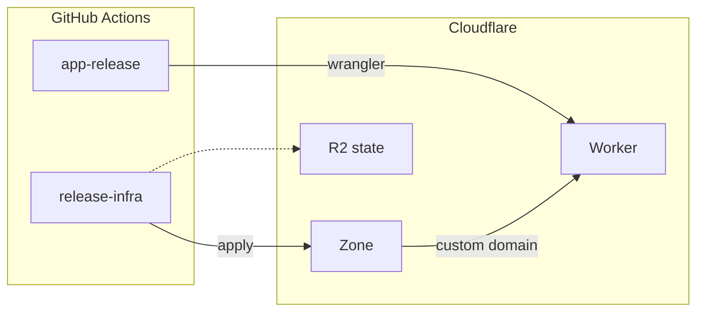
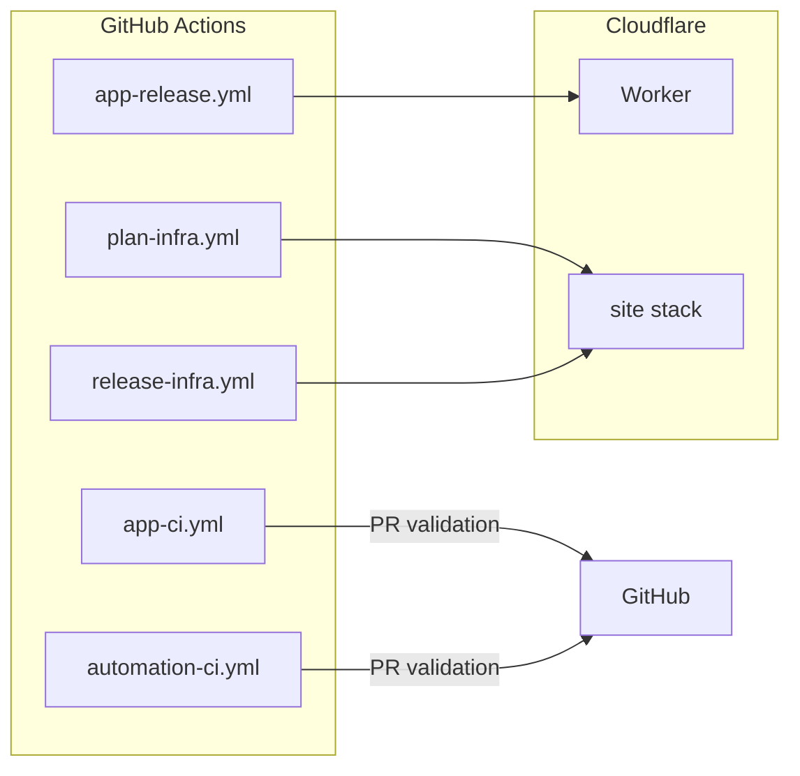

# koborin.ai


Technical proving ground for exploring AI, cloud architecture, and continuous learning.

Astro ( [](https://starlight.astro.build) ) is served as Cloudflare Worker static assets. App deploys use wrangler. DNS and the custom domain are a TerraDart `site` stack applied from GitHub Actions.

## Architecture

The only public host is `koborin.ai`. There is no `dev.koborin.ai`.



| Abbreviation | Full Name | Description |
| --- | --- | --- |
| Worker | [Cloudflare Workers](https://developers.cloudflare.com/workers/) | Serves the static Astro site |
| Custom domain | [Workers custom domains](https://developers.cloudflare.com/workers/configuration/routing/custom-domains/) | Attaches `koborin.ai` to Worker `koborin-ai-web` |
| R2 | [Cloudflare R2](https://developers.cloudflare.com/r2/) | Terraform state bucket `koborin-ai-tfstate` |
| Wrangler | [Wrangler](https://developers.cloudflare.com/workers/wrangler/) | Uploads `app/dist` |

### Environment matrix

| Layer | Production (`koborin.ai`) |
| --- | --- |
| Runtime | Cloudflare Worker `koborin-ai-web` (static assets) |
| Access | Public |
| Content | Same MDX content (no env-specific filtering) |
| Analytics | GA4 + Giscus on article pages |

## CI/CD

Infrastructure and application deploys are each handled by dedicated GitHub Actions workflows. Cloudflare auth is a scoped API token.



| Workflow | Trigger | Purpose | Notes |
| --- | --- | --- | --- |
| `plan-infra.yml` | PRs touching infra | `mise run check:infra` + `terraform plan` for the `site` stack | No apply |
| `release-infra.yml` | `infra-v*` tags, `main` infra push, or manual dispatch | Applies the `site` stack | State is in R2 |
| `app-ci.yml` | PRs touching `app/` | Runs `npm run check` and the production build | Blocks merges that break the app |
| `automation-ci.yml` | PRs touching workflows, shell scripts or Markdown | `mise run check:automation` + `check:docs` (actionlint, shellcheck, label tests, markdownlint) | Guards the automation and the docs |
| `app-release.yml` | Merge to `main` or `workflow_dispatch` | Builds the static site and runs `wrangler deploy` | Uses `CLOUDFLARE_API_TOKEN` |

Tool versions come from `.tool-versions`. `actions/setup-node` reads it through `node-version-file`, and the infra and automation workflows install from it with `jdx/mise-action`.

## Tech Stack

- **Frontend**: Astro with Starlight (documentation theme), TypeScript.
- **Content Management**: MDX stored under `app/src/content/docs/` within git. Frontmatter is validated via Zod schemas (from Starlight) to keep metadata type-safe. Drafts can be marked with `draft: true` in frontmatter.
- **Analytics**: Google Analytics 4 for baseline PV/engagement.
- **Infrastructure**: TerraDart (Dart) targeting Cloudflare via Terraform. State is in R2.
- **CI/CD**: GitHub Actions with a Cloudflare API token. `plan-infra.yml` / `release-infra.yml` drive infra; `app-ci.yml` / `app-release.yml` handle the Astro app.
- **Toolchain**: [mise](https://mise.jdx.dev/) pins Node, Dart, Terraform, actionlint, and shellcheck for both laptops and CI.
- **Quality gates**: oxlint and `astro check` for the app, Vitest for app unit tests, `dart analyze` + `dart test` for infra, actionlint and shellcheck for the automation, markdownlint for the docs. `mise run check` runs all of it.
- **LLM Context**: Machine-readable `llms.txt` files for AI assistants. Auto-generated at build time.

## LLM Context Files (llms.txt)

The site provides structured context files for LLMs at `https://koborin.ai/llms.txt`.

| File | Content |
| --- | --- |
| `/llms.txt` | Index with links to all variants |
| `/llms-full.txt` | All English articles (full Markdown) |
| `/llms-ja-full.txt` | All Japanese articles (full Markdown) |
| `/llms-tech.txt` | English tech articles only |
| `/llms-ja-tech.txt` | Japanese tech articles only |
| `/llms-life.txt` | English life articles only |
| `/llms-ja-life.txt` | Japanese life articles only |

These files are **auto-generated** at build time from Content Collections. Articles with `draft: true` are excluded. No runtime overhead.

## Repository Layout

```text
.
├── .tool-versions                 # Node, Dart, Terraform, actionlint, shellcheck
├── mise.toml                      # Repo-wide check tasks
├── app/                           # Astro + Starlight application (static)
│   ├── wrangler.jsonc            # Worker name and dist/ assets
│   ├── .oxlintrc.json            # oxlint rules for TS and .astro scripts
│   ├── vitest.config.ts          # Vitest via Astro's getViteConfig
│   ├── src/
│   │   ├── assets/               # Images organized by category
│   │   │   ├── _shared/          # Common assets (header logo)
│   │   │   ├── tech/             # Tech article images
│   │   │   ├── life/             # Life article images
│   │   │   └── og/               # Open Graph images
│   │   ├── content/
│   │   │   └── docs/             # MDX pages: tech/, life/, beats/, ja/ (Starlight)
│   │   ├── content.config.ts    # Content Collections schema (extends docsSchema)
│   │   ├── data/
│   │   │   ├── beats.ts          # Beat catalog for /beats/
│   │   │   └── beats.test.ts     # Vitest coverage for the catalog helpers
│   │   ├── utils/
│   │   │   ├── llms.ts           # Shared logic for llms.txt generation
│   │   │   └── llms.test.ts      # Vitest coverage for llms.txt rendering
│   │   ├── pages/                # Astro endpoints (llms.txt, RSS)
│   │   └── styles/
│   │       └── custom.css        # Custom CSS overrides (logo sizing, etc.)
│   ├── public/
│   │   ├── _headers               # Worker static-asset header rules
│   │   ├── audio/beats/          # Beat MP3s for on-site playback
│   │   ├── favicon.png           # Browser tab icon
│   │   ├── og/                   # Open Graph source images
│   │   └── robots.txt
│   └── astro.config.mjs          # Starlight integration config
├── docs/                          # Architecture notes, contact-flow specs, etc.
├── infra/                         # TerraDart site stack
│   ├── bin/synth.dart            # Synth entry point → tf-out/site/main.tf.json
│   ├── lib/                      # Stack definitions
│   │   └── site_stack.dart       # Zone lookup + Workers custom domain
│   ├── test/                     # dart test coverage for the synth output
│   └── pubspec.yaml              # TerraDart dependencies
├── .github/
│   ├── actionlint.yaml           # Self-hosted runner labels for actionlint
│   ├── scripts/                  # Shell helpers + their test suite
│   └── workflows/                # CI pipelines (infra plan/apply, app deploy)
├── README.md                      # This file
└── AGENTS.md                      # English operations guide for collaborators
```

### Brand Assets

| Asset | Location | Usage | Notes |
| --- | --- | --- | --- |
| Favicon | `app/public/favicon.png` | Browser tab icon | PNG format, transparent background recommended |
| Header Logo | `app/src/assets/_shared/koborin-ai-header-light.svg` / `-dark.svg` | Site header (replaces title text) | SVG, separate light/dark variants |
| Hero Image | `app/public/og/koborin-ai-hero.png` | Landing page hero section | 16:9 aspect ratio recommended |

Logo sizing is customized via `app/src/styles/custom.css` (`.site-title img` selector).

### Image Optimization (Automatic)

For performance, images are automatically converted to WebP format. **Authors can use PNG/JPEG normally** - optimization happens during build/deploy.

| Image Type | Location | What You Do | What Happens Automatically |
| --- | --- | --- | --- |
| OG images | `app/public/og/` | Place PNG/JPEG, reference as `.png` | CI converts to WebP; `Head.astro` references `.webp` |
| Blog images | `app/src/assets/{category}/{article}/` | Place PNG/JPEG in article folder | Astro optimizes to WebP |

**Example workflow for OG images**:

1. Place image: `app/public/og/my-article.png`
2. Frontmatter: `ogImage: /og/my-article.png`
3. Article display: import the copy under `app/src/assets/og/` and render it with `SiteImage`

That's it! The CI pipeline (`app/scripts/optimize-og-images.sh`) generates WebP versions.

## Workflow Overview

1. **Infra changes**: edit TerraDart stacks → `mise run check:infra` → open PR → GitHub Actions runs `terraform plan` → reviewer approves → merge triggers apply of the `site` stack.
2. **App changes**: edit Astro/MDX → `mise run check` and `npm run build --prefix app` → PR triggers `app-ci.yml` → merge to `main` (or tag `app-v*`) triggers `app-release.yml`, which builds the static site and runs `wrangler deploy`.
3. **Content-only updates**: modify MDX under `app/src/content/docs/`, update frontmatter (`title`, `description`), run `mise run check:app`, open PR. Mark drafts with `draft: true` in frontmatter to exclude from production builds.

### Adding New Content

To add a new article or page:

1. **Create MDX file** under `app/src/content/docs/` (or subdirectory for categories):

   ```bash
   # Single page
   app/src/content/docs/my-article.mdx

   # Categorized page
   app/src/content/docs/blog/my-post.mdx
   ```

2. **Add frontmatter** with required fields:

   ```yaml
   ---
   title: My Article Title
   description: Brief description of the article
   publishedAt: 2025-01-02
   ---
   ```

   - `publishedAt`: Set the publish date manually (YYYY-MM-DD format).
   - Updated date is automatically extracted from Git history at build time.

3. **Update sidebar** in `app/src/sidebar.ts`:

   ```typescript
   export const sidebar = [
     // ... existing items
     {
       label: "Blog",
       items: [
         { label: "My Post", slug: "blog/my-post" },
       ],
     },
   ];
   ```

4. **Build and test** locally before pushing.

## Release Strategy

- Infra applies use `infra-v*` tags (or a `main` push under `infra/`) to trigger `release-infra.yml` for the `site` stack.
- App deploys use `app-v*` tags or a `main` merge under `app/` to drive `app-release.yml` (`wrangler deploy`).
- GitHub release notes are generated via `.github/release.yml`. Label each PR with `app`, `infra`, `feature`, `bug`, or `doc` so the notes stay segmented by domain; apply the `ignore` label to omit a PR entirely.

## Local Setup

Tool versions live in `.tool-versions`, so [mise](https://mise.jdx.dev/) is the only prerequisite.

```bash
# Install mise once, then provision Node, Dart, Terraform, actionlint, shellcheck
curl https://mise.run | sh
mise install

npm install --prefix app

# Run Astro dev server
npm run dev --prefix app

# Run every quality gate (app + infra + automation)
mise run check
```

`mise run check` does not build the site. Run `npm run build --prefix app` for that; it needs Playwright Chromium (`npx playwright install chromium` in `app/`) to render Mermaid diagrams.

## Infrastructure Dev Notes

- TerraDart stacks are located in `infra/lib/`.
- Synth emits Terraform JSON via `dart run bin/synth.dart`.
- State is in R2: `koborin-ai-tfstate` / `terraform/site/terraform.tfstate`.
- Never run `terraform apply` locally. Apply goes through GitHub Actions.

### Site Stack

- **Zone lookup**: `data.cloudflare_zone` for `koborin.ai` (the zone is not created here).
- **Custom domain**: `cloudflare_workers_custom_domain` attaches Worker `koborin-ai-web` to `koborin.ai`.
- **Unmanaged DNS**: MX and GitHub organization verification TXT stay in the dashboard.

## Contact & Analytics Design (planned)

- Contact form will post to `/api/contact` (Astro API Route) with:
  - Payload validation (Zod), reCAPTCHA enforcement, structured logging.
  - Notification via SendGrid or Gmail API.
- `/api/track` endpoint will receive custom events.
- GA4 integration via gtag.js (injected at build time via `PUBLIC_GA_MEASUREMENT_ID`).

## Environment Variables

| Variable | Purpose | Where to Set |
| --- | --- | --- |
| `GA_MEASUREMENT_ID` | GA4 Measurement ID (e.g., `G-XXXXXXXXXX`) | GitHub Secrets |
| `GISCUS_REPO_ID` | Giscus repository ID for the comments widget | GitHub Secrets |
| `GISCUS_CATEGORY_ID` | Giscus discussion category ID | GitHub Secrets |
| `CLOUDFLARE_API_TOKEN` | Scoped token for wrangler and Terraform | GitHub Secrets |
| `CLOUDFLARE_ACCOUNT_ID` | Cloudflare account ID | GitHub Variables |
| `R2_ACCESS_KEY_ID` / `R2_SECRET_ACCESS_KEY` | Terraform state in R2 | GitHub Secrets |

`app-release.yml` writes GA and Giscus values into `app/.env` at build time as `PUBLIC_*`.

## Documentation

- `README.md`: quickstart + architectural highlights (this file).
- `AGENTS.md`: contribution workflow, review checklist, release rules, IaC philosophy.
