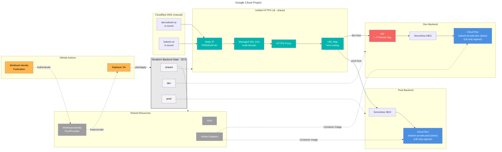
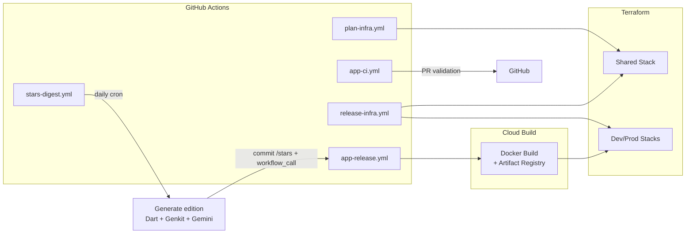

# koborin.ai


Technical proving ground for exploring AI, cloud architecture, and continuous learning.

Astro ( [](https://starlight.astro.build) ) runs on Cloud Run behind a global HTTPS load balancer, and the entire stack (app + infra) lives in this monorepo with TerraDart (Dart → Terraform).

## Architecture

Dev/Prod share the same HTTPS load balancer and Artifact Registry; only Cloud Run scaling/access policies differ.



> DNS is hosted in Cloudflare. Terraform does **not** manage DNS records; add/update `koborin.ai` / `dev.koborin.ai` A records manually whenever the load balancer IP changes.

### Environment matrix

| Layer | Dev (`dev.koborin.ai`) | Prod (`koborin.ai`) |
| --- | --- | --- |
| Runtime | Cloud Run (`koborin-ai-web-dev`) | Cloud Run (`koborin-ai-web-prod`) |
| Access | IAP allow list + `X-Robots-Tag: noindex` | Public (no IAP) |
| Ingress | `INGRESS_TRAFFIC_INTERNAL_LOAD_BALANCER` | `INGRESS_TRAFFIC_INTERNAL_LOAD_BALANCER` |
| Scaling | Min: 0, Max: 1 | Min: 0, Max: 10 |
| Env Vars | `NODE_ENV=development`, `NEXT_PUBLIC_ENV=dev` | `NODE_ENV=production`, `NEXT_PUBLIC_ENV=prod` |
| Content | Same MDX content (no env-specific filtering) | Same MDX content (no env-specific filtering) |
| Analytics | GA4 (debug view) + optional server events | GA4 + server events + Cloud Monitoring |

## CI/CD

Infrastructure and application deploys are each handled by dedicated GitHub Actions workflows using Workload Identity Federation.



| Workflow | Trigger | Purpose | Notes |
| --- | --- | --- | --- |
| `plan-infra.yml` | PRs touching infra | `dart analyze` + `terraform plan` for shared/dev/prod stacks | No apply; reviewers inspect plan output |
| `release-infra.yml` | `infra-v*` tags or manual dispatch | Applies shared/dev/prod stacks via Terraform | Workload Identity SA has infra IAM roles |
| `app-ci.yml` | PRs touching `app/` or `content/` | Runs Astro lint/typecheck/test/build | Blocks merges that break the app |
| `app-release.yml` | Merge to `main`, `app-v*` tags, or `workflow_call` | Builds + pushes Docker image (tag = `${GITHUB_SHA}-${GITHUB_RUN_ID}-${TARGET_ENV}`) and applies Terraform to update Cloud Run | Reusable via `workflow_call` (used by `stars-digest.yml`); Cloud Build runs asynchronously |
| `stars-digest.yml` | Daily cron (03:30 JST) or manual dispatch | Generates the `/stars` OSS newsletter, commits it, then deploys dev → prod | Calls `app-release.yml` via `workflow_call`; publishes a daily GitHub release |
| `claude.yml` | `@claude` mention in issues/PR comments/reviews | Runs Claude Code Action to respond in-thread | Reads CI results on PRs; gated on the mention string |

## Tech Stack

- **Frontend**: Astro with Starlight (documentation theme), TypeScript.
- **Content Management**: MDX stored under `app/src/content/docs/` within git. Frontmatter is validated via Zod schemas (from Starlight) to keep metadata type-safe. Drafts can be marked with `draft: true` in frontmatter.
- **Analytics & o11y**:
  - Google Analytics 4 for baseline PV/engagement.
  - Optional custom `/api/track` endpoint writing to Cloud Logging → BigQuery for privacy-friendly metrics.
  - Cloud Monitoring dashboards + alert policies for Cloud Run metrics.
- **Infrastructure**: TerraDart (Dart) targeting Google Cloud via Terraform.
- **Stars Digest**: Dart CLI built on Genkit (`genkit` + `genkit_vertexai`) that calls Gemini on Vertex AI to generate the daily `/stars` OSS newsletter. See [Stars Digest](#stars-digest).
- **CI/CD**: GitHub Actions with Workload Identity. `plan-infra.yml` / `release-infra.yml` drive infra, `app-ci.yml` / `app-release.yml` handle the Astro app, and `stars-digest.yml` runs the daily newsletter.
- **Testing**: Vitest for app tests, `dart analyze` for infra, Playwright for Mermaid rendering in production builds.
- **LLM Context**: Machine-readable `llms.txt` files for AI assistants. Auto-generated at build time.

## Stars Digest

`tools/stars-digest/` is a Dart package that generates the daily [`/stars`](https://koborin.ai/stars) personalized OSS newsletter. It reads the starred-repos data from a local clone of the private [`koborin-ai/stars`](https://github.com/koborin-ai/stars) repo, picks one main deep-dive plus up to five new arrivals, and writes structured Japanese prose via Gemini (on Vertex AI) through [Genkit](https://genkit.dev). A deterministic stub keeps `--dry-run` fully offline.

```bash
cd tools/stars-digest
dart pub get
dart run build_runner build

# Generate today's edition (Asia/Tokyo); needs GEMINI_API_KEY / GOOGLE_API_KEY
dart run bin/generate.dart --stars-dir <path/to/stars> --site-dir <repo-root>

# Offline dry-run (no Gemini call)
dart run bin/generate.dart --stars-dir <path/to/stars> --site-dir <repo-root> --dry-run
```

Each edition is written to `app/src/content/docs/stars/<YYYY-MM-DD>.md` and surfaced on the `/stars` index page and its RSS feed (`/stars/rss.xml`). The newsletter is personal, so `/stars` is excluded from search indexing (`noindex`, `robots.txt` Disallow, sitemap filter, and `pagefind: false`). In CI, `stars-digest.yml` runs the generator on a daily cron, commits the new edition, and deploys it through `app-release.yml`. For interactive prompt iteration, the Genkit Developer UI runs locally via `genkit start -o -- dart run bin/dev.dart` (details in `tools/stars-digest/README.md`).

## LLM Context Files (llms.txt)

The site provides structured context files for LLMs at `https://koborin.ai/llms.txt`.

| File | Content |
| --- | --- |
| `/llms.txt` | Index with links to all variants |
| `/llms-full.txt` | All English articles (full Markdown) |
| `/llms-ja-full.txt` | All Japanese articles (full Markdown) |
| `/llms-tech.txt` | English tech articles only |
| `/llms-ja-tech.txt` | Japanese tech articles only |
| `/llms-life.txt` | English life articles only |
| `/llms-ja-life.txt` | Japanese life articles only |

These files are **auto-generated** at build time from Content Collections. Articles with `draft: true` are excluded. No runtime overhead.

## Repository Layout

```text
.
├── .gcloudignore                  # Excludes files from Cloud Build upload
├── app/                           # Astro + Starlight application (Static, nginx)
│   ├── cloudbuild.yaml            # Cloud Build config for Docker build
│   ├── src/
│   │   ├── assets/               # Images organized by category
│   │   │   ├── _shared/          # Common assets (header logo)
│   │   │   ├── tech/             # Tech article images
│   │   │   ├── life/             # Life article images
│   │   │   └── og/               # Open Graph images
│   │   ├── content/
│   │   │   └── docs/             # MDX pages: tech/, life/, beats/, stars/, ja/ (Starlight)
│   │   ├── content.config.ts    # Content Collections schema (extends docsSchema)
│   │   ├── data/
│   │   │   └── beats.ts          # Beat catalog for /beats/
│   │   ├── utils/
│   │   │   └── llms.ts           # Shared logic for llms.txt generation
│   │   ├── pages/                # Astro endpoints (llms.txt, RSS, /stars/rss.xml)
│   │   └── styles/
│   │       └── custom.css        # Custom CSS overrides (logo sizing, etc.)
│   ├── public/
│   │   ├── audio/beats/          # Beat MP3s for on-site playback
│   │   ├── favicon.png           # Browser tab icon
│   │   ├── og/                   # Open Graph source images
│   │   └── robots.txt
│   ├── nginx/
│   │   └── nginx.conf            # nginx configuration for static serving
│   ├── Dockerfile                # Multi-stage build (node → nginx:alpine)
│   └── astro.config.mjs          # Starlight integration config
├── docs/                          # Architecture notes, contact-flow specs, etc.
├── infra/                         # TerraDart stacks (shared/dev/prod)
│   ├── bin/synth.dart            # Synth entry point → tf-out/<stack>/main.tf.json
│   ├── lib/                      # Stack definitions
│   │   ├── shared_stack.dart     # Shared resources (LB, APIs, WIF)
│   │   ├── dev_stack.dart        # Dev Cloud Run
│   │   └── prod_stack.dart       # Prod Cloud Run
│   └── pubspec.yaml              # TerraDart dependencies
├── tools/
│   └── stars-digest/              # Dart + Genkit CLI for the daily /stars newsletter
├── .github/workflows/             # CI pipelines (infra plan/apply, app deploy, stars digest, Claude)
├── README.md                      # This file
└── AGENTS.md                      # English operations guide for collaborators
```

### Brand Assets

| Asset | Location | Usage | Notes |
| --- | --- | --- | --- |
| Favicon | `app/public/favicon.png` | Browser tab icon | PNG format, transparent background recommended |
| Header Logo | `app/src/assets/_shared/koborin-ai-header-light.svg` / `-dark.svg` | Site header (replaces title text) | SVG, separate light/dark variants |
| Hero Image | `app/public/og/koborin-ai-hero.png` | Landing page hero section | 16:9 aspect ratio recommended |

Logo sizing is customized via `app/src/styles/custom.css` (`.site-title img` selector).

### Image Optimization (Automatic)

For performance, images are automatically converted to WebP format. **Authors can use PNG/JPEG normally** - optimization happens during build/deploy.

| Image Type | Location | What You Do | What Happens Automatically |
| --- | --- | --- | --- |
| OG images | `app/public/og/` | Place PNG/JPEG, reference as `.png` | CI converts to WebP, nginx serves WebP |
| Blog images | `app/src/assets/{category}/{article}/` | Place PNG/JPEG in article folder | Astro optimizes to WebP |

**Example workflow for OG images**:

1. Place image: `app/public/og/my-article.png`
2. Frontmatter: `ogImage: /og/my-article.png`
3. Article display: ``

That's it! The CI pipeline (`app/scripts/optimize-og-images.sh`) generates WebP versions, and nginx automatically serves them.

## Workflow Overview

1. **Infra changes**: edit TerraDart stacks → `dart analyze` → open PR → GitHub Actions runs `terraform plan` → reviewer approves → merge triggers apply on the right environment.
2. **App changes**: edit Astro/MDX → `npm run lint && npm run test && npm run typecheck && npm run check-images && npm run build` → PR triggers `app-ci.yml` → merge to `main` (or tag `app-v*`) triggers `app-release.yml` which builds the container, pushes to Artifact Registry, and applies the new image via Terraform.
3. **Content-only updates**: modify MDX under `app/src/content/docs/`, update frontmatter (`title`, `description`), run `npm run lint`, open PR. Mark drafts with `draft: true` in frontmatter to exclude from production builds.

### Adding New Content

To add a new article or page:

1. **Create MDX file** under `app/src/content/docs/` (or subdirectory for categories):

   ```bash
   # Single page
   app/src/content/docs/my-article.mdx

   # Categorized page
   app/src/content/docs/blog/my-post.mdx
   ```

2. **Add frontmatter** with required fields:

   ```yaml
   ---
   title: My Article Title
   description: Brief description of the article
   publishedAt: 2025-01-02
   ---
   ```

   - `publishedAt`: Set the publish date manually (YYYY-MM-DD format).
   - Updated date is automatically extracted from Git history at build time.

3. **Update sidebar** in `app/src/sidebar.ts`:

   ```typescript
   export const sidebar = [
     // ... existing items
     {
       label: "Blog",
       items: [
         { label: "My Post", slug: "blog/my-post" },
       ],
     },
   ];
   ```

4. **Build and test** locally before pushing.

## Release Strategy

- Infra applies use `infra-v*` tags to trigger `release-infra.yml`. Tag the repo after merging infra PRs even if app work is still ongoing; this ensures the latest load balancer/stateful resources are deployed before app images roll out.
- App deploys use `app-v*` tags to drive `app-release.yml`. Tagging after a successful `main` merge guarantees that the latest container image is built and the Cloud Run service is updated via Terraform.
- GitHub release notes are generated via `.github/release.yml`. Label each PR with `app`, `infra`, `feature`, `bug`, or `doc` so the notes stay segmented by domain; apply the `ignore` label to omit a PR entirely.

## Local Setup (once the app repo is initialized)

```bash
# Node.js >= 20, npm 10 recommended
npm install

# Run Astro dev server (app directory)
npm run dev --prefix app

# Analyze infrastructure (infra directory)
cd infra && dart analyze
```

## Infrastructure Dev Notes

- TerraDart stacks are located in `infra/lib/`.
- Synth emits Terraform JSON via `dart run bin/synth.dart <stack>`.
- Each stack uses a GCS backend at `gs://<BUCKET_NAME>/terraform/<stack>`.

### Shared Stack

- **API enablement**: Run, Compute, IAM, Artifact Registry, IAP, Monitoring, Logging, Certificate Manager.
- **Artifact Registry**: Container images repository (`koborin-ai-web`).
- **Global static IP**: PREMIUM tier for HTTPS load balancer.
- **Managed SSL Certificate**: Multi-domain (`koborin.ai`, `dev.koborin.ai`).
- **HTTPS Load Balancer**:
  - Serverless NEGs (dev/prod) referencing Cloud Run services by name.
  - Backend Services:
    - Dev: IAP enabled + `X-Robots-Tag: noindex, nofollow` header.
    - Prod: No IAP, logging enabled.
  - URL Map (host-based routing).
  - Target HTTPS Proxy.
  - Global Forwarding Rule.
- **Workload Identity Federation**:
  - Pool: `github-actions-pool`.
  - Provider: `actions-firebase-provider` (OIDC issuer: `https://token.actions.githubusercontent.com`).
  - Service Account: `github-actions-service@{project}.iam.gserviceaccount.com`.
  - IAM binding: Subject-based binding for repository `koborin-ai/site`.
  - Project IAM roles (Artifact Registry, Run, Compute, IAM, etc.) granted to the deployer service account.
- **DNS**: Records live in Cloudflare and are managed manually (A records point to the LB IP).

### Dev Stack

- **Cloud Run Service**: `koborin-ai-web-dev`.
  - Ingress: `INGRESS_TRAFFIC_INTERNAL_LOAD_BALANCER` (LB-only access).
  - Execution Environment: Gen2.
  - Environment Variables:
    - `NODE_ENV=development` (runtime mode).
    - `NEXT_PUBLIC_ENV=dev` (client-side environment identifier).
  - Scaling: Min 0, Max 1.

### Prod Stack

- **Cloud Run Service**: `koborin-ai-web-prod`.
  - Ingress: `INGRESS_TRAFFIC_INTERNAL_LOAD_BALANCER` (LB-only access).
  - Execution Environment: Gen2.
  - Environment Variables:
    - `NODE_ENV=production` (runtime mode).
    - `NEXT_PUBLIC_ENV=prod` (client-side environment identifier).
  - Scaling: Min 0, Max 10.

## Contact & Analytics Design (planned)

- Contact form will post to `/api/contact` (Astro API Route) with:
  - Payload validation (Zod), reCAPTCHA enforcement, structured logging to Cloud Logging.
  - Notification via SendGrid or Gmail API (configured via Secret Manager).
- `/api/track` endpoint will receive custom events and forward to Cloud Logging/BigQuery.
- GA4 integration via gtag.js (prod only, injected at build time via `PUBLIC_GA_MEASUREMENT_ID`).

## Environment Variables

| Variable | Purpose | Where to Set |
| --- | --- | --- |
| `GA_MEASUREMENT_ID` | GA4 Measurement ID (e.g., `G-XXXXXXXXXX`) | GitHub Secrets |
| `GISCUS_REPO_ID` | Giscus repository ID for the comments widget | GitHub Secrets |
| `GISCUS_CATEGORY_ID` | Giscus discussion category ID | GitHub Secrets |

`app-release.yml` writes these into `app/.env` at build time: `PUBLIC_GA_MEASUREMENT_ID` for **prod** builds only, and `PUBLIC_GISCUS_REPO_ID` / `PUBLIC_GISCUS_CATEGORY_ID` for both dev and prod. Separately, `stars-digest.yml` authenticates to Vertex AI via Workload Identity (`STARS_DIGEST_SERVICE_ACCOUNT`) to call Gemini — no API key is stored.

## Documentation

- `README.md`: quickstart + architectural highlights (this file).
- `AGENTS.md`: contribution workflow, review checklist, release rules, IaC philosophy.
