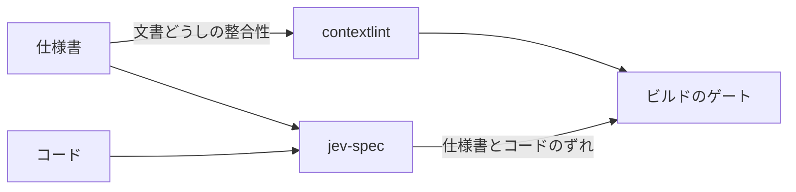

import RichLinkCard from '../../../../components/RichLinkCard.astro';
import SiteImage from '../../../../components/SiteImage.astro';
import jevSpecIntroductionOg from '../../../../assets/og/jev-spec-introduction.png';

<SiteImage src={jevSpecIntroductionOg} alt="jev-spec: Catch spec drift on every commit." variant="articleHeader" style="width: 100%; height: auto;" />

## AI がコードを速く書く現場で起きていること

半年ほど前に、Markdown ドキュメント間の整合性を静的解析する contextlint というリンターの [記事](/ja/tech/contextlint-introduction/) を書きました。仕様駆動開発（SDD）の現場では、要件や設計、受け入れ基準を Markdown に書き起こし、それを Cursor や Claude Code などの AI コーディングエージェントへの入力として渡す開発スタイルが定着しつつあります。

AI は驚くべき速度でコードを書き進めてくれます。しかしコードの生成速度が上がるほど、開発者が元の仕様書を読み返す機会は相対的に減っていきます。日々のレビューでは目先のコード差分や動作確認に意識が向きがちで、仕様書の一文一文と実装されたコードの振る舞いが一致しているかまでを常に確認し続けるのは困難です。その結果、仕様書とコードのあいだに誰も気づかないまま乖離が蓄積していきます。

`REQ-AUTH-02` という要件が存在し、書式が正しく、ドキュメント間で正しく参照されている。ここまでは静的解析で確認できます。しかし「`src/auth/session.ts` は今も `REQ-AUTH-02` のとおりに動くのか」は、文書の構文解析だけでは分かりません。

この問題に対処するため、現場では Cursor のスラッシュコマンドや Claude Code の Agent Skill を作成し、定期的にコードベースを巡回して仕様書との乖離を検知しようとする工夫も見られます。「このコードが仕様書の要件を満たしているか照合してほしい」とエージェントに依頼するアプローチです。

しかし、このアプローチを毎回のコミットで回すことには無理があります。巨大なコードと仕様書をプロンプトに詰め込んで汎用の LLM エージェントを走らせると、1 回の実行に数分単位の時間がかかり、トークン消費による費用もかさみます。あまりに遅く、あまりに高価であるため、毎回の `git commit` を遮る pre-commit フックに組み込むことはできません。結果として乖離の検知は「気が向いたときに走らせる重い調査」にとどまり、日々の開発の裏側で乖離が進行していくことになります。

「毎回のコミットで、コンマ数秒のうちに仕様書とコードの乖離を止められないか」。この課題意識から開発を始めたのが、今回紹介する OSS `jev-spec` です。

<RichLinkCard
  href="https://github.com/nozomi-koborinai/jev-spec"
  title="jev-spec"
  description="Catch spec drift on every commit: check your code against your Markdown specs with TypeSafe AI's Jev model."
/>

## 従来の LLM の限界と、Jev というアプローチ

コミットのたびに仕様書とコードを突き合わせるゲートを作ろうとしたとき、従来の LLM には構造的な壁が存在していました。

汎用の LLM は、トークンを 1 つずつ順番に生成していく自己回帰的なデコーディングを行います。JSON モードや Structured Outputs を使って出力スキーマを厳格に指定したとしても、モデルが内部で文字列をトークン単位で逐次デコードしている点に変わりはありません。この逐次デコーディングこそが、数秒から数十秒におよぶ待ち時間と、生成トークンごとの課金を生む根本的な原因です。ローカルの pre-commit で開発者の作業リズムを崩さないためには、検証は 1 秒未満で終わる必要があります。待ち時間が長く、実行のたびに課金が発生する仕組みを、毎回のコミットに挟むことはできません。

この制約に対して新しい切り口を提示したのが、TypeSafe AI が開発した Jev というモデルです。TypeSafe はこれを「System One モデル」と呼んでいます。

<RichLinkCard
  href="https://docs.typesafe.ai/concepts/system-one"
  title="System One - TypeSafe"
  description="System One models make fast, structured decisions for software. Jev is TypeSafe's flagship model and the first System One model."
/>

Jev の仕組みを正確に説明すると、自由形式の文章を自己回帰的に逐次生成するデコーディングを行いません。その代わりに、与えられた共有コンテキスト（仕様書とコード）を一度の評価で直接推論し、型付けされた決定プリミティブ（確からしさを表す確率やスコア）を出力します。

文章の逐次生成を行わないため、出力トークンの待ち時間がなく、出力トークンに対する課金もありません。入力トークン費用も 100 万トークンあたり $0.042 と極めて低価格に抑えられており、応答時間はわずか 70〜400ms 程度で完了します。

Jev には 3 つの決定プリミティブが備わっています。

- **`noul`（真偽判定）** — Yes か No で答えられる命題に対し、真である確率を 0 から 1 の数値で返す
- **`choice`（カテゴリ分類）** — 宣言された排他的な選択肢（たとえば `compliant`、`vulnerable`、`inconclusive` など）に対する離散確率分布を返す
- **`score`（順序評価）** — 未実装から本番水準までといった段階的な評価尺度に対して、期待スコアと各段階の確率を返す

ここでいう確率には、統計用語でいう「較正（calibration：キャリブレーション）」が施されています。少し馴染みがない言葉かもしれませんが、要するに「モデルが 80% の確率と言ったときは、本当に約 80% の割合で正解になるよう、数値の目盛りが調整されている」という意味です（天気予報で『降水確率 80%』と言われた日が 100 日あったら、そのうち約 80 日は実際に雨が降る、という感覚です）。

Jev の答えは最初から信頼できる数値として得られるため、自然言語のパース処理を挟む必要がありません。得られた確率をしきい値（たとえば `minProbability: 0.85`）と比較するだけで、確定的な合否判定を下せます。

:::note
jev-spec は個人で開発している独立したオープンソースのプロジェクトです。TypeSafe AI とは提携しておらず、公認も受けていません。Jev の性質や価格についての記述は、2026 年 9 月時点の公式ドキュメントに基づいています。
:::

## 広がる可能性と、jev-spec の着想

ここで触れておきたいのは、Jev は仕様書の検証のためだけに作られたモデルではないという点です。

X（旧 Twitter）のコミュニティを見渡すと、開発者たちはこの超高速かつ安価な決定プリミティブを活用し、これまでのソフトウェア開発では難しかった新しい体験を試行錯誤しています。

象徴的な例が、Marcus Lowe 氏が公開したスマートクリップボードのデモです。クリップボードにコピーされた氏名や連絡先といったテキストの内容を瞬時に判別し、対応する入力フィールドへとミリ秒単位でルーティングする、新しい UI/UX を提示していました。ほかにも、テトリスのようなゲームロジックの高速な意思決定、ブロックチェーン上で 1 ブロックごとに取引可否を判断する高頻度オンチェーントレード、画面の要素判定を高速に繰り返すブラウザ自動化など、多彩な応用例が投稿されています。

文章をだらだらと生成させるのではなく、高速に、安価に、型安全な判断だけを下す。この特性は、これまで LLM の待ち時間とコストのせいで実現できなかった、まったく新しいソフトウェアの相互作用を可能にします。エンジニアとして、この技術の流れには素直な興奮を覚えます。

そして、この Jev の特性に触れたとき、Markdown ドキュメントの静的解析ツール contextlint を作ってきた私の頭にひとつの発想が浮かびました。

「この高速な決定プリミティブがあれば、毎回の git commit でコードが仕様を満たしているか判定できるのではないか」

jev-spec は、コミュニティで広がる Jev の多様な可能性のなかから、仕様駆動開発の課題に向けて生まれたひとつの形です。

## jev-spec の仕組み

jev-spec が行っている処理の流れは次の 4 つです。

1. **仕様書を読む** — Markdown の仕様書から、見出しやタグ、要件 ID に基づいて必要な部分を抽出する
2. **コードを読む** — その要件を実装しているソースコードを読み込む
3. **問う** — 要件ごとに焦点を絞った問い（Rubric）を Jev に投げる。Jev は仕様書とコードを一度の評価で直接推論し、すべての問いに対して並列に確率を返す
4. **比べる** — 返ってきた確率をしきい値（Assertion）と比較し、1 つでも違反があれば検証エラー（チェック失敗）としてビルドを止める

jev-spec の設定ファイルは TypeScript で記述します。言語処理系には、新しい Go 製コンパイラによって高速なコンパイルと厳密な型安全性を実現した **TypeScript 7** を採用しています。さらに実行ランタイムとして、Node.js（22 以上）と Bun の双方を公式にサポートするデュアルランタイム構成をとっています。

設定では、仕様書の範囲とそれを実装するコードの組を `targets` という DSL の中に定義します。

```typescript
import { defineConfig, noul } from 'jev-spec';

export default defineConfig({
  client: { model: 'jev-1.13.0' },
  targets: {
    auth: {
      specPath: 'docs/specs/auth-requirements.md',
      codePaths: ['src/auth/**/*.ts', '!src/auth/**/*.test.ts'],
      rubrics: {
        'REQ-AUTH-01': noul(
          'Is the signature of a session token checked before access to a protected resource is granted?'
        ),
        'REQ-AUTH-02': noul('Is a token rejected when its ID is on the revocation list?'),
      },
      assertions: {
        'REQ-AUTH-01': { minProbability: 0.85 },
        'REQ-AUTH-02': { minProbability: 0.85 },
      },
    },
  },
});
```

問いを **Rubric**、しきい値との比較を **Assertion** と呼びます。仕様書の合否判定では真偽判定を行う `noul` が中心になりますが、DSL では選択肢を判定する `choice` や段階評価の `score` も使えます。

使いどころは pre-commit フックと CI です。`npx jev-spec check --staged`（または `bunx jev-spec check --staged`）を pre-commit で実行すると、Git のステージング差分に関係するターゲットだけが自動的に選択され、ローカルのコミット作業を遮らない軽快な速度で判定が完了します。差分に関係のないターゲットは `SKIPPED` になります。

実行時のレポート表示は以下のようになります。

```text
$ npx jev-spec check

=== jev-spec Check Report ===

Target: auth [✖ FAILED]
  Spec files: docs/specs/auth-requirements.md
  Code files: src/auth/session.ts
  Model: jev-1.13.0
    ✔ REQ-AUTH-01: probability: 0.97
    ✖ REQ-AUTH-02: probability: 0.08
       └─ Violation: Probability 0.08 is below minimum threshold 0.85

Overall: ✖ CHECKS FAILED

$ echo $?
1
```

Rubric の名前に要件 ID を割り当てておくことで、不合格のときに「どの要件がずれたのか」がそのままレポートに表示されます。

## 実測で確かめたこと

確率で答えるモデルをビルドゲートに置くにあたり、コスト・再現性・不安の 3 つについて、自分自身の仕様書（`docs/specs/`）を持つ jev-spec のリポジトリで実測を行いました。以下の数値はすべて 2026 年 9 月 21 日に `jev-1.13.0` に対して計測した結果です。

### コストの実測

リポジトリ全体を対象に 8 つのターゲット、合計 22 個の問いすべてをチェックした場合でも、所要時間は約 4 秒で完了しました。1 ターゲットあたりにかかる時間は 0.3〜0.9 秒程度です。CLI の起動そのものは Node.js で約 0.1 秒、Bun ではさらに高速で、所要時間の大半は API との通信時間でした。

レポートに出力された見積もりコストは、1 回の実行あたり約 $0.0006 でした。リポジトリ全体をプロンプトに詰め込むのではなく、ターゲットごとに必要な仕様書の抜粋と数ファイルのコードだけを送り、Jev が一度の評価ですべての問いにまとめて答えるため、コミットごとに実行しても気になる金額にはなりません。

### 再現性とモデル固定

同じコードに対して同じ問いを 5 回繰り返したとき、正しいコードに対する確信度のばらつきは 0.00〜0.03 の範囲内に収まりました。0.96 が 0.95 になる程度の揺らぎであり、設定ファイルで指定した 0.85 という例示のしきい値（minProbability）を割り込むことはありませんでした。

一方で、仕様を満たさないコードに対する確率が 0.33〜0.72 と大きく揺れた問いもありました。しきい値のすぐ近くにある問い（0.82〜0.86 を行き来した例など）は、実行のたびに合否が反転するリスクがあります。

この結果から決めた運用方針が 2 つあります。ひとつは、yes を期待する問いは 0.85 以上、no を期待する問いは 0.3 以下のように、答えが安定している領域にしきい値を寄せて設定すること（0.85 という値は固定のハードコードではなく、要件の性質に応じて設定ファイルで調整する値です）。もうひとつは、仕様を満たす正常なコードと、仕様に反する変更を加えたコードを明確に切り分けられない問いは、ゲートに入れないことです。

また、モデルの暗黙的な更新による結果の変動を防ぐため、設定の `client.model` にバージョン付きの ID（`jev-1.13.0` など）を指定できるようにし、レポートにも実際に判定したモデル名を必ず明記するようにしています。

### 不安を解消するプローブ

「確率モデルの判定をゲートにして本当に見逃しはないのか」という不安に対しては、あえて仕様を満たさない変更を加えた差分を用意して検知できるかを確かめる「プローブ（Probe）」という仕組みで向き合いました。

要件ごとに、その要件の挙動から意図的に外した小さなパッチを用意します。たとえば「チェック違反時はエラーとして終了する」という要件に対するプローブは以下の差分です。

```diff
-    return result.passed ? 0 : 1;
+    return 0;
```

`npm run probes` を実行すると、正常なコードとパッチを当てたコードの双方に対してチェックが走り、正常な状態では合格し、仕様から意図的に外したコードでは確実に不合格になることを検証します。合格しかしない問いは、何も確かめていないのと同じだからです。

実測の結果、用意した 22 個のプローブすべて（22/22）を検出できました。以下はその抜粋です。

| 要件 | 正常なコード | 仕様に反する変更を加えたコード | 結果 |
| :--- | :--- | :--- | :--- |
| REQ-EXIT-02 | 0.92 | 0.17 | 検出 |
| REQ-RUN-01 | 0.96 | 0.09 | 検出 |
| REQ-CONFIG-01 | 0.97 | 0.55 | 検出 |
| REQ-CONFIG-04 | 0.98 | 0.57 | 検出 |
| REQ-GIT-01 | 0.04 | 0.92 | 検出 |
| REQ-PATH-03 | 0.07 | 0.95 | 検出 |

下の 2 つは「してはいけないこと」を問う形のため、正しいコードでの確率が低くなります。全件の記録は [docs/probe-results.md](https://github.com/nozomi-koborinai/jev-spec/blob/main/docs/probe-results.md) にあります。

この 22/22 という結果は、モデル全体の精度を示すベンチマークではありません。自分のリポジトリの要件に対し、仕様に反する変更を見逃さないようになるまで問い（Rubric）の表現を調整した経験的な検証結果です。重要なのは数字そのものではなく、「この問いなら仕様から外れたコードを捉えられる」と確かめておくこと、そしてモデルのバージョンを更新するときに同じ検証をやり直せる点にあります。

### 問いの書き方で学んだこと

実際の API で検証を進める中で、Rubric の書き方によって精度に大きな差が出ることが分かりました。

- **要件の言い直しではなく、仕組みを直接問う** — 要件文をそのまま反復すると、モデルはそれを主張として受け取って yes に傾きやすくなります。コードの具体的な挙動を直接問う形にすることで、正常なコードと仕様に反する変更を加えたコードの確率差が明確に開きます
- **要件 ID は問いに入れず、Rubric の名前に持たせる** — 問いの中に「Does the code satisfy REQ-PATH-01:」のように ID を含めると、仕様を満たさないコードへの判定が甘くなる現象が見られました。ID はモデルに送信されない Rubric の名前に記述します
- **どの部分のコードかを名指しする** — 似た関数が複数あるファイルでは、「glob パターンを解決する関数で」のように対象の場所を特定して問うことで、正答率が大きく向上しました
- **ターゲットを小さく保つ** — 無関係なファイルを含めないことで、仕様から外れたコードに対する検知精度が高まります

## ドッグフーディングで見つかったずれ

自分の仕様書を書き、自分自身を Jev でチェックするドッグフーディングを行う中で、単なるユニットテストでは見えてこなかった興味深いずれが浮き彫りになりました。

### テストがオールグリーンでも潜む開発者の盲点

日々の開発において、ユニットテストを丁寧に書き、CI がすべてグリーンで通過している状態は大きな安心感を与えてくれます。しかし、テストコードそのものも開発者の理解や前提に基づいて書かれている以上、開発者自身の思い込みや盲点までは防げません。

jev-spec 自身の英語仕様書とコードを突き合わせたとき、すべてのテストを通過していたにもかかわらず、「仕様書が約束している振る舞いをコードが満たしきれていない」という微妙な不一致がいくつか見つかりました。

たとえば、エラー発生時の例外処理や終了処理の契約において、仕様書では一貫した挙動を定めていたはずが、実装コードの一部では暗黙的な例外伝播に依存していたり、過去のリファクタリングで使われなくなった遺産コードが残っていたことで、仕様の意図をすり抜けうる状態になっていました。

「テストが通っているから大丈夫」と過信していた部分に対し、仕様書に書かれた明確な英語の要件とコードを客観的に照合したことで、開発者の盲点となっていた仕様との乖離に気づくことができました。

### 差分実行（--staged）の誤検知とコンテキストの重要性

もうひとつの大きな教訓は、Git のステージング差分を検証する `--staged` の設計で得られました。

初期の実装では、判定を少しでも高速化し、入力トークンを切り詰めるために、変更された行の周辺差分（ハンク）だけをモデルに渡す設計をとっていました。しかし、コメントを 1 行修正しただけのコミットで pre-commit を走らせたところ、関連する要件の判定が不合格になるという誤検知（False Alarm）に見舞われました。同じコードでも、ファイル全体をコンテキストとして渡せば高い確信度で合格する問いです。

原因は明白でした。コードの意味的な整合性を判定するためには、変更された行そのものだけでなく、そのコードが呼び出している周辺ロジックやファイル全体のコンテキストが不可欠だったのです。局所的な差分だけを切り取ると、モデルの視点からは「仕様を満たすロジックが存在しない」ように見えてしまいます。

この失敗から設計を根本的に見直しました。差分情報（`--staged`）の役割は「どのターゲットが変更の影響を受けたかを特定するセレクター」に限定し、選択されたターゲットの検証にはファイル全体のコンテキストを渡すアーキテクチャへと改めました。意味の合致を評価する上では、局所的な差分ではなく完全なコンテキストを渡すことこそが精度の鍵であるという、仕様駆動開発の実践における本質的な学びでした。

### 仕様駆動開発のリアルな手触り

仕様書を「書いて終わり」のドキュメントにせず、コードと常に同期し続ける生きた契約として保ち続ける。ドッグフーディングを通じて実感したのは、決定モデルが開発者の「仕様に対する誠実さ」を無理なく支えてくれる感覚でした。

AI によってコードの生成速度が加速する今だからこそ、テストコードのグリーンさに甘えることなく、仕様書という本来の設計思想に立ち戻って整合性を確信できること。これこそが、日々の開発において得られる最も心強い手触りです。

## 静的解析と決定モデルの役割分担・おわりに

jev-spec を実戦で運用するにあたっては、その限界も把握しておく必要があります。

- **証明ではなくチェックであること** — 合格は確率がしきい値を超えたことを意味し、数学的な正しさの証明ではありません。そのため道具内の用語も verify ではなく check に統一しています
- **英語での記述が最も正確であること** — Jev の主な学習言語は英語です。[日本語を含む CJK 言語も扱えますが、英語と同等の精度ではありません](https://docs.typesafe.ai/models#language-support)。仕様書や問いは英語で記述することを推奨します
- **コード内の自己主張コメントに影響されうること** — 「この関数は要件を満たしている」といった自己主張的なコメントがあると、モデルの判断が引っ張られる可能性があります
- **厳密な計算や日時の比較は不得手であること** — 数値のカウントや日時の比較、多段の論理推論を要する確認はモデルへの問いから外し、通常のユニットテストで担保します
- **仕様書のみの変更では差分実行が反応しないこと** — ターゲットの選択はコードの差分に基づくため、CI では差分実行だけでなくリポジトリ全体の検証を定期的に走らせる運用が推奨されます

静的解析ツール contextlint と、意味検証エンジン jev-spec の役割分担を整理すると、次のようになります。

| | contextlint | jev-spec |
| :--- | :--- | :--- |
| 検証対象 | 文書どうしの整合性 | 仕様書とコードの一致 |
| アプローチ | 構文木とルールによる静的解析 | 決定モデルへの問いと確率のしきい値判定 |
| 結果 | 決定的（Deterministic） | 確率的（モデル固定とプローブで担保） |
| AI への依存 | なし | あり（TypeSafe AI の Jev） |



機械的に決まるものは静的解析で検証し、意味の合致は決定モデルで評価し、その問いの妥当性はプローブでテストする。

AI がコードを高速に書き出す時代だからこそ、コードと仕様書の乖離を放置せず、開発のリズムを損なわない速度で守り続ける仕組みが求められています。

jev-spec は生まれたばかりのオープンソースですが、仕様書を Markdown で管理し、コードとの乖離をどう防ぐか悩んでいる方は、ぜひ試してみてください。設定を書けば、`npx jev-spec check --dry-run` は API キーなしですぐに動作確認できます。

<RichLinkCard
  href="https://www.npmjs.com/package/jev-spec"
  title="jev-spec - npm"
  description="Catch spec drift on every commit: check your code against your Markdown specs with TypeSafe AI's Jev model."
/>

<RichLinkCard
  href="/ja/tech/contextlint-introduction/"
  title="Markdown ドキュメント間の整合性を静的解析する contextlint というリンターを作っている話"
  description="前の記事：SDD で直面した Markdown の整合性課題を解決するルールベースリンター contextlint の紹介"
/>
