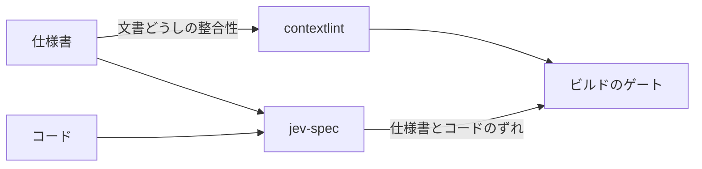

import RichLinkCard from '../../../../components/RichLinkCard.astro';
import SiteImage from '../../../../components/SiteImage.astro';
import jevSpecIntroductionOg from '../../../../assets/og/jev-spec-introduction.png';

<SiteImage src={jevSpecIntroductionOg} alt="jev-spec: Catch spec drift on every commit." variant="articleHeader" style="width: 100%; height: auto;" />

## はじめに

半年ほど前に、Markdown ドキュメント間の整合性を静的解析する contextlint というリンターの [記事](/ja/tech/contextlint-introduction/) を書きました。仕様駆動開発（SDD）では、要件や仕様を書いた Markdown が、AI がコードを書くときの入力になります。文書どうしの整合性が壊れていれば、生成されるコードにも影響が出ます。contextlint はそこを守るための道具です。

ただ、文書どうしの整合性が取れていても、まだ確かめられていない場所が残っています。仕様書と、そこから実装されたコードのあいだです。

`REQ-AUTH-02` という要件が存在して、書式が正しく、正しい場所から参照されている。ここまでは静的解析で分かります。でも「`src/auth/session.ts` は今も `REQ-AUTH-02` のとおりに動くのか」は分かりません。AI がコードを書く速度が上がるほど、人が仕様書を読み返す機会は相対的に減っていきます。仕様書とコードは、誰も気づかないうちに少しずつずれていきます。

このずれをコミットのたびに検出したくて、jev-spec という道具を作っています。

<RichLinkCard
  href="https://github.com/nozomi-koborinai/jev-spec"
  title="jev-spec"
  description="Catch spec drift on every commit: check your code against your Markdown specs with TypeSafe AI's Jev model."
/>

この記事では jev-spec を紹介しますが、その前に、正直に向き合っておきたいことがあります。jev-spec は AI のモデルに問いを投げて、返ってきた確率で合否を決めます。そして私は前の記事で、検証に LLM は向かないと書いています。

## 前の記事で書いたこと

contextlint の記事には「なぜ LLM ではなく静的解析か」という節があり、理由を 3 つ挙げました。

- **コスト** — 対象のファイルをすべてコンテキストに入れる必要があり、文書が増えるほど遅く、高くなる
- **再現性** — LLM の出力にはランダム性があり、Yes/No で判定できる問題に確率的な答えは向かない
- **不安** — 「たぶん大丈夫です」と返されても、結局は自分で確認しないと安心できない

この 3 つは、今も正しいと思っています。必須カラムがあるか、ID が重複していないか、リンク先のファイルが存在するか。条件さえ決まれば機械的に判定できるものを、モデルに問う理由はありません。contextlint はこれからも、AI に依存しない静的解析のままです。

## それでもモデルに問う理由

では、なぜ jev-spec はモデルに問うのか。静的解析では判定できないことを確かめたいからです。

たとえば「セッショントークンの署名は、保護されたリソースへのアクセスを許可する前に検証される」という要件があったとします。コードがこの一文のとおりになっているかを、構文木やパターンマッチで判定する方法を、私は知りません。関数名も変数名も実装の仕方も、書く人によって、あるいは書く AI によって変わるからです。人がコードレビューで見ているのはまさにここで、意味が一致しているかを読んで判断しています。

つまり、2 つの道具は守る場所が違います。



機械的に決まるものは静的解析に任せ、意味を読まないと決まらないものだけをモデルに問う。この分担なら、前の記事の主張とはぶつかりません。

ただし、モデルに問う以上、前の記事で挙げた 3 つの懸念はそのまま jev-spec に向きます。分担を説明しただけでは答えになっていないので、記事の後半で 1 つずつ実測で確かめます。

## Jev は文章を生成しないモデル

jev-spec が問いを投げる相手は、汎用のチャット用 LLM ではなく、TypeSafe AI の Jev というモデルです。TypeSafe はこれを System One モデルと呼んでいます。

<RichLinkCard
  href="https://docs.typesafe.ai/concepts/system-one"
  title="System One - TypeSafe"
  description="System One models make fast, structured decisions for software. Jev is TypeSafe's flagship model and the first System One model."
/>

公式の説明によれば、System One モデルは LLM と同じように自然言語を理解しますが、文章は生成しません。一般的な LLM のようにトークンを 1 つずつ生成する（自己回帰的なテキストデコーディングを行う）のではなく、仕様書とコードを一度に直接評価し、型付けされた判定プリミティブの較正された確率を出力します。

Jev には 3 つの判定プリミティブが用意されています。

- **`noul`（真偽判定）** — Yes か No で答えられる命題に対して、真である確率を 0 から 1 の数値で返す
- **`choice`（離散選択）** — あらかじめ宣言した排他的な選択肢（たとえば `compliant`、`vulnerable`、`inconclusive` など）に対する確率分布を返す
- **`score`（順序尺度）** — 未実装から本番品質までといった段階的な評価尺度に対して、期待スコアを返す

この性質は、ビルドのゲートに使う立場からすると都合がよいものです。汎用の LLM に「このコードは要件を満たしていますか」と聞くと、返ってくるのは文章です。それをパースする必要があり、答えの形は実行のたびに変わり、生成されたトークンの分だけ料金がかかります。Jev の答えは最初から数値なので、しきい値と比べるだけで済みます。仕様書とコードを一度に直接評価するため、複数の問いがあっても並列に判定され、問いが増えてもコンマ数秒（70〜400ms 程度）で高速に応答します。文章生成を行わないため出力トークンの費用もかからず、実行コストはほぼゼロに近い金額で済みます（[価格の一覧](https://docs.typesafe.ai/models)）。

ここで断っておくと、「Jev は LLM ではないから、前の記事の懸念は当てはまらない」と言うつもりはありません。Jev も自然言語を読んで確率で答えるモデルで、答えが常に正しい保証はありません。TypeSafe 自身も、確率の較正（calibration）は予測の集まりに対して測る統計的な性質であり、個々の答えの正しさを保証するものではないと書いています。数学的に較正された確率が返ってくるからこそ確定的なしきい値（`minProbability: 0.85` など）と比較できるのですが、個別の問いが期待どおりに動くかどうかは、自分の手で測る必要がありました。

:::note
jev-spec は私が個人で開発している独立したオープンソースのプロジェクトです。TypeSafe AI とは提携しておらず、公認も受けていません。Jev の性質や価格についての記述は、2026 年 9 月時点の公式ドキュメントに基づいています。
:::

## jev-spec の仕組み

やっていることは 4 つです。

1. **仕様書を読む** — Markdown の仕様書から、見出しやタグ、要件 ID で必要な部分だけを抜き出す
2. **コードを読む** — その要件を実装しているファイルを読む
3. **問う** — 要件ごとに焦点を絞った問い（Rubric）を Jev に投げる。Jev は仕様書とコードを一度に直接評価し、すべての問いに並列で確率を返す
4. **比べる** — 確率をしきい値と比べ、1 つでも違反があれば終了コード 1 で終わる

jev-spec の設定は TypeScript で書きます（TypeScript 7 対応）。ランタイムは Node.js（22 以上）と Bun の両方を公式にサポートするデュアルランタイム構成です。

設定では、仕様書の範囲とそれを実装するコードの組を **ターゲット** と呼び、`targets` という DSL の中に定義します。

```typescript
import { defineConfig, noul } from 'jev-spec';

export default defineConfig({
  client: { model: 'jev-1.13.0' },
  targets: {
    auth: {
      specPath: 'docs/specs/auth-requirements.md',
      codePaths: ['src/auth/**/*.ts', '!src/auth/**/*.test.ts'],
      rubrics: {
        'REQ-AUTH-01': noul(
          'Is the signature of a session token checked before access to a protected resource is granted?'
        ),
        'REQ-AUTH-02': noul('Is a token rejected when its ID is on the revocation list?'),
      },
      assertions: {
        'REQ-AUTH-01': { minProbability: 0.85 },
        'REQ-AUTH-02': { minProbability: 0.85 },
      },
    },
  },
});
```

問いを **Rubric**、しきい値との比較を **Assertion** と呼んでいます。仕様書の合否判定では真偽判定を行う `noul` が中心になりますが、DSL では選択肢を判定する `choice` や段階評価の `score` も使えます。実行すると、要件ごとの確率と合否が出ます（レイアウトは実物、確率は説明用の値です）。

```text
$ npx jev-spec check

=== jev-spec Check Report ===

Target: auth [✖ FAILED]
  Spec files: docs/specs/auth-requirements.md
  Code files: src/auth/session.ts
  Model: jev-1.13.0
    ✔ REQ-AUTH-01: probability: 0.97
    ✖ REQ-AUTH-02: probability: 0.08
       └─ Violation: Probability 0.08 is below minimum threshold 0.85

Overall: ✖ CHECKS FAILED

$ echo $?
1
```

Rubric の名前を要件 ID にしておくと、不合格のときに「どの要件がずれたのか」がそのままレポートに出ます。

使いどころは pre-commit フックと CI です。`--staged` や `--diff` を付けた実行（差分実行）では、変更が触れたターゲットだけをチェックし、触れていないターゲットは `SKIPPED` になります。細かい使い方は [README](https://github.com/nozomi-koborinai/jev-spec#readme) に書いてあります。

## 3 つの懸念を実測で確かめる

ここからが本題です。jev-spec は自分自身の仕様書（`docs/specs/`）を持っていて、自分のコードを自分でチェックしています。以下の数字はすべて、このリポジトリで 2026 年 9 月 21 日に `jev-1.13.0` に対して測ったものです。

### コスト

差分に絞らずリポジトリ全体を対象にすべてのターゲットをチェックした場合でも、jev-spec 自身に対する実行（8 ターゲット・22 個の問い）は 4 秒未満でした。jev-spec がレポートに出す見積もりでは、1 回あたり約 $0.0006 です。1 ターゲットにかかる時間は 0.3〜0.9 秒でした。CLI の起動そのものは Node で約 0.1 秒、Bun ではさらに高速で、全体の所要時間のほとんどはリクエストが占めています。

前の記事で心配したのは、文書が増えるほどトークンが膨らむことでした。jev-spec はターゲットごとに仕様書の抜粋とコード（1〜3 ファイル程度）を 1 回だけ送り、Jev が一度の直接評価ですべての問いにまとめて答えます。リポジトリ全体をコンテキストに抱え込むことも、問いごとにモデル呼び出しを繰り返すこともありません。コミットのたびに回しても、気になる金額にはなりませんでした。

### 再現性

同じコードに同じ問いを 5 回繰り返したとき、正しいコードに対する自信のある答えの幅は 0.00〜0.03 でした。0.96 が 0.95 になる程度の揺れで、しきい値の 0.85 をまたぐことはありません。

一方で、中間の値は不安定でした。壊したコードへの答えが 0.33〜0.72 と、幅 0.4 で揺れた問いもあります。しきい値のすぐ近くにいる問いは、実行のたびに合否が入れ替わります（0.82〜0.86 を行き来した例がありました）。

ここから決めたことが 2 つあります。ひとつは、しきい値を、答えが安定している「正しいコードの側」に寄せて置くこと。yes を期待する問いは 0.85 以上、no を期待する問いは 0.3 以下を合格にしました。もうひとつは、無傷のコードと壊したコードをはっきり分けられない問いは、ゲートに入れないことです。

再現性にはもうひとつ、モデルのバージョンの固定が効きます。何も指定しないと `jev-latest` という別名に問い合わせることになり、この別名は新しいモデルが出るたびに移動します。リポジトリに何の変更もないのに結果が変わってしまうのを防ぐため、`client.model` にバージョン付きの ID を指定できるようにし、レポートには実際に答えたモデルを必ず表示するようにしています。

静的解析のように「同じ入力なら常に同じ結果」にはなりません。それでも、正しいコードへの答えがしきい値から十分に離れている問いだけをゲートに使えば、正しいコードが理由もなく落ちることは避けられます。壊したコードの側は揺れが大きいので、見逃しが起きないとまでは言えません。ここは次の「不安」の話に続きます。

### 不安

「たぶん大丈夫です」への不安に対して私が出した答えは、わざと壊して確かめることです。

要件ごとに、その要件だけを破る小さなパッチを用意しました。私はこれをプローブと呼んでいます。たとえば「違反があれば終了コード 1 で終わる」という要件のプローブは、これだけです。

```diff
-    return result.passed ? 0 : 1;
+    return 0;
```

`npm run probes` は、無傷のコードと、パッチを当てたコピーの両方をチェックします。無傷なら合格し、壊したら不合格になる。この 2 つが揃った問いだけが、ゲートに入る資格を持ちます。合格しかしない問いは、何も確かめていないのと同じだからです。

結果は、22 個のうち 22 個の検出でした。一部を抜粋します。

| 要件 | 無傷のコード | 壊したコード | 結果 |
| :--- | :--- | :--- | :--- |
| REQ-EXIT-02 | 0.92 | 0.17 | 検出 |
| REQ-RUN-01 | 0.96 | 0.09 | 検出 |
| REQ-CONFIG-01 | 0.97 | 0.55 | 検出 |
| REQ-CONFIG-04 | 0.98 | 0.57 | 検出 |
| REQ-GIT-01 | 0.04 | 0.92 | 検出 |
| REQ-PATH-03 | 0.07 | 0.95 | 検出 |

下の 2 つは「してはいけないこと」を問う形なので、正しいコードの答えが低くなります。全件は [docs/probe-results.md](https://github.com/nozomi-koborinai/jev-spec/blob/main/docs/probe-results.md) にあります。

念のために書くと、この 22/22 はモデルの精度のベンチマークではありません。私のリポジトリの、英語で書いた 22 個の要件に対して、検出できるようになるまで問いの書き方を直した結果です。意味があるのは数字そのものではなく、「この問いは壊れたコードを見逃さない」と要件ごとに確かめてあること、そしてモデルのバージョンを上げるときに同じ確認をやり直せることだと考えています。

## 実 API で初めて回して分かったこと

自分自身の仕様書に対して、実際の API で体系的に確かめ始めたとき、最初の結果は期待外れでした。

当時の問いは、要件をそのまま言い直す形をしていました。

```text
Does the code satisfy REQ-PATH-01: a path is accepted only when its real path,
with symbolic links resolved, lies inside the project root, and any other path
is rejected with an error?
```

この形で 20 個のプローブを回すと、検出できたのは 14 個でした。4 個は壊したコードにも 0.86〜0.94 で「yes」と答え、2 個は無傷のコードなのに不合格（0.64 と 0.75）でした。

問いの書き方を変えながら測り直して、分かったことが 4 つあります。

### 要件の言い直しではなく、仕組みを直接問う

要件文を問いの中で繰り返すと、モデルはそれを主張として読み、yes に寄ります。REQ-PATH-01 の場合、言い直しの形では無傷のコードが 0.63〜0.68、壊したコードが 0.47〜0.54 で、ほとんど差がつきませんでした。コードの仕組みを字義どおりに問う形に変えると、0.96 対 0.44〜0.47 まで開きました。

```text
Does the asynchronous function that resolves a path with realpath throw an error
when the resolved path lies outside the project root?
```

### 要件 ID は問いに入れず、Rubric の名前に持たせる

同じ直接の問いでも、頭に「Does the code satisfy REQ-PATH-01:」を付けるだけで、壊したコードへの答えが 0.71〜0.80 まで上がってしまいました。末尾に「(REQ-PATH-01)」と添えるだけでも 0.53〜0.64 です。Rubric の名前はモデルに送られないので、ID はそちらに書くことにしました。

### どの部分のコードかを名指しする

似た関数が 2 つあるファイルでは、名指しのない問いは 0.85 対 0.78 で、区別がつきませんでした。「ファイルシステムに対して glob パターンを解決する関数で」と場所を示すと、0.98 対 0.32〜0.44 になりました。

### ターゲットを小さくする

無関係なファイルを 1 つ外すだけで、壊したコードへの答えが 0.68〜0.80 から 0.56〜0.64 に下がりました。TypeSafe のドキュメントにも、[無関係な内容が多いと精度が落ちる](https://docs.typesafe.ai/model-jaggedness/jev-1.13) とあります。

そして、どう書いても確かめられなかった要件が 3 つ残りました。値を関数の中で追いかける必要があるもの、正規表現が何を受け入れるかに依存するもの、ある関数に渡すリストが別のリストと入れ替わっていないかというものです。これらはモデルへの問いから外して、テストで固定しました。仕様書の側では別のファイルに分けて置き、テスト名に要件 ID を入れて繋いでいます。

モデルに問えることと問えないことの境界を、要件ごとに自分で引く。地味ですが、これが「たぶん大丈夫です」をゲートに変える作業の中身でした。

## 自分自身をチェックして見つけたずれ

自分の仕様書を書いて自分をチェックすると、実際にずれが見つかりました。

### 予期しないエラーの終了コード

仕様書には「実行できなかったときは、どんなエラーでも終了コード 2 で終わる」と書きました。ところがコードは、使い方の誤り以外のエラーを再スローしていて、Node の既定の終了コード 1 で終わっていました。jev-spec にとって 1 は「チェックに不合格」の意味なので、CI は内部エラーを仕様違反と取り違えることになります。要件を一文で書いたことで気づいたずれです。

### どこからも使われていないエラークラス

実 API での最初の実行で、「捕まえたエラーはすべて終了コード 2 になるか」という問いの答えが 0.78 と、自信の低いままでした。原因を探すと、どこからも投げられていないエラークラスが残っていて、それが終了コード 1 を返せる作りになっていました。削除すると 0.97 に上がりました。モデルの自信のなさが、死んだコードを指していたことになります。

### 差分実行の誤検知

`--staged` は当初、変更された行の周辺だけをモデルに送っていました。コメントを 1 行変えただけのコミットでこれを回すと、終了コードに関する 4 つの問いが 0.49〜0.64 で、すべて不合格になりました。ファイル全体を送れば 0.92〜0.97 で合格する問いです。問いの対象のコードが、送った断片に入っていなかったのが原因でした。

README で勧めていた pre-commit フックが、この形では使い物にならなかったわけです。そこで設計を見直し、差分は「どのターゲットをチェックするか」を選ぶためだけに使い、選ばれたターゲットについてはファイル全体を送るようにしました。

3 つとも、テストは通っていました。仕様書に書いた一文とコードを突き合わせて、初めて見えたものです。

## 限界

使う前に知っておいてほしいことも書いておきます。

- **証明ではなくチェック** — 合格は「確率がしきい値を超えた」という意味で、正しさの保証ではありません。道具の中の用語も verify ではなく check に統一しました
- **英語が最も正確** — TypeSafe のドキュメントによれば、Jev の主な学習言語は英語で、[日本語を含む CJK の言語は扱えるものの、精度は同等ではありません](https://docs.typesafe.ai/models#language-support)。私は仕様書を英語で書いています。日本語の仕様書で使う場合は、自分の文書でしきい値を調整してからゲートにしてください
- **コードの中の主張が答えを動かしうる** — 「この関数は要件を満たしている」と書かれたコメントのように、自分の分類を主張する内容は答えを動かしうると、TypeSafe は [既知の弱点](https://docs.typesafe.ai/model-jaggedness/jev-1.13#adversarial-content) に挙げています。私の実験でも、古い説明コメントが残っていて検出できなかった例と、残っていても検出できた例の両方がありました
- **数えること、日時の比較、多段の推論は苦手** — 要件と問いは、これらを避けて書きます
- **仕様書だけを変えたコミットでは、差分実行は何も選ばない** — ターゲットを選ぶのはコードの変更だけです。そのため、CI では差分実行に限定せず、リポジトリ全体のすべてのターゲットを検証し続ける運用を推奨します

## おわりに

2 つの道具の分担をまとめると、こうなります。

| | contextlint | jev-spec |
| :--- | :--- | :--- |
| 確かめるもの | 文書と文書の整合性 | 仕様書とコードの一致 |
| 方法 | ルールによる静的解析 | モデルへの問いと、確率に対するしきい値 |
| 結果 | 決定的 | 確率的（モデルのバージョンを固定し、壊して確かめる） |
| AI への依存 | なし | あり（TypeSafe AI の Jev） |

機械的に決まるものは静的解析に、意味を読まないと決まらないものはモデルに。そしてモデルに任せた部分は、壊して確かめる。

前の記事で書いた「検証に LLM は向かない」を撤回するつもりはありません。ただ、その先に「では、向かないものをどうすれば使えるようになるのか」という続きがあった、というのが今の実感です。

始めたばかりの道具で、自分のリポジトリ以外での実績はまだありません。仕様書を Markdown で管理していて、コードとのずれが気になっている方は、試してみてください。README の Quickstart に沿って設定を書けば、`npx jev-spec check --dry-run` は API キーなしで動きます。

<RichLinkCard
  href="https://www.npmjs.com/package/jev-spec"
  title="jev-spec - npm"
  description="Catch spec drift on every commit: check your code against your Markdown specs with TypeSafe AI's Jev model."
/>

<RichLinkCard
  href="/ja/tech/contextlint-introduction/"
  title="Markdown ドキュメント間の整合性を静的解析する contextlint というリンターを作っている話"
  description="前の記事：SDD で直面した Markdown の整合性課題を解決するルールベースリンター contextlint の紹介"
/>
