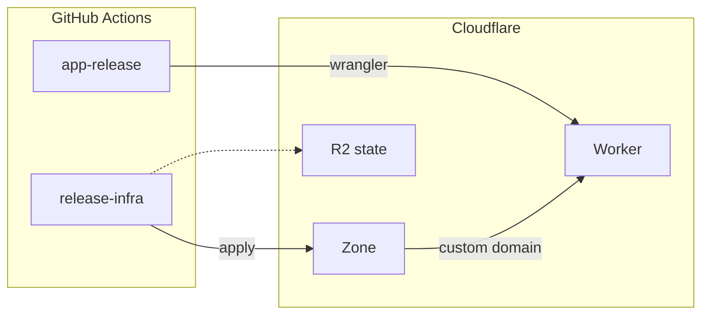
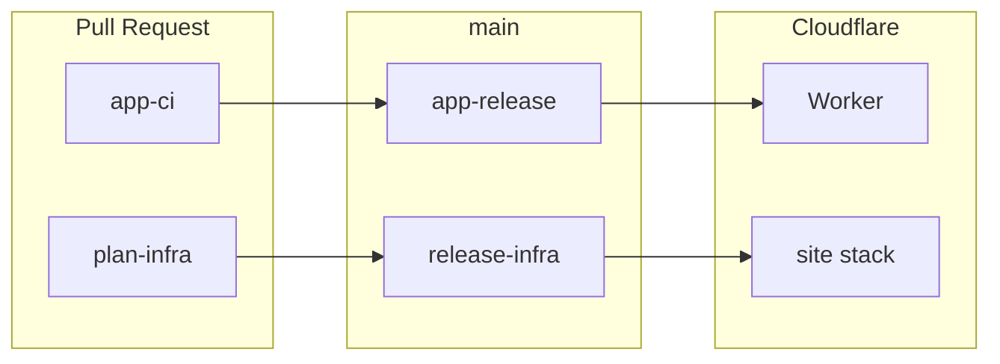

import RichLinkCard from '../../../../components/RichLinkCard.astro';
import SiteImage from '../../../../components/SiteImage.astro';
import koborinAiArchitectureOg from '../../../../assets/og/koborin-ai-architecture.png';

<SiteImage src={koborinAiArchitectureOg} alt="og" variant="articleHeader" style="width: 100%; height: auto;" />

このサイト [koborin.ai](https://koborin.ai) は、自身の技術メモや思考を発信するための個人サイト (Technical Garden) です。

この記事では、サイト全体のアーキテクチャと設計思想を紹介します。インフラとフロントエンドの両面から、なぜこの構成を選んだのかを説明していきます。

最初の公開構成は Google Cloud でした。Cloud Run の前にグローバル HTTPS ロードバランサを置き、`dev.koborin.ai` は IAP で守っていました。このサイトは記事を出す場所であり、GCP の構成を試す場所ではないので、配信は Cloudflare Workers に移し、このサイト用の GCP はやめました。

---

## 全体アーキテクチャ



### 図中の用語

| Abbreviation | Full Name | Description |
| --- | --- | --- |
| Worker | [Cloudflare Workers](https://developers.cloudflare.com/workers/) | 静的な Astro サイトをエッジで配信する |
| Custom domain | [Workers custom domains](https://developers.cloudflare.com/workers/configuration/routing/custom-domains/) | `koborin.ai` を Worker に付け、DNS と証明書を管理する |
| R2 | [Cloudflare R2](https://developers.cloudflare.com/r2/) | Terraform state を置く S3 互換ストレージ |
| Wrangler | [Wrangler](https://developers.cloudflare.com/workers/wrangler/) | Astro の `dist/` を上げる CLI |

### ポイント

- **リクエストパス**: `koborin.ai` → Cloudflare のカスタムドメイン → Worker の静的アセット
- **公開ホストは 1 つ**: `koborin.ai` だけ。`dev.koborin.ai` も IAP もない
- **デプロイの分担**: アプリ更新は `wrangler deploy`。DNS とカスタムドメインは TerraDart の `terraform apply`
- **CI の認証**: GitHub Secrets の Cloudflare API トークン。このサイトに WIF は使わない

---

## 設計思想

### インフラ設計

#### 公開ホストは本番だけ

下書きの確認は今もしたい。それは `npm run dev` の localhost で足りる。公開用の 2 つ目のホストは要らない。

個人サイトに、2 つ目の Cloud Run、ロードバランサ、IAP は不要だった。Worker とカスタムドメインが 1 組あれば足りる。

#### アプリの deploy とインフラの apply は分ける

Worker のファイルは Terraform では上げない。`wrangler deploy` が `app/dist` を公開する。TerraDart はホスト名を付けることと、R2 上の state だけを持つ。

コンテンツのデプロイが DNS を書き換えず、インフラの apply がサイトファイルを上書きしない。

#### IaC の経緯

このサイトの IaC は CDK for Terraform から始まり、Pulumi Go、Google Cloud 上の TerraDart と移ってきた。ツールの問題というより、配信先を変えた。

<RichLinkCard
  href="https://github.com/hashicorp/terraform-cdk"
  title="hashicorp/terraform-cdk: Define infrastructure resources using programming languages"
  description="CDK for Terraform (CDKTF) allows you to define infrastructure using familiar programming languages."
/>

CDKTF は 2025 年 12 月 10 日にアーカイブされた。そのあと Pulumi Go に移し、さらに TerraDart にして、インフラコードを Dart のまま Terraform に出す形にした。

いまのスタックは TerraDart のルートモジュール `site` だけである。

### フロントエンド設計

#### 独自 API / DB は不要

個人サイトとして、次の要件を考えました。

- 技術メモや思考を Markdown (MDX) で書いて公開する
- 動的なデータ取得やユーザー認証は不要
- 運用はできるだけ単純にする

この要件なら、**独自の API サーバやデータベースは不要**です。静的生成で足ります。

#### GitHub を CMS にする

エンジニアなので、WordPress や Notion のような CMS は要りません。**MDX を GitHub リポジトリで直接管理する**だけで足ります。

- 記事の作成と編集は Git でバージョン管理できる
- PR でレビューとプレビューができる
- CI/CD がビルドとデプロイをする

別途データベースを持たなくてよくなり、運用コストが下がります。

#### Starlight の採用

フレームワーク選定では [genkit.dev](https://genkit.dev) の構成を参考にしました。genkit.dev は Starlight を使い、ドキュメントサイトとして整った UX を出しています。

<RichLinkCard href="https://starlight.astro.build/" title="Starlight" description="Build beautiful, accessible, high-performance documentation websites with Astro." />

Starlight を選んだ理由は次です。

- **Astro ベース**: 静的生成に特化していて性能が良い
- **多言語**: 英語と日本語の両方を出せる
- **ドキュメント向け機能**: サイドバー、検索、ダークモードが最初からある
- **MDX**: Markdown の中で React コンポーネントを使える

---

## リクエストパス

### 1. DNS（Cloudflare）

ゾーン `koborin.ai` はもともと Cloudflare にありました。TerraDart はゾーンを名前で引きます。ゾーンは作らず、MX や GitHub 検証用 TXT も管理しません。

Workers のカスタムドメインが `koborin.ai` を Worker `koborin-ai-web` に付けます。証明書とプロキシされた DNS レコードは Cloudflare 側が作ります。

### 2. Worker の静的アセット

Astro は静的サイト（`output: "static"`）としてビルドします。Wrangler が `dist/` を [Workers static assets](https://developers.cloudflare.com/workers/static-assets/) として上げます。Worker の JavaScript `main` もなく、nginx コンテナもありません。

---

## サイト機能

### llms.txt

このサイトでは、`/llms.txt` で LLM 向けのコンテキストファイルを提供しています。

| ファイル | 内容 |
| --- | --- |
| `/llms.txt` | 全バリアントへのリンク一覧 |
| `/llms-full.txt` | 英語記事すべて (Markdown 本文込み) |
| `/llms-ja-full.txt` | 日本語記事すべて (Markdown 本文込み) |
| `/llms-tech.txt`, `/llms-ja-tech.txt` | Tech カテゴリのみ |
| `/llms-life.txt`, `/llms-ja-life.txt` | Life カテゴリのみ |

```text
# koborin.ai
> Personal site + technical garden.

## Full (with article content)
- https://koborin.ai/llms-full.txt
- https://koborin.ai/llms-ja-full.txt

## By Category

### Tech
- https://koborin.ai/llms-tech.txt
- https://koborin.ai/llms-ja-tech.txt

### Life
- https://koborin.ai/llms-life.txt
- https://koborin.ai/llms-ja-life.txt
```

OSS プロジェクトの `llms.txt` は、「プロジェクトの概要や使い方を LLM に理解してもらう」という目的で公開されていることが多いです。
これはとても有用で、LLM がライブラリやフレームワークを正しく扱うためのコンテキストを提供しています。

個人サイトの場合は、また別の使い方ができると考えています。
自分の思考や技術メモが蓄積されていく（少なくとも現時点ではその想定。。続けたい。。笑）ので、将来「過去に自分が何を考えていたか」を LLM に参照してもらうような場面で役立つと考えています。

そういった可能性を見据えて、記事本文を含む形式で公開しています。

### Engagement Features

記事ページには、読者とのエンゲージメントを促進する機能を実装しています。

#### Giscus（コメント）

[Giscus](https://giscus.app) は、GitHub Discussions をバックエンドとしたコメントシステムです。

- 読者は GitHub アカウントでログインしてコメントやリアクションが可能
- コメントは GitHub Discussions に保存されるため、別途データベース不要
- サイトのダークモード/ライトモードに自動追従

#### Share Buttons（シェア）

記事を SNS でシェアするためのボタンを用意しています：

- X（旧 Twitter）
- Bluesky
- Mastodon
- はてなブックマーク
- リンクコピー

これらの機能は、**frontmatter に `publishedAt` がある記事ページのみ**に表示されます。インデックスページや一般的なドキュメントページには表示されません。

---

## CI/CD



### App のデプロイ

| トリガー | ワークフロー | 処理内容 |
| --- | --- | --- |
| PR 時 | `app-ci.yml` | lint / typecheck / test / build の検証 |
| main マージ時 | `app-release.yml` | `npm run build` のあと `wrangler deploy` |
| `app-v*` タグ | `app-release.yml` | 本番 Worker への同じデプロイ |

### Infra のデプロイ

| トリガー | ワークフロー | 処理内容 |
| --- | --- | --- |
| PR 時 | `plan-infra.yml` | `site` スタックの `dart analyze` と `terraform plan` |
| main マージまたは `infra-v*` | `release-infra.yml` | `site` スタックの `terraform apply` |

認証は `CLOUDFLARE_API_TOKEN` です。Terraform state は R2 バケット `koborin-ai-tfstate` に置きます。

### 変更タイプによる CI の最適化

このサイトでは、PR の変更内容に応じて CI の実行範囲を調整する仕組みを導入しています。

この考え方は、t-wada さんが [開発生産性カンファレンス 2025](https://dev-productivity-con.findy-code.io/2025#special-sessions) で紹介されていた **Behavior Change（振る舞いの変更）** と **Structure Change（構造の変更）** の区別を参考にしています。

<RichLinkCard href="https://www.oreilly.com/library/view/tidy-first/9781098151232/" title="Tidy First?: A Personal Exercise in Empirical Software Design" description="By Kent Beck. Messy code is a nuisance. Tidying code, to make it more readable, requires breaking it up into manageable sections." />

元ネタは Kent Beck の著書 "Tidy First?" で、コードの変更を「振る舞いの変更」と「構造の変更」に分けて考えることで、レビューの負荷を下げ、変更の意図を明確にするというアプローチです。

#### 別案件での経験

以前、会社の別の案件でフルスタック開発をした際にも、AI エージェント向けのガードレールの 1 つとして Playwright で E2E テストを構築したことがあります。

そのプロジェクトでも `app` と `infra` を分離しており、`app/` 配下のコードが変更されたら CI を実行するというルールにしていました。
しかし、E2E テストを CI に組み込んだ結果、**実行時間が 13 分**にまで膨らみ、CI がとてつもないボトルネックとなってしまいました。

問題は、UI に影響がないとわかりきっている変更（例えばモデルのフィールド追加やリファクタリング）でも、毎回フル E2E テストが走ってしまっていたことです。
**変更の性質に応じてテスト範囲を絞るべきだった**、という学びを得ました。

#### ラベルによる分岐

この経験を踏まえ、koborin.ai ではパスの判定（リリースノート用の PR ラベル）によって CI の実行ステップを分岐させています。

| ラベル | 意味 | CI の挙動 |
| --- | --- | --- |
| `change:behavior` | 振る舞いの変更（UI/出力/設定が変わる） | フルチェック（lint + build + audit） |
| `change:structure` | 構造の変更（リファクタ/フォーマット） | 軽量チェック（lint のみ） |

デフォルトは `behavior`（フルチェック）です。構造だけの diff では `npm audit` と `npm run build` を飛ばします。

#### AI エージェント向けの明文化

この変更タイプの区別は、AI エージェントが PR を作成する際にも活用しています。

`AGENTS.md` に定義を書いておくことで、AI が変更内容を見て適切なラベルを判断できるようにしています。

- **Behavior Change**: `app/src/content/docs/` 配下のコンテンツ変更、`astro.config.mjs` や `wrangler.jsonc` の変更、TerraDart スタックの変更
- **Structure Change**: `README.md` や `AGENTS.md` の更新、コメントのみの変更、リファクタリング

---

## 実装詳細

### site スタック

<RichLinkCard href="https://github.com/koborin-ai/site/tree/main/infra" title="site/infra" description="TerraDart site stack for koborin.ai." />

`infra/lib/site_stack.dart` はゾーン `koborin.ai` を引き、Worker `koborin-ai-web` をカスタムドメインとして付けます。synth は Terraform JSON を `tf-out/site/` に出します。GitHub Actions がそれを R2 の state に対して apply します。

`data.cloudflare_zone` と `cloudflare_workers_custom_domain` は、このリポジトリの薄いラッパーです。`terradart_cloudflare` 自体は直していません。

### App

<RichLinkCard href="https://github.com/koborin-ai/site/tree/main/app" title="site/app at main · koborin-ai/site" description="Astro + Starlight application for koborin.ai." />

`app/wrangler.jsonc` は Worker 名 `koborin-ai-web` と `assets.directory` の `./dist` を持ちます。`main` も `routes` もありません。`npm run deploy` が `wrangler deploy` を呼びます。

Astro と Starlight はこれまでどおりです。英語の `root` と `ja`、サイドバーは `app/src/sidebar.ts`、Head / Header / Sidebar はカスタムコンポーネントです。

---

## まとめ

- **単純な構成**: 公開ホストは Cloudflare Workers 上の 1 つ
- **フロントエンド**: API / DB なし、GitHub を CMS に、Starlight で構築
- **デプロイの分担**: サイトは wrangler、カスタムドメインは TerraDart
- **Behavior / Structure**: 変更の性質に応じて CI の範囲を変える
- **サイト機能**: llms.txt と Engagement Features（Giscus、シェアボタン）

## koborin.ai 開発リポジトリ

<RichLinkCard href="https://github.com/koborin-ai/site" title="site" description="Personal site and technical garden for koborin.ai." />
