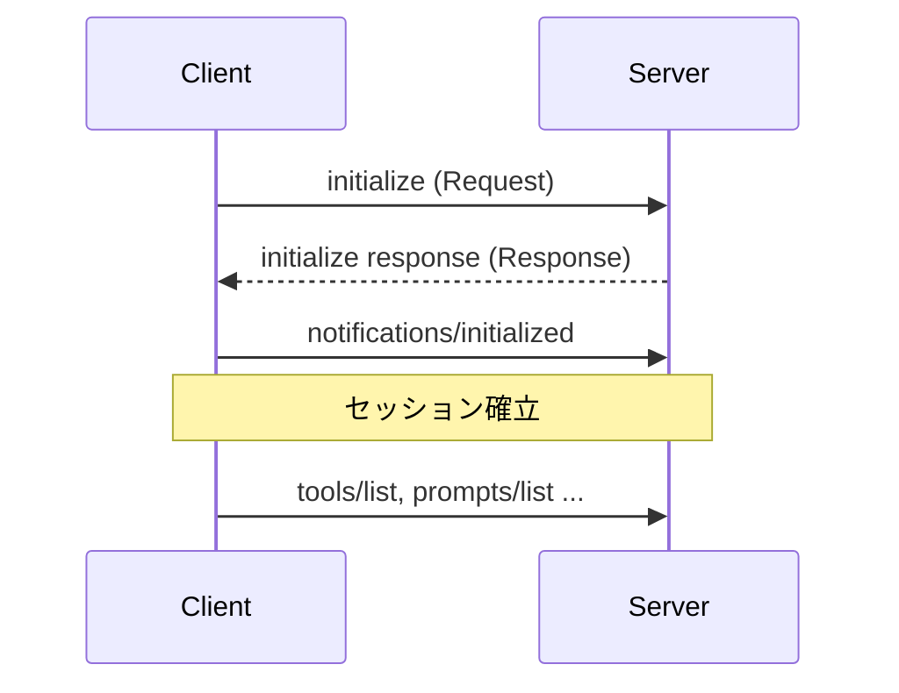
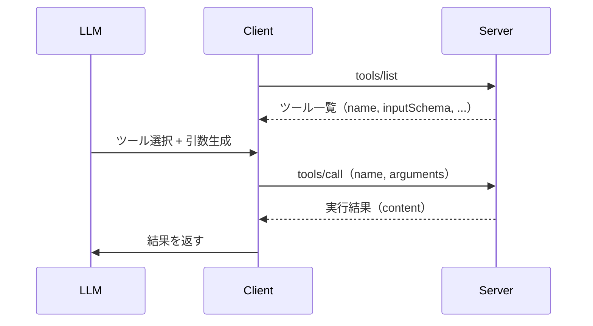
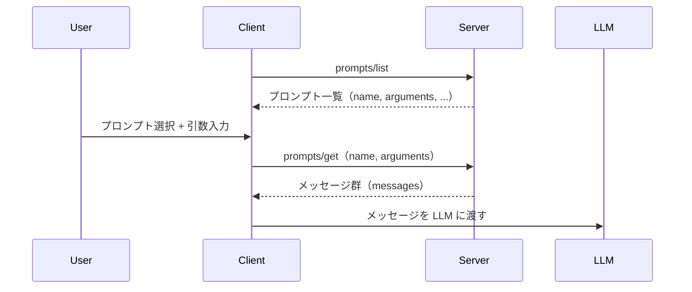
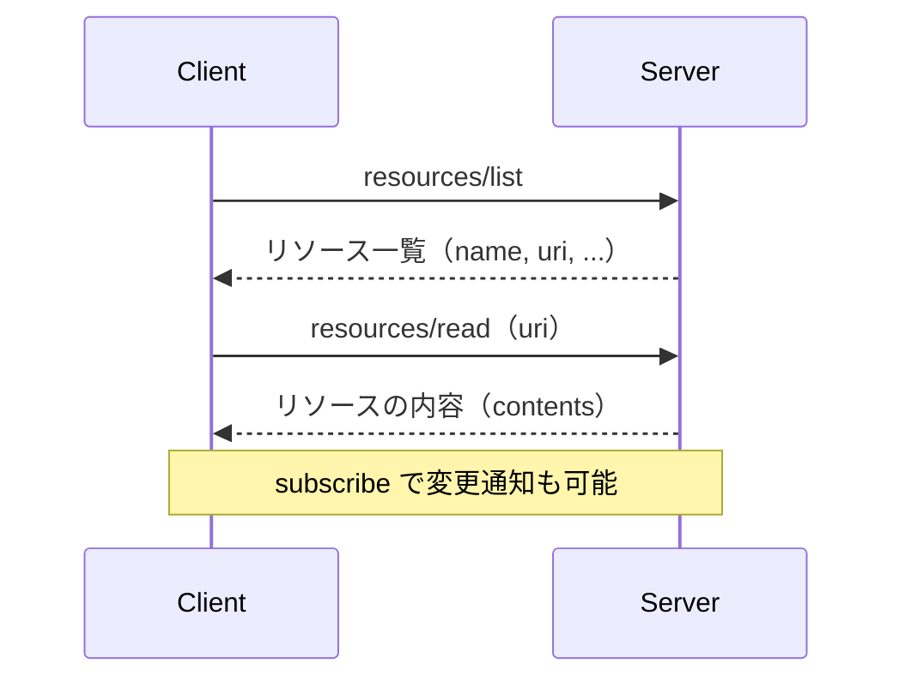
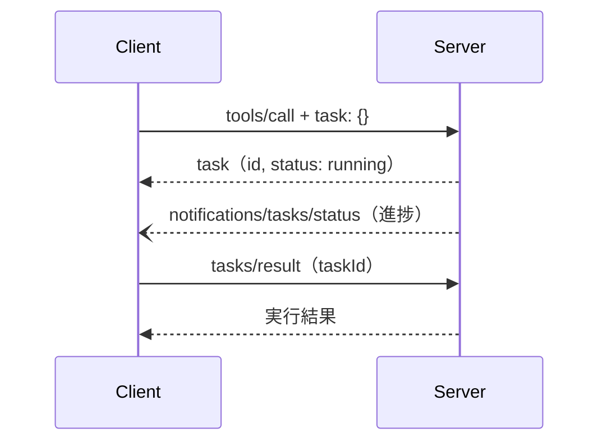
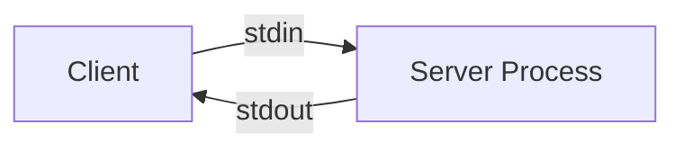
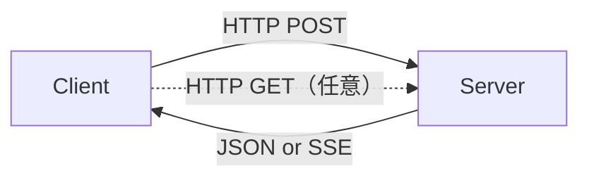

import RichLinkCard from '../../../../components/RichLinkCard.astro';


## はじめに

[Genkit](https://genkit.dev/) は Google が開発する AI アプリケーション開発フレームワークです。

TypeScript と Go は GA で、[Dart 版](https://github.com/genkit-ai/genkit-dart) は 2026 年 2 月時点で Preview として開発が進んでいます。

私は Genkit for Dart の開発に携わっており、フル SDK 化の一環として MCP (Model Context Protocol) プラグインの実装を担当しました。

もともと [Genkit for Go の MCP パッケージ](https://pkg.go.dev/github.com/firebase/genkit/go/plugins/mcp) を使って [gcp-cost-mcp-server](https://github.com/nozomi-koborinai/gcp-cost-mcp-server) や [ableton-osc-mcp](https://github.com/nozomi-koborinai/ableton-osc-mcp) といった MCP サーバーの OSS を公開しており、MCP は「使う側」として馴染みがありました。
しかし、Genkit for Dart にも TypeScript/Go と同等の MCP のサポートが必要となり、今度は「プロトコルを組み込む側」として MCP と向き合うことになりました。

<RichLinkCard
  href="https://github.com/genkit-ai/genkit-dart/pull/94"
  title="feat: add MCP (Model Context Protocol) plugin"
  description="Add genkit_mcp package — MCP integration for Genkit for Dart. Implements the MCP specification (2025-11-25)."
/>

この記事では、MCP プラグインを実装する過程で理解した Model Context Protocol のプロトコル仕様について共有します。
MCP Server を日常的に使っているけれど、裏側の仕組みは知らないというエンジニアの方に向けた内容です。

## MCP のプロトコルバージョン

MCP プラグインの実装でまず向き合うことになったのが、どのバージョンの [仕様](https://modelcontextprotocol.io/specification) に準拠するかという判断です。

MCP の仕様は semver ではなく `YYYY-MM-DD` 形式の日付でバージョン管理されています。バージョンごとに利用可能な機能が異なり、2024 年 11 月の初版から数ヶ月のペースで更新が続いています。

| バージョン | 主な変更 |
| --- | --- |
| [2024-11-05](https://modelcontextprotocol.io/specification/2024-11-05) | 初版。JSON-RPC 2.0、Tools / Prompts / Resources、[stdio / HTTP+SSE](https://modelcontextprotocol.io/specification/2024-11-05/basic/transports) トランスポート |
| [2025-03-26](https://modelcontextprotocol.io/specification/2025-03-26) | [Streamable HTTP](https://modelcontextprotocol.io/specification/2025-03-26/basic/transports#streamable-http) トランスポート、[OAuth 2.1](https://modelcontextprotocol.io/specification/2025-03-26/basic/authorization) 認可フレームワーク（[Changelog](https://modelcontextprotocol.io/specification/2025-03-26/changelog)） |
| [2025-06-18](https://modelcontextprotocol.io/specification/2025-06-18) | [Elicitation](https://modelcontextprotocol.io/specification/2025-06-18/client/elicitation)、[Resource Links](https://modelcontextprotocol.io/specification/2025-06-18/server/tools#resource-links)、[構造化ツール出力](https://modelcontextprotocol.io/specification/2025-06-18/server/tools#structured-content)（[Changelog](https://modelcontextprotocol.io/specification/2025-06-18/changelog)） |
| [2025-11-25](https://modelcontextprotocol.io/specification/2025-11-25) | [Tasks](https://modelcontextprotocol.io/specification/2025-11-25/basic/utilities/tasks)、[OAuth Client ID Metadata Documents](https://modelcontextprotocol.io/specification/2025-11-25/basic/authorization#oauth-client-id-metadata-documents)、JSON Schema 2020-12 デフォルト化（[Changelog](https://modelcontextprotocol.io/specification/2025-11-25/changelog)） |

Cursor、Claude Desktop、Claude Code、Windsurf、Antigravity といった MCP 対応ツールは、それぞれクライアントとしてこの仕様を実装しています。

サーバー側も同様です。接続時に `protocolVersion` を交換して、互いが対応可能なバージョンで合意します（仕様: [Lifecycle / Version Negotiation](https://modelcontextprotocol.io/specification/2025-11-25/basic/lifecycle#version-negotiation)）。クライアントが要求したバージョンにサーバーが対応していなければ、サーバーは自身が対応する別のバージョンを返し、クライアントがそのバージョンを受け入れるかどうかを判断します（この仕組みは後述します）。

今回の Genkit for Dart MCP プラグインでは、最新の [2025-11-25](https://modelcontextprotocol.io/specification/2025-11-25) 版に準拠しました。
なお、[OAuth 2.1 認可フロー](https://modelcontextprotocol.io/specification/2025-11-25/basic/authorization) については今回のスコープ外としています。

## MCP の通信基盤：JSON-RPC 2.0

MCP のすべての通信は [JSON-RPC 2.0](https://www.jsonrpc.org/specification) 上で行われます。

JSON-RPC 2.0 は、JSON でエンコードされたリモートプロシージャコールのための軽量プロトコルです。

クライアントとサーバーが JSON のメッセージをやり取りして処理を呼び出す、というシンプルな仕組みで、MCP ではこのメッセージを以下の 3 種類に分けて使います。

- **Request**: `id`, `method` を持つ（`params` は任意）。レスポンスを期待するメッセージ
- **Response**: `id` と `result` または `error` を持つ。リクエストに対する応答
- **Notification**: `method` を持つ（`params` は任意）が `id` がない。レスポンスを期待しない一方向のメッセージ

MCP セッションの開始は、必ず Initialize ハンドシェイクから始まります。



Client が `initialize` リクエストを送り、Server がレスポンスで応答した後、Client が `notifications/initialized` 通知を送ることでセッションが確立します。

Genkit for Dart の MCP プラグインでは、クライアント側の `_initialize()` メソッドがこの一連のハンドシェイクを担っています。

```dart
// Client: initialize ハンドシェイク（mcp_client.dart）
Future<void> _initialize() async {
  // 1. initialize リクエストを送信
  final result = await _sendRequest('initialize', {
    'protocolVersion': '2025-11-25',
    'capabilities': _clientCapabilities(),
    'clientInfo': {
      'name': options.name,
      'version': options.version ?? '1.0.0',
    },
  });

  // 2. Server のレスポンスから情報を取得
  final serverInfo = asMap(result['serverInfo']);
  if (options.serverName == null && serverInfo['name'] is String) {
    _serverName = serverInfo['name'] as String;
  }

  // 3. HTTP トランスポートの場合、合意したバージョンをヘッダーに設定
  final negotiatedVersion = result['protocolVersion'];
  if (negotiatedVersion is String &&
      _transport is StreamableHttpClientTransport) {
    (_transport as StreamableHttpClientTransport).setProtocolVersion(
      negotiatedVersion,
    );
  }

  // 4. notifications/initialized を送信してセッション確立
  await _sendNotification('notifications/initialized', {});
}
```

サーバー側は `handleRequest()` の中で `initialize` リクエストを受け取り、自身の `protocolVersion`・`capabilities`・`serverInfo` を返します。

```dart
// Server: initialize リクエストの処理（mcp_server.dart）
case 'initialize':
  return _respond(id, {
    'protocolVersion': '2025-11-25',
    'capabilities': _serverCapabilities(),
    'serverInfo': {
      'name': options.name,
      'version': options.version ?? '1.0.0',
    },
  });
case 'notifications/initialized':
  return null; // Notification なのでレスポンス不要
```

このコードが実際にやり取りする JSON は次のようになります。

**Client → Server（initialize リクエスト）：**

```json
{
  "jsonrpc": "2.0",
  "id": 1,
  "method": "initialize",
  "params": {
    "protocolVersion": "2025-11-25",
    "capabilities": {
      "roots": { "listChanged": true }
    },
    "clientInfo": {
      "name": "my-client",
      "version": "1.0.0"
    }
  }
}
```

**Server → Client（initialize レスポンス）：**

```json
{
  "jsonrpc": "2.0",
  "id": 1,
  "result": {
    "protocolVersion": "2025-11-25",
    "capabilities": {
      "tools": { "listChanged": true },
      "prompts": { "listChanged": true },
      "resources": { "listChanged": true, "subscribe": true },
      "logging": {},
      "tasks": { "cancel": {}, "list": {} }
    },
    "serverInfo": {
      "name": "my-server",
      "version": "0.1.0"
    }
  }
}
```

ここからは `protocolVersion` と `capabilities` を順に見ていきます。

`protocolVersion` は、`initialize` ハンドシェイクで「このセッションで使うプロトコルバージョン」を合意するためのフィールドです（[Lifecycle / Version Negotiation](https://modelcontextprotocol.io/specification/2025-11-25/basic/lifecycle#version-negotiation)）。

Server が要求バージョンをサポートしていれば同じ値で返し、サポートしていなければ Server は別のサポート可能なバージョンで応答します。

Client がその返答バージョンをサポートできない場合、Client は切断します（SHOULD disconnect）。

HTTP トランスポートの場合は、以降のリクエストで `MCP-Protocol-Version` ヘッダーに合意したバージョンを含める必要があります（[Protocol Version Header](https://modelcontextprotocol.io/specification/2025-11-25/basic/transports#protocol-version-header)）。

次の `capabilities` は、このセッションで利用可能な機能セットをすり合わせるための宣言です。

## MCP の機能交渉：Capabilities Negotiation

MCP の Server と Client は、必ずしも同じ機能セットをサポートしているわけではありません。

あるサーバーは Tools だけを提供し、別のサーバーは Resources や Prompts も提供する、といった具合です。

そこで `initialize` ハンドシェイクの中で、互いに「自分は何ができるか」を宣言し合い、そのセッションで使える機能を確定させます（[Capabilities Negotiation](https://modelcontextprotocol.io/specification/2025-11-25/basic/lifecycle#capability-negotiation)）。

### Capability の一覧

**Server Capabilities（サーバーが宣言する機能）：**

| Capability | 意味 |
| --- | --- |
| `tools` | ツールの提供。`listChanged` で動的な追加・削除の通知に対応 |
| `prompts` | プロンプトテンプレートの提供 |
| `resources` | リソースの提供。`subscribe` でリアルタイム更新に対応 |
| `logging` | ログメッセージの送信 |
| `completions` | 補完（オートコンプリート）の提供 |
| `tasks` | 非同期タスクの管理（2025-11-25 で追加） |

**Client Capabilities（クライアントが宣言する機能）：**

| Capability | 意味 |
| --- | --- |
| `roots` | ワークスペースのルートディレクトリ情報を提供 |
| `sampling` | サーバーからの LLM 呼び出しリクエストを受け付ける |
| `elicitation` | サーバーからの追加情報要求を受け付ける（2025-06-18 で追加） |
| `tasks` | 非同期タスクの管理（2025-11-25 で追加） |

この交渉の結果、Server が `tools` を宣言していなければ Client は `tools/list` を呼べませんし、Client が `sampling` を宣言していなければ Server は LLM の呼び出しをリクエストできません。

機能の有無を「呼んでみてエラーになるかどうか」ではなく「事前に宣言して合意する」という設計です。

### Genkit for Dart での実装

この `capabilities` オブジェクトは MCP Server / Client の開発者が手で JSON を組み立てるものではなく、SDK が自動的に構築します。

Genkit for Dart では、サーバー側は対応する全機能を静的に宣言し、クライアント側は設定に応じて動的に組み立てています。

```dart
// Server: 対応する全機能を静的に宣言（mcp_server.dart）
Map<String, dynamic> _serverCapabilities() {
  return {
    'tools': {'listChanged': true},
    'prompts': {'listChanged': true},
    'resources': {'listChanged': true, 'subscribe': true},
    'logging': {},
    'completions': {},
    'tasks': {
      'cancel': {},
      'list': {},
      'requests': {
        'tools': {'call': {}},
      },
    },
  };
}
```

一方クライアント側は、開発者が設定したコールバック関数（ハンドラー）の有無に応じて、宣言する capability を動的に決めます。

たとえば `sampling` は「サーバーから LLM 呼び出しを要求された際に、それを処理する関数」です。

Genkit for Dart では、このハンドラーはクライアントのオプションとしてオプショナルに定義されています。

```dart
// クライアントオプションの定義（mcp_client.dart）
class McpClientOptions {
  final String name;
  final String? serverName;
  final String? version;
  final bool rawToolResponses;
  final McpServerConfig mcpServer;
  final McpSamplingHandler? samplingHandler;     // nullable = オプショナル
  final McpElicitationHandler? elicitationHandler; // nullable = オプショナル
  // ...
}
```

ハンドラーが設定されていない状態でサーバーから要求が来た場合は、`Method not found` エラーを返します。

```dart
// ハンドラー未設定時のエラー処理（mcp_client.dart）
Future<void> _handleSamplingRequest(Object? id, Map<String, dynamic> params) async {
  final handler = options.samplingHandler;
  if (handler == null) {
    _sendError(id, {
      'code': -32601,
      'message': 'Method not found: sampling/createMessage',
    });
    return;
  }
  // handler が設定されていれば正常に処理
  await _respondWithClientTask(id, params, handler, requestType: 'sampling/createMessage');
}
```

このエラーを防ぐために、ハンドラーが無い capability はそもそも宣言しない、という設計になっています。

```dart
// Client: ハンドラーの有無に応じて動的に構築（mcp_client.dart）
Map<String, dynamic> _clientCapabilities() {
  final capabilities = <String, dynamic>{
    'roots': {'listChanged': true},
  };
  // samplingHandler が設定されていれば sampling を宣言
  if (options.samplingHandler != null) {
    capabilities['sampling'] = {'context': {}, 'tools': {}};
  }
  // elicitationHandler が設定されていれば elicitation を宣言
  if (options.elicitationHandler != null) {
    capabilities['elicitation'] = {'form': {}, 'url': {}};
  }
  // sampling か elicitation のいずれかがあれば tasks も宣言
  if (options.samplingHandler != null || options.elicitationHandler != null) {
    capabilities['tasks'] = {
      'cancel': {},
      'list': {},
      'requests': {
        if (options.samplingHandler != null)
          'sampling': {'createMessage': {}},
        if (options.elicitationHandler != null)
          'elicitation': {'create': {}},
      },
    };
  }
  return capabilities;
}
```

サーバーはこのレスポンスを見て「このクライアントには sampling を要求できる／できない」を判断します。

## MCP の 3 つのプリミティブ

前のセクションで Server Capabilities に `tools`・`prompts`・`resources` が登場しました。

MCP の公式ドキュメントではこの 3 つを [Primitives](https://modelcontextprotocol.io/docs/concepts/architecture#primitives)（基本要素）と呼んでおり、サーバーがクライアントに提供する機能の基本単位として位置づけています。

### Tools（ツール）

ツールは LLM が呼び出す関数です。

Gemini や Claude の Function Calling / Tool Use として馴染みのある方も多いと思いますが、MCP の Tools はまさにそれをプロトコルレベルで標準化したものです。3 つのプリミティブの中で最もよく使われています。

Client が `tools/list` でサーバーの提供するツール一覧を取得し、LLM が選択したツールを `tools/call` で実行します。



**tools/list のレスポンス例：**

```json
{
  "tools": [
    {
      "name": "greet",
      "description": "Greets a user by name.",
      "inputSchema": {
        "type": "object",
        "properties": {
          "name": { "type": "string", "description": "Name to greet" }
        },
        "required": ["name"]
      }
    }
  ]
}
```

各ツールには `inputSchema`（JSON Schema）が定義されており、LLM はこのスキーマに沿って引数を生成します。

**tools/call のリクエストとレスポンス：**

```json
// Request
{
  "jsonrpc": "2.0",
  "id": 2,
  "method": "tools/call",
  "params": {
    "name": "greet",
    "arguments": { "name": "Dart" }
  }
}

// Response
{
  "jsonrpc": "2.0",
  "id": 2,
  "result": {
    "content": [
      { "type": "text", "text": "Hello, Dart!" }
    ]
  }
}
```

Genkit for Dart では、サーバー側で Genkit の Tool 定義を MCP 形式に変換して公開し、`tools/call` で実行結果を返しています。

```dart
// Server: Genkit の Tool 定義を MCP 形式に変換して一覧を返す（mcp_server.dart）
Future<Map<String, dynamic>> _listTools() async {
  await setup();
  return {'tools': _toolActions.map(toMcpTool).toList()};
}

// Server: ツール名で検索し、引数を渡して実行する（mcp_server.dart）
Future<Map<String, dynamic>> _callTool(Map<String, dynamic> params) async {
  await setup();
  final name = params['name'];
  if (name is! String) {
    throw GenkitException('[MCP Server] Tool name must be provided.');
  }
  final tool = _toolActions.firstWhere(
    (t) => t.name == name,
    orElse: () => throw GenkitException('[MCP Server] Tool "$name" not found.'),
  );
  final input = params['arguments'];
  try {
    final result = await tool.runRaw(input);
    final output = result.result;
    final text = _stringifyToolOutput(output);
    return {
      'content': [
        {'type': 'text', 'text': text},
      ],
    };
  } catch (e) {
    // 実行エラーは isError: true で返し、LLM が自己修正できるようにする
    return {
      'content': [
        {'type': 'text', 'text': e.toString()},
      ],
      'isError': true,
    };
  }
}
```

`_callTool` の `catch` ブロックで `isError: true` を返している点に注目してください。ツール実行エラーを JSON-RPC のプロトコルエラーではなく `isError: true` で返す理由は、[後述のセクション](#ツール実行エラーの返し方)で詳しく説明します。

### Prompts（プロンプト）

プロンプトは、サーバーが提供する再利用可能なメッセージテンプレートです。

ツールが「LLM がサーバーの機能を呼び出す」フローなのに対し、プロンプトは「サーバーが LLM に渡すメッセージの雛形を定義する」という逆方向の役割を持ちます。

Client が `prompts/list` でテンプレート一覧を取得し、ユーザーが選択したプロンプトを `prompts/get` で引数を埋めて取得します。



Tools が **Model-controlled**（LLM が自動的に選択・実行する）なのに対し、Prompts は **User-controlled**（ユーザーが明示的に選択する）という違いがあります（[Server Primitives Overview](https://modelcontextprotocol.io/specification/2025-11-25/server)）。

たとえば Claude Desktop では `/` を入力するとスラッシュコマンドとして MCP Server が提供するプロンプト一覧が表示され、ユーザーがそこから選んで引数を入力します。

Genkit for Dart では、サーバー側で Genkit の Prompt 定義から MCP 形式のテンプレート一覧と展開済みメッセージを返しています。

```dart
// Server: プロンプト一覧を返す（mcp_server.dart）
Future<Map<String, dynamic>> _listPrompts() async {
  await setup();
  final prompts = _promptActions.map((prompt) {
    final args = toMcpPromptArguments(prompt.inputSchema);
    return {
      'name': prompt.name,
      'description': ?prompt.description,
      'arguments': ?args,
    };
  }).toList();
  return {'prompts': prompts};
}

// Server: 引数を埋めて展開済みメッセージを返す（mcp_server.dart）
Future<Map<String, dynamic>> _getPrompt(Map<String, dynamic> params) async {
  await setup();
  final name = params['name'];
  final prompt = _promptActions.firstWhere((p) => p.name == name);
  final args = params['arguments'];
  final result = await prompt.runRaw(args);
  return {
    if (prompt.description != null) 'description': prompt.description,
    'messages': toMcpPromptMessages(result.result.messages),
  };
}
```

### Resources（リソース）

リソースは、LLM のコンテキストとして提供するデータです。

ファイルの内容、データベースのレコード、API のレスポンスなど、LLM が参照すべき情報をサーバーがリソースとして公開します。

Client が `resources/list` で一覧を取得し、`resources/read` で内容を読み取ります。



`resources/subscribe` を使えば、リソースの変更をリアルタイムに通知することも可能です。

Genkit for Dart では、リソースは URI で識別され、固定 URI のリソースと URI テンプレート（パラメータ付き）の 2 種類をサポートしています。

```dart
// Server: リソース一覧を返す（mcp_server.dart）
Future<Map<String, dynamic>> _listResources() async {
  await setup();
  final resources = _resourceActions.map((resource) {
    final data = resource.metadata['resource'];
    if (data is Map<String, dynamic> && data['uri'] is String) {
      return {
        'name': resource.name,
        if (resource.description != null) 'description': resource.description,
        'uri': data['uri'],
      };
    }
    return null;
  }).whereType<Map<String, dynamic>>().toList();
  return {'resources': resources};
}

// Server: URI でリソースを検索し、内容を返す（mcp_server.dart）
Future<Map<String, dynamic>> _readResource(Map<String, dynamic> params) async {
  await setup();
  final uri = params['uri'];
  final resource = _resourceActions.firstWhere((r) => r.matches(ResourceInput(uri: uri)));
  final result = await resource.runRaw({'uri': uri});
  return {'contents': toMcpResourceContents(uri, result.result.content)};
}
```

## Tasks：非同期タスクの管理

3 つのプリミティブに加えて、2025-11-25 のバージョンで [Tasks](https://modelcontextprotocol.io/specification/2025-11-25/basic/utilities/tasks) という仕組みが追加されました。

公式ドキュメントでは、プリミティブを横断的に拡張する `cross-cutting utility` として位置づけられています。

Tasks は、`tools/call` のような通常のリクエストに「タスクとして非同期実行する」というオプションを付加する仕組みです。

時間のかかる処理（大量データの一括処理、外部 API の連鎖呼び出しなど）で、レスポンスを待ち続ける代わりにタスク ID を受け取って後からポーリングで結果を取得できます。



ポイントは、リクエストに `task` フィールドを含めるかどうかでクライアントが切り替えられる点です。

Genkit for Dart の `_respondWithTask` では、`task` フィールドの有無で同期レスポンスとタスク化を分岐しています。

```dart
// Server: task フィールドの有無で同期・非同期を分岐（mcp_server.dart）
Future<Map<String, dynamic>?> _respondWithTask(
  Object? id,
  Map<String, dynamic> params,
  Future<Map<String, dynamic>> Function() action, {
  required String requestType,
}) async {
  if (id == null) return null;
  final taskMeta = params['task'];
  if (taskMeta is Map) {
    // task フィールドあり → タスクとして非同期実行
    final task = _createTask(
      requestType: requestType,
      meta: taskMeta.cast<String, dynamic>(),
      progressToken: _extractProgressToken(params),
      action: action,
    );
    return _respond(id, {'task': _taskToJson(task)});
  }
  // task フィールドなし → 通常の同期レスポンス
  final result = await action();
  return _respond(id, result);
}
```

タスクの実行は `_runTask` でバックグラウンドで行われ、完了・失敗時に `notifications/tasks/status` でクライアントに通知されます。

```dart
// Server: バックグラウンドでタスクを実行し、完了/失敗を通知（mcp_server.dart）
Future<void> _runTask(
  _TaskState task,
  Object? progressToken,
  Future<Map<String, dynamic>> Function() action,
) async {
  await _sendProgress(progressToken, message: 'started');
  try {
    final result = await action();
    if (task.isCancelled) return;
    task.complete(result);
    await _sendProgress(progressToken, message: 'completed');
  } catch (e) {
    if (task.isCancelled) return;
    task.fail(toJsonRpcError(e));
    await _sendProgress(progressToken, message: 'failed');
  } finally {
    await _notifyTaskStatus(task);
  }
}
```

この設計により、`tools/call`・`prompts/get`・`resources/read` などのリクエストが、コードの変更なしにタスク化できるようになっています。

## MCP のトランスポート層

ここまで、JSON-RPC メッセージの構造や Capabilities、Primitives といった「**何を**やり取りするか」を見てきました。ここからは「**どうやって**運ぶか」——トランスポート層に入ります。

MCP の [トランスポート](https://modelcontextprotocol.io/specification/2025-11-25/basic/transports) は、Client と Server 間で JSON-RPC メッセージを運ぶ通信経路を定義します。

プロトコル自体はトランスポートに依存しない設計ですが、現行仕様では 2 つの標準トランスポートが定義されています。

### stdio

stdio は標準入出力を使ったトランスポートです。

Client が Server をローカルの子プロセスとして起動し、stdin / stdout で JSON-RPC メッセージをやり取りします。



CLI ツールやローカル開発環境での利用に適しています。

Cursor や Claude Desktop で `command` と `args` を指定して MCP Server を起動する場合、この stdio トランスポートが使われています。

### Streamable HTTP

[Streamable HTTP](https://modelcontextprotocol.io/specification/2025-11-25/basic/transports#streamable-http) は、2025-03-26 で追加され、初版（2024-11-05）の [HTTP+SSE トランスポート](https://modelcontextprotocol.io/specification/2024-11-05/basic/transports#http-with-sse) を置き換えたトランスポートです。

旧 HTTP+SSE では、SSE 用と POST 用の 2 つのエンドポイントが必要で、クライアントはまず SSE 接続を確立してからリクエストを送る必要がありました。

Streamable HTTP では単一のエンドポイントに統合され、レスポンス形式もサーバーが選択できるようになっています。



クライアントは HTTP POST でリクエストを送り、サーバーは JSON（単発レスポンス）か SSE ストリーム（複数メッセージの逐次送信）のどちらかで応答します。

SSE は [仕様上はオプション](https://modelcontextprotocol.io/specification/2025-11-25/basic/transports#streamable-http) で、基本的な MCP サーバーであれば JSON レスポンスのみでも実装可能です。

また、セッション管理のために `MCP-Session-Id` ヘッダーが使用されます。ネットワーク越しの通信に対応しており、リモートの MCP Server への接続で使用されます。

## 実装して気づいた MCP 仕様のハマりどころ

仕様書を読んだだけでは気づけず、実装してみて初めてぶつかったポイントをいくつか共有します。

### ツール実行エラーの返し方

ツールの実行中にエラーが発生した場合、どう返すか。最初の実装では、例外をそのまま JSON-RPC エラーとして返していました。

```json
{
  "jsonrpc": "2.0",
  "id": 2,
  "error": {
    "code": -32603,
    "message": "Tool execution failed"
  }
}
```

しかし MCP の仕様では、ツールの**実行エラー**は `CallToolResult` の `isError` フラグで返すことになっています。

```json
{
  "jsonrpc": "2.0",
  "id": 2,
  "result": {
    "content": [
      { "type": "text", "text": "Error: Division by zero" }
    ],
    "isError": true
  }
}
```

`isError: true` は「正常な応答として返されたエラー情報」です。

LLM はこのメッセージを読んで入力を修正し、再試行できます。

一方、JSON-RPC エラーはプロトコルレベルの失敗なので、LLM がエラー内容を見ることすらできません。

プロトコルエラー（存在しないメソッド、引数の型不正など）と、ツール実行エラー（API のレート制限、外部サービスの障害など）は別物。

前者は JSON-RPC の `error`、後者は `isError: true`。この使い分けは仕様書の文面だけだと読み飛ばしがちでした。

### ツールレベルの Task サポート宣言

MCP 2025-11-25 で追加された Tasks は、長時間かかるツール実行を非同期タスクとして管理する仕組みです。

Server が Capabilities で `tasks` を宣言するだけでは不十分で、**各ツールが個別に** `execution.taskSupport` を宣言する必要があります。

Server が `tasks.requests.tools.call` を宣言していても、ツール定義に `execution.taskSupport` がなければ、そのツールへのタスク呼び出しは仕様上**禁止**です。サーバーレベルとツールレベルの二段構えで宣言が必要という設計になっています。

Genkit for Dart では、`toMcpTool` でツール定義を MCP 形式に変換する際、メタデータで個別指定がなければデフォルトで `'optional'` を設定しています。

```dart
// convert_tools.dart — Genkit Tool → MCP Tool 変換
Map<String, dynamic> toMcpTool(Tool tool) {
  // メタデータに明示的な指定がなければ 'optional' をデフォルトにする
  final execution =
      _extractMcpExecution(tool.metadata) ?? const {'taskSupport': 'optional'};
  return {
    'name': tool.name,
    'description': tool.description ?? '',
    'inputSchema': _toJsonSchema(tool.inputSchema) ?? {
      r'$schema': 'http://json-schema.org/draft-07/schema#',
      'type': 'object',
    },
    'execution': execution,
    // ...
  };
}
```

### JSON Schema の dialect

上のコードで `$schema` に `draft-07` を明示している点も、ハマりどころの一つです。

MCP 仕様では `inputSchema` の JSON Schema dialect はデフォルトで 2020-12 ですが、Genkit for Dart のスキーマ生成ライブラリ（schemantic、[後述](#schemantic-との統合)）は draft-07 のスキーマを生成します。

`$schema` を省略すると、クライアントが 2020-12 として解釈してしまう可能性があります。

そのため、`_toJsonSchema` では schemantic が生成したスキーマに `draft-07` を明示的にセットしています。

```dart
// convert_tools
Map<String, dynamic>? _toJsonSchema(SchemanticType? type) {
  if (type == null) return null;
  final schema = type.jsonSchema(useRefs: true).value;
  schema[r'$schema'] = 'http://json-schema.org/draft-07/schema#';
  return schema;
}
```

仕様のデフォルト値と実際のライブラリが出力する値が食い違うケースは、ドキュメントだけ読んでいると見落としがちです。

## 自前実装を選んだ理由

当初はコミュニティ製の Dart MCP SDK をラップする予定でした。しかし実装を進める中で方針を変え、JSON-RPC レイヤーを直接実装する選択をしました。

理由は大きく 2 つあります。

### Genkit の型体系との密結合

Genkit には Registry / Plugin / Action という独自の型体系があります。

MCP の Tool は Genkit の `Tool<I, O>` に、Prompt は `PromptAction` に、Resource は `ResourceAction` にマッピングされます。

サードパーティの SDK を間に挟むと、「SDK の型 → Genkit の型」という変換レイヤーが追加で必要になります。

JSON-RPC から直接 Genkit の型にマッピングすることで、変換レイヤーを一段に抑えています。

### schemantic との統合

Genkit for Dart では [schemantic](https://pub.dev/packages/schemantic) という zod や pydantic に相当する仕組みが導入されています。

Dart には型安全なスキーマ定義の標準的な手段がなく、schemantic はそのギャップを埋めるために genkit-dart のメンテナーである Google の Pavel さんが開発したパッケージです。

schemantic では、`@Schematic()` アノテーションを付けた抽象クラスから、ビルド時に型安全なデータクラスと JSON Schema を自動生成します。

```dart
@Schematic()
abstract class UserSchema {
  @StringField(minLength: 2, maxLength: 50)
  String get name;

  @IntegerField(description: 'Age of the user', minimum: 0, maximum: 120)
  int? get age;

  @Field(description: 'Is this user an admin?')
  bool get isAdmin;
}
```

実は schemantic の設計段階で、もう一つの候補がありました。`json_schema_builder` の `Schema` オブジェクトを直接使うアプローチです。

```dart
@Schematic()
final userSchema = Schema.object(
  properties: {
    'name': Schema.string(minLength: 2, maxLength: 50),
    'years_old': Schema.integer(description: 'Age of the user', minimum: 0, maximum: 120),
    'isAdmin': Schema.boolean(description: 'Is this user an admin?'),
  },
  required: ['name', 'isAdmin'],
);
```

Pavel さんからこの 2 つのアプローチについてフィードバックを求められた際、私はアノテーション方式を推しました。

理由は、Schema builder 方式だと開発者が JSON Schema の構造を意識する必要があり、認知負荷が高くなるからです。

アノテーション方式なら JSON Schema は実装の裏側に隠れ、`json_serializable` や `freezed` と同じビルド時コード生成のパターンで Dart エコシステムに馴染みます。

MCP のツール定義でもこの仕組みをそのまま活用でき、schemantic で定義したスキーマがそのまま MCP の `inputSchema` になります。

コミュニティ SDK をラップするアプローチでは、この統合が難しくなるため、直接実装する道を選びました。

結果として、この判断は genkit-dart のメンテナーにも受け入れていただき、[PR はマージされました](https://github.com/genkit-ai/genkit-dart/pull/94)。

---

MCP は「製品」や「特定のライブラリ」ではなく、**プロトコル仕様**です。

私の場合、仕様を読み込んだことで「なぜこの MCP Server はこういう挙動をするのか」「なぜ接続にこの手順が必要なのか」「なぜエラーがこの形で返ってくるのか」といった疑問に対する解像度が上がりました。

この記事が、MCP の裏側を知るきっかけになれば嬉しいです。

<RichLinkCard
  href="https://modelcontextprotocol.io/specification/2025-11-25"
  title="Model Context Protocol Specification (2025-11-25)"
  description="The latest version of the Model Context Protocol specification."
/>

<RichLinkCard
  href="https://github.com/genkit-ai/genkit-dart"
  title="genkit-dart"
  description="Dart SDK for Genkit — Build, deploy, and monitor AI-powered apps in Dart."
/>
