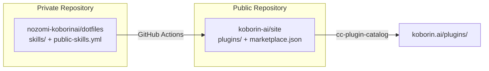

import RichLinkCard from '../../../../components/RichLinkCard.astro';


## はじめに

koborin.ai では以前から [llms.txt](https://koborin.ai/llms.txt) を導入し、AI がサイトの構造を理解できる状態にしていました。

今回のアップデートでは、その延長線として **Claude Code Plugin Marketplace** を追加しました。AI に読まれるサイトから、**AI エージェントが使えるサイト** への一歩です。

実際のカタログは [koborin.ai/plugins/](https://koborin.ai/plugins/) で確認できます。

---

## 何ができるようになったか

koborin.ai が Claude Code の Plugin Marketplace として機能するようになりました。

<RichLinkCard
  href="https://code.claude.com/docs/en/plugin-marketplaces"
  title="Create and distribute a plugin marketplace"
  description="Build and host plugin marketplaces to distribute Claude Code extensions across teams and communities."
/>

以下のコマンドで、公開しているスキルを誰でもインストールできます。

```bash
# ターミナルから
claude plugin marketplace add koborin-ai/site
claude plugin install mermaid-diagram@koborinai-plugins

# Claude Code 内から
/plugin marketplace add koborin-ai/site
/plugin install mermaid-diagram@koborinai-plugins
```

たとえば `mermaid-diagram` は、元々自分のプロジェクトで使っていたワークフローです。提出物が Google ドキュメントや Microsoft Word に制限されるお客さん向けのプロジェクトでは、Mermaid 形式でのレンダリングができないため、効率よく PNG を生成してドキュメントに埋め込む仕組みが必要でした。この手順を SKILL.md にまとめ、社内勉強会で共有したこともありました。

しかし、それはその場限りのナレッジ共有に過ぎず、やりたい人がいてもそれぞれのプロジェクトで個別に適用していくことが多い状況でした。Plugin にしたことで、Claude Code の正式な仕組みの上で、使いたい人がコマンドひとつで自由に導入できる形になりました。

公開中のプラグイン一覧は [koborin.ai/plugins/](https://koborin.ai/plugins/) から確認できます。

---

## なぜやったか

きっかけは **cc-plugin-catalog** という OSS を見つけたことでした。

<RichLinkCard
  href="https://github.com/giginet/cc-plugin-catalog"
  title="cc-plugin-catalog"
  description="Static site generator for Claude Code Plugin Marketplace repositories."
/>

Plugin Marketplace のリポジトリからカタログサイトを自動生成するツールです。これを見て、自分が日常的に書いているスキル定義をそのままカタログにできると思いました。

普段の開発で SKILL.md を書くのは、自分のワークフローや思考を整理するために元々やっていることです。であれば、使いたい人が Claude Code の正式な導入方法で自由に利用でき、かつ**追加の作業を生まずに公開が成立する仕組み**を作れるはずだと考えました。

---

## 仕組み

スキルの管理は個人の dotfiles（private リポジトリ）で行っており、公開対象は `public-skills.yml` で制御しています。



dotfiles に push すると、GitHub Actions がスキルを Plugin Marketplace の形式に変換して koborin-ai リポジトリに同期します。koborin-ai 側ではアプリのリリースパイプラインで cc-plugin-catalog がカタログサイトを生成し、既存のインフラ上で配信します。

スキルを公開したいときは `public-skills.yml` にエントリを追加して push するだけです。なお、このファイルは Plugin Marketplace の仕様ではなく、dotfiles から koborin-ai への同期を制御するために独自に設けた定義ファイルです。

```yaml
public_skills:
  - name: agent-team-fullstack
    category: development
    tags: [agent-team, fullstack, parallel-development]
  - name: mermaid-diagram
    category: documentation
    tags: [mermaid, diagram, documentation]
```

同期・変換・カタログ生成はすべて CI が行うため、この定義ファイルと SKILL.md の更新以外に手作業は発生しません。

---

## まとめ

今回のアップデートで意識したのは、**日常の作業成果を資産に変える** ということです。

| 作業 | 以前 | 現在 |
| --- | --- | --- |
| スキルを書く | 自分用に書く | 同じ（変わらない） |
| スキルを共有する | AGENTS.md に書く、勉強会で説明する | `public-skills.yml` に 1 行追加 |
| ドキュメントを作る | 別途ブログ記事を書く | カタログが自動生成される |
| インストール手段を提供する | ファイルを手渡しする | `claude plugin install` で完結 |

SKILL.md を書くという行為は変わっていません。それがそのままカタログのコンテンツになり、プラグインとしてインストールできるようになる。副産物として公開が成立する仕組みを、koborin.ai に組み込みました。
