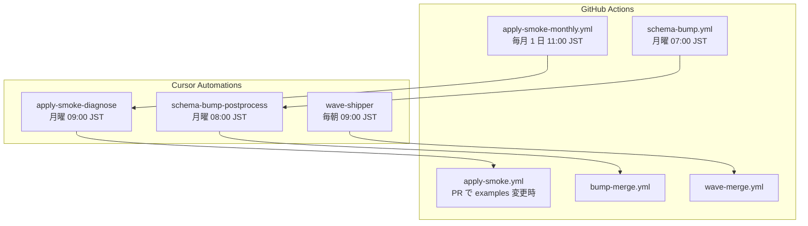

import RichLinkCard from '../../../../components/RichLinkCard.astro';
import SiteImage from '../../../../components/SiteImage.astro';
import articleHeader from '../../../../assets/tech/solo-maintainer-cursor-automations/solo-maintainer-cursor-automations-hero.jpg';
import automationsListLight from '../../../../assets/tech/solo-maintainer-cursor-automations/automations-list-light.png';
import automationsListDark from '../../../../assets/tech/solo-maintainer-cursor-automations/automations-list-dark.png';
import waveShipperSettingsLight from '../../../../assets/tech/solo-maintainer-cursor-automations/wave-shipper-settings-light.png';
import waveShipperSettingsDark from '../../../../assets/tech/solo-maintainer-cursor-automations/wave-shipper-settings-dark.png';
import wavePrSummary from '../../../../assets/tech/solo-maintainer-cursor-automations/wave-pr-summary.png';
import wavePrMerged from '../../../../assets/tech/solo-maintainer-cursor-automations/wave-pr-merged.png';
import licenseManagerCostTable from '../../../../assets/tech/solo-maintainer-cursor-automations/license-manager-cost-table.png';

<SiteImage src={articleHeader} alt="Cursor Automations for Solo Maintainers" variant="articleHeader" style="width: 100%; height: auto;" />

私は [TerraDart](https://github.com/nozomi-koborinai/terradart) というライブラリを、ほぼ一人でメンテナンスしています。
Dart で Google Cloud のインフラを定義して、`terraform apply` できる JSON に変換する IaC ライブラリです。
レビュー済みのリソースファクトリは 389 件、サービスごとのサンプルプロジェクトは 60 本あり、上流の Terraform provider は毎週更新されます。

この物量を一人で回すために、TerraDart はもともとエージェントに書かせて育ててきたライブラリです。
リソースの追加もサンプルも、対話セッションでエージェントに作業させ、成果物を私がレビューし、逸脱を見つけたら lint や検証スクリプトを足して同じ逸脱が二度と通らないようにする。この繰り返しです。
それでもボトルネックは残りました。
私がセッションを開かない日は、何も進みません。
本業の傍らで毎晩セッションを開き続けるのは、現実的ではありませんでした。

ふりかえると、対話の中で私に残っていた仕事は 2 つしかありませんでした。

- 作業を始めさせること
- merge してよいか決めること

指示の中身はすでにリポジトリの手順書に移してあり、レビューの大半は積み上げてきた lint と CI が先に済ませています。
それなら、起動はスケジューラに、merge の判定は workflow に渡せるはずです。

そうして組み直したのが、**Cursor Automations** と **GitHub Actions** に役割を分担させた保守ループです。
Automations が起動する cloud agents は、判断と起草を受け持って PR を開くところまで。
テストと実クラウドへの apply、そして merge 前の再検証は GitHub Actions が受け持ちます。

この記事で扱うのは TerraDart の使い方ではありません。
ソロメンテナが、検証、出荷、上流への追従といった回り続ける保守ループを、エージェントと CI にどう分担させるか。その設計を実際の構成に沿って書きます。

<RichLinkCard
  href="https://github.com/nozomi-koborinai/terradart"
  title="TerraDart"
  description="Type-safe IaC for Dart. Google Cloud infrastructure as real Dart code — typed, refactor-safe, drop-in for terraform apply."
/>

## 用語を Cursor 公式に揃える

同じ機能が UI とブログ記事で違う名前で呼ばれがちなので、この記事は [Cursor 公式ドキュメント](https://cursor.com/docs/cloud-agent/automations.md) の用語で通します。

| 用語 | この記事での意味 |
| --- | --- |
| **Cloud Agents** | クラウド上の VM で動くエージェント。リポジトリを clone し、ブランチで作業して PR を push する |
| **Automations** | スケジュールや GitHub イベントを引き金に cloud agents を起動する機能 |
| **Rules / Skills / Hooks** | リポジトリにコミットする永続的なガイド。TerraDart では `AGENTS.md`、`.agents/skills/`、`.cursor/hooks.json` |
| **GitHub Actions** | 決定論的な実行を受け持つ CI。schema 取得、`terraform apply`、テスト、条件付き auto-merge |

## 保守ループの全体像

ここでは「保守ループ」と呼んでいますが、実際には週次を中心に、日次の Wave 出荷と月次の full apply-smoke を組み合わせた流れです。
スケジュール処理は、GitHub Actions（機械的な実行）と Automations（判断と起草）のペアで組んでいます。



Automations は 3 本だけです。

| Automation | 指示の正本 | ペアの workflow | 受け持ち |
| --- | --- | --- | --- |
| schema-bump-postprocess | `.cursor/agents/schema-bump-postprocess.md` | `schema-bump.yml` → `bump-merge.yml` | 週次 bump PR の分類と機械修復 |
| wave-shipper | `.cursor/agents/wave-shipper.md` | → `wave-merge.yml` | backlog からリソース追加 PR を開く |
| apply-smoke-diagnose | `.cursor/agents/apply-smoke-diagnose.md` | `apply-smoke-monthly.yml` | 月次検証の失敗 issue を診断し fix PR を開く |

<figure class="theme-figure">
  <SiteImage src={automationsListLight} alt="Cursor の Automations 一覧。wave-shipper、apply-smoke-diagnose、schema-bump-postprocess の 3 本が Active" variant="inline" class="theme-light" />
  <SiteImage src={automationsListDark} alt="Cursor の Automations 一覧。wave-shipper、apply-smoke-diagnose、schema-bump-postprocess の 3 本が Active" variant="inline" class="theme-dark" />
</figure>

時間軸で見ると、こうなります。
時刻はすべて日本時間です。

**月曜 07:00、schema-bump（GitHub Actions）。**
HashiCorp の最新 provider から `schema.json` を更新します。
新しい `google_*` リソースが増えていれば、キュレーション待ちの台帳に追記して PR を開きます。

**月曜 08:00、schema-bump-postprocess（Automation）。**
1 時間前に開いた bump PR を読み、そのまま merge できるもの、機械的に修復できるもの、人間に回すべきものに分類します。
修復できる差分は push し、レポートとラベルを付けます。
merge 自体は bump-merge workflow の仕事です。

**毎朝 09:00、wave-shipper（Automation）。**
台帳の先頭から 3〜6 リソースの製品グループを取り、ファクトリとサンプル、課金分類の台帳更新までを含んだ PR を開きます（この単位の追加作業を、リポジトリでは Wave と呼んでいます）。
`wave/*` の PR がすでに開いていれば、その日は何もしません。
仕掛かりを常に 1 件に制限することで、レビューが積み上がらないようにしています。

<SiteImage src={wavePrSummary} alt="wave-shipper が実装した Wave PR。追加した 3 リソースと、コスト分類の根拠、追加を見送ったリソースの理由まで PR 本文にまとめてある" variant="inline" />

上は wave-shipper が実装した実際の Wave PR です。
追加した 3 リソースに加えて、コスト分類の根拠、あえて追加を見送ったリソースとその理由まで、エージェントが PR 本文に書いています。
ひとつ正直に書いておくと、いまの Cursor では agent の GitHub トークンに PR を作成する権限がありません。
そのため wave-shipper が実装した変更を PR として開く操作だけは、まだ私の手元に残っています。

**PR 時、apply-smoke change-gate（GitHub Actions）。**
サンプルに触れた PR では、変更されたサンプルだけを検証専用の GCP プロジェクトに apply して destroy します。

**毎月 1 日 11:00、apply-smoke monthly（GitHub Actions）。**
全サンプルのフル検証です。
PR 時には飛ばしている高コストなサンプルも、ここでまとめて検証します。
失敗すると issue が開きます。

**月曜 09:00、apply-smoke-diagnose（Automation）。**
未処理の失敗 issue を 1 件取り、ログから原因を分類して、直せるものは fix PR を開きます。
merge はしません。

どのペアでも役割は同じです。
機械にできることは workflow が先にやり、判断が要る後始末だけが Automation に渡ります。

## 設計原則は 3 つ

### 原則 1：判断はリポジトリに書く

Automations の設定画面に、長い指示は置きません。
UI に置くプロンプトは、正本を指す 1 行だけです。

<figure class="theme-figure">
  <SiteImage src={waveShipperSettingsLight} alt="wave-shipper の設定画面。トリガーは毎日 09:00 GMT+9 で、Agent Instructions は正本ファイルを指す 1 行だけ" variant="inline" class="theme-light" />
  <SiteImage src={waveShipperSettingsDark} alt="wave-shipper の設定画面。トリガーは毎日 09:00 GMT+9 で、Agent Instructions は正本ファイルを指す 1 行だけ" variant="inline" class="theme-dark" />
</figure>

Agent Instructions の欄にあるのは `Read .cursor/agents/wave-shipper.md in the repository and follow it exactly.` という 1 行だけです。
手順の詳細、台帳の更新ルール、人間へエスカレーションする条件は、すべてリポジトリにコミットしてあります。

- 運用ガイドの正本：`AGENTS.md`
- タスクごとの手順書：`.agents/skills/`（Agent Skills 形式）
- 例外と負債の台帳：`tool/*.yaml`
- 定期エージェントの指示書：`.cursor/agents/*.md`

チャットと違ってリポジトリは版管理されているので、指示の変更が diff としてレビューでき、エージェント製品を乗り換えても指示が生き残ります。
Automation は起動装置で、判断の中身はリポジトリにある、という分担です。

もうひとつ、文章で書いたルールには寿命があります。
冒頭に書いた「逸脱を見つけたら lint や検証スクリプトを足す」という運用は、`AGENTS.md` に「prose rules drift; gates converge（文章のルールはずれていく、機械のゲートは収束する）」という標語で明文化してあります。
レビューの指摘コメントは一度きりの修正で終わりますが、ゲートに落とせば以後のすべての実行に効き続けます。

### 原則 2：実行は GitHub Actions に任せる

同じ入力からは同じ結果が出るべき処理、つまり決定論的に実行できる処理には、エージェントを挟みません。
TerraDart で GitHub Actions に寄せているのは次の処理です。

- 最新の Terraform provider から `schema.json` を取得する
- 全サンプルの synth（Dart から Terraform JSON への変換）と `terraform validate`
- 検証専用の GCP プロジェクトへの `terraform apply` と `destroy`
- 条件を満たした PR の squash merge

エージェントの出力は実行のたびに揺れますが、workflow は揺れません。
決定論的にできる処理を先に workflow へ寄せておくほど、エージェントに残る仕事が「判断が要るものだけ」になっていきます。

### 原則 3：merge は渡さない

cloud agents の権限は PR を開くところまでです。
merge は専用の workflow が、次の 3 つを機械的に確認してから行います。

- 変更ファイルが許可パスに収まっているか
- 必須チェックがすべて通っているか
- 実クラウドで本当に apply できた実績があるか

さらに auto-merge そのものをリポジトリ変数で無効にした状態から始めて、運用が安定してから有効にしました。

ここを最後まで人間と CI に残すのは、誤 merge の代償が大きいからです。
クラウド課金、破壊的な API 変更、組織アカウントでしか使えないリソースの誤出荷は、merge の手前で止めるのがいちばん安く済みます。

<SiteImage src={wavePrMerged} alt="82 個のチェックが通った Wave PR の merge 画面。チェックの先頭に apply smoke が見える" variant="inline" />

実際の Wave PR の merge 場面です。
82 個のチェックの先頭に apply smoke が見えます。
この PR は、変更したサンプルが「PR 時は skip して月次でだけ apply する」分類だったので、実 apply の実績という auto-merge の条件を満たしませんでした。
merge workflow は設計どおり手を出さず、私が中身を確認して merge しています。

## 品質ゲートを Test Sizes で 3 層に分ける

この保守ループを安心して回すには、PR ごとに何をどこまで検証するかを決める必要があります。
TerraDart ではテストの層を、単体テストや結合テストという呼び方ではなく、[Google の Test Sizes](https://testing.googleblog.com/2010/12/test-sizes.html)（Small / Medium / Large）で整理しています。
Test Sizes の要点は、テストを名前ではなく制約（ネットワークを使うか、外部システムに触るか、どれだけ時間をかけてよいか）で分類することです。

| Size | TerraDart での例 | 何を証明するか |
| --- | --- | --- |
| Small | `dart test`、生成コードの一致検査、override の lint | 生成される Dart の形と、設計ルールへの適合 |
| Medium | 全サンプルの synth ゲート、`terraform validate` | synth 出力が Terraform として妥当で、カタログと矛盾しないこと |
| Large | apply-smoke（実 GCP への apply と destroy） | 代表サンプルが実際のクラウドで作れて、壊せること |

Small と Medium は毎 PR で全部回します。
Large は 1 回ごとに時間もお金もかかるので、全部は回しません。
どのサンプルを実際に apply するかは、台帳で決めます。

Large 層が要るという確信は、失敗から来ています。
apply-smoke を初めて全サンプルに回したとき、`terraform validate` を通っていたサンプルが、実際の apply ではほぼ全滅しました。

- 必須変数が渡っていない
- API が有効化されていない
- placeholder が残ったままになっている
- 組織アカウントでしか作れないリソースが混ざっている

どれも、構文と参照の検証（Medium）では原理的に見つからない問題です。
「validate が通る」と「作れる」のあいだには、思っていたよりずっと広い隙間がありました。

### 実クラウド apply を絞る台帳

Large 層を無制限に回すと、ソロメンテナは請求と後片付けで潰れます。
TerraDart では、どのサンプルを apply してよいかを 3 枚の YAML 台帳で決めています。

| 台帳 | 単位 | 役割 |
| --- | --- | --- |
| `apply_cost_denylist.yaml` | Terraform リソース型 | `safe` / `sweep_only` / `never_apply` に分類。どこにも載っていない型は未分類として apply しない |
| `apply_smoke_skip.yaml` | サンプル名 | 常に apply しない（組織専用、外部秘密が必要、存在するだけで課金、削除不能など） |
| `apply_smoke_pr_skip.yaml` | サンプル名 | PR 時だけ skip。月次のフル検証では apply する |

3 枚に共通する方針は、「載っていないものは動かさない」です。
新しく増えたリソースは、課金の性質を確認して安全側へ分類されるまで、実クラウドには触れません。

この設計も、一度の請求事故から来ています。
License Manager のサンプルが作る Office SPLA ライセンス設定は、VM を 1 台も作らなくても、設定が存在するだけで課金される種類のリソースでした。
しかも日割りがなく、apply して数分で destroy しても当月分の請求は確定します。
apply-smoke は作ってすぐ壊す検証なので、時間で課金される普通のリソースなら請求は月に数百円で収まります。
存在で確定する課金には、その前提が通じませんでした。

<SiteImage src={licenseManagerCostTable} alt="検証用プロジェクトの月次請求。40,342 円のうち 36,277 円が Cloud License Manager で、実際に VM を動かした Compute Engine は 203 円" variant="inline" />

事故の月の請求です。
40,342 円のうち 36,277 円が License Manager でした。
実際に VM を作って壊した Compute Engine が 203 円ですから、桁が 2 つ違います。
`terraform validate` は何も警告してくれず、この画面で初めて気づきました。
いまはこの型を `never_apply` に分類したうえで、存在課金型のリソースを含むサンプルが skip 台帳に載っていなければ CI が落ちる、という再発防止のゲートを足してあります。

### エージェントによる課金分類

台帳への分類は、wave-shipper が Wave を出荷するたびに、エージェント自身がやります。
勘で `safe` と書かれては困るので、判断材料を機械で引けるようにしました。
もともと GCP の見積もり用に作っていた自作の MCP サーバー gcp-cost-mcp-server（Cloud Billing Catalog API から SKU 単価を引けます）を、この保守ループに組み込んであります。

分類の決まりは 3 つです。

- 台帳に書き込む前に、MCP で SKU 単価を引く
- 根拠の SKU と価格を、分類と一緒にコメントで台帳に残す
- 根拠コメントのない `safe` 分類は、CI が落とす

最後の 1 つは手順書のお願いではなく、CI のゲートとして強制しています。

組み込みには、ひとつ壁がありました。
リポジトリの MCP 設定は、ローカルの Cursor からは動きます。
ところが cloud agents のセッションは、command 型の MCP サーバーを起動してくれません。
毎朝分類をやるのは、まさにその cloud agents です。
そこで、同じツールを stdio で呼ぶだけの小さなクライアント CLI をリポジトリに置き、cloud agents はそれ経由で SKU を引くようにしました。
実装に使った genkit_mcp は Genkit Dart の MCP プラグインで、初期実装は私が書いてコントリビュートしたものです。
このクライアントは意図的に「呼ぶだけ」にしてあり、どのツールをどう呼び、結果をどう読むかはエージェントに残しています。
選定済みの SKU や出来合いの分類を返すラッパーにすると、分類の判断が結局それを書く人間へ戻ってくるからです。

ただし、価格表は万能ではありません。
単価が引けても、課金のかたち（存在するだけで課金されるのか、動いている時間だけ課金されるのか）までは読み切れません。
事故を起こした License Manager の SPLA ライセンスに至っては、そもそも Cloud Billing Catalog に SKU がありません。
だから課金のかたちは公式ドキュメントと突き合わせ、迷ったら未分類のまま、つまり apply されないままにする決まりです。
さきほどの Wave PR にも実例があります。
エージェントは MIG 関連のリソースを「メタデータだけなので安全」と分類してきましたが、MIG はメンバーとなる VM を実体化します。
レビューでそこに気づき、月次でだけ apply する `sweep_only` へ訂正しました。
根拠は機械で強制し、最終の訂正権は人間に残す。merge と同じ分担がここにもあります。

<RichLinkCard
  href="https://github.com/nozomi-koborinai/gcp-cost-mcp-server"
  title="gcp-cost-mcp-server"
  description="An MCP server that enables AI assistants to estimate Google Cloud costs, powered by Cloud Billing Catalog API and built with Genkit for Go"
/>

## 補足：TerraDart の生成フロー

ここまでが保守ループの本題です。
Terraform バインディングに興味がある方向けに、cloud agents が作っている差分の中身だけを短く置きます。

ユーザーが import する `terradart_google` のファクトリは、メンテナが `terradart wrap` という生成コマンドで作ってコミットしています。
入力は 2 系統です。

```text
schema.json + 上流メタデータ     →  マージした中間表現
override YAML（API 設計の判断）  →  コード生成  →  terradart_google の .dart
```

機械が決められること（属性の型、必須か任意か）は schema から生成し、人間とエージェントの判断（どう束ねるか、何を隠すか）だけが override YAML に残ります。
wave-shipper が毎朝やっているのは、この override を書いてファクトリとサンプルを生成し、PR にするところまでです。

全属性の組み合わせを試す網羅的なテストはありません。
サンプル 1 本が代表パス 1 つを実クラウドで証明する、というのが Large 層のカバレッジの考え方です。
生成パイプラインの詳細は TerraDart の [`AGENTS.md`](https://github.com/nozomi-koborinai/terradart/blob/main/AGENTS.md) に書いてあります。

## まとめ

Automations（判断と起草）と GitHub Actions（実行とゲート）を分けると、ソロメンテナでも OSS の保守ループを継続的に回せます。
TerraDart 固有の事情を除くと、核は 3 つです。

- エージェントに merge させない
- 実クラウドに触る検証は台帳で決め、分類していないものは動かさない
- 判断はチャットではなくリポジトリに置いて、版管理する

この構成は TerraDart で現役で動いていて、指示の正本もゲートもすべてリポジトリで読めます。

## 参考リンク

- [TerraDart](https://github.com/nozomi-koborinai/terradart) / [terradart.dev](https://terradart.dev/)
- [Cursor Automations](https://cursor.com/docs/cloud-agent/automations.md)
- [Cursor Cloud Agents](https://cursor.com/docs/cloud-agent.md)
- [Google Testing Blog — Test Sizes](https://testing.googleblog.com/2010/12/test-sizes.html)
