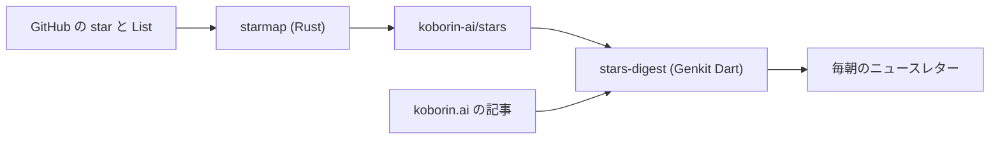

import SiteImage from '../../../../components/SiteImage.astro';
import RichLinkCard from '../../../../components/RichLinkCard.astro';
import listsLight from '../../../../assets/tech/stars-digest/lists-light.png';
import listsDark from '../../../../assets/tech/stars-digest/lists-dark.png';
import devUiLight from '../../../../assets/tech/stars-digest/dev-ui-light.png';
import devUiDark from '../../../../assets/tech/stars-digest/dev-ui-dark.png';
import starsDigestOg from '../../../../assets/og/stars-digest.png';

<SiteImage src={starsDigestOg} alt="star した OSS を、「自分」を読んだエージェントが掘り起こす" variant="articleHeader" style="width: 100%; height: auto;" />

:::note[廃止]
個人用ニュースレター `/stars` は廃止しました。この記事は、当時作っていた仕組みの記録として残しています。
:::

私は GitHub で気になったリポジトリを見つけると、とりあえず star を付けます。ただ、付けたあとに見返すことはほとんどありません。その先で何かをするわけでもなく、数だけが増えていきます。

この「積んだまま」をどうにかしたくて、star したリポジトリの中から毎朝ひとつを選んで、自分宛てに紹介してくれる仕組みを作りました。選んで紹介文を書いているのは私ではなく、AI エージェントです。そのエージェントは、私がこのサイトに書いてきた記事を読んでいます。

## star して、List に分けて、満足して、放置する

star したリポジトリは、GitHub の List 機能でテーマごとに分類しています。Cloud & DevOps、Web、Agent Tools、Dev Tools、Databases、といった具合です。

<figure class="theme-figure">
  <SiteImage src={listsLight} alt="GitHub の List 機能でテーマごとに分類した star の一覧" variant="inline" class="theme-light" />
  <SiteImage src={listsDark} alt="GitHub の List 機能でテーマごとに分類した star の一覧" variant="inline" class="theme-dark" />
</figure>

ただ、分類するとそこで満足してしまって、あとから開き直すことはあまりありません。star した直後は「あとで読もう」「今度試そう」と思っていても、気持ちはすぐ次のものへ移ります。また新しく star して List に入れて、そこで満足する。その繰り返しで、前に入れたものは下に流れ、「あとで見る」つもりが「二度と見ない」になっていきます。

ほしかったのは、こうしてたまった star を、今の自分の関心やいま作っているものに引き寄せて、「これは今の自分に効きそう」と思える 1 本として出してくれる仕組みでした。GitHub のトレンドや話題の OSS をまとめたものを読む手もありますが、それだと「世間で流行っているもの」を追うことになって、自分が star したものとは別の流れになってしまいます。

## 手で分けた構造を、そのまま保つ

仕組みは、star のデータを整える部分と、そこから毎朝の 1 本を選ぶ部分に分かれています。まず、データを整えるほうからです。

GitHub の star を書き出すツールはすでにいくつかあります。よく使われているのは maguowei/starred で、star を言語やトピックごとに自動でカテゴリ分けして、awesome list（テーマ別に整理したリンク集）として出力してくれます。

<RichLinkCard href="https://github.com/maguowei/starred" title="maguowei/starred" description="Create and maintain your own Awesome-style list from GitHub stars!" />

ただ、自動でカテゴリ分けされると、私が GitHub の List で分けた分類は使われません。その分け方自体を残したかったので、List をそのまま反映するツールを自分で書きました。starmap です（Rust 製）。

<RichLinkCard href="https://github.com/nozomi-koborinai/starmap" title="nozomi-koborinai/starmap" description="⭐️ Generate Awesome Lists from your GitHub Stars, organized by Lists" />

starmap は、List の分け方を崩さずに awesome list として書き出します。あわせて、LLM（大規模言語モデル）に読ませることを想定した llms.txt と、各リポジトリの README を抜粋した llms-full.md も生成します。これらは GitHub Actions で毎日動かしていて、koborin-ai/stars というリポジトリに自動でコミットしています。

<RichLinkCard href="https://github.com/koborin-ai/stars" title="koborin-ai/stars" description="🌟 A personal library of GitHub stars — catalogued by topic, refreshed by starmap" />

## それを「自分宛て」に翻訳する

後半を担当するのは、stars-digest という小さなプログラムです。Genkit Dart で書いています。Genkit は Google の AI フレームワークで、Dart からも使えます。

stars-digest は、koborin-ai/stars のデータを読み込んで、毎朝のニュースレターを組み立てます。全体の流れは下の図のとおりです。



ポイントは、メインで紹介する 1 本の選び方です。新しく star したものではなく、すでに star してあって、まだ一度も取り上げていないものの中から選びます。つまり「積んだまま」の中からの掘り起こしです。どれを選ぶかは日付で決まるようにしてあり、一度取り上げたものは除くので、同じものが続けて出ることはありません。あわせて、その日までに新しく star したものがあれば、新着として何件か添えます。

紹介文は Gemini に書かせています。モデルは Gemini Flash です。呼び出しは Gemini API ではなく Agent Platform（旧 Vertex AI）経由にしていて、Google Cloud のサービスアカウントの認証で動かしています。こうすると、自分で API キーを発行して管理する必要がありません。実行は 1 日に 1 回だけで、結果は決まった構造（何のツールか、なぜ今の自分に効くか、使いどころ、最初の一歩）で受け取ります。

実際の呼び出しはこれだけです。

```dart
final response = await ai.generate(
  model: vertexAI.gemini(modelId),        // Gemini Flash を Agent Platform 経由で
  messages: [
    Message(role: Role.system, content: [TextPart(text: systemPrompt)]),  // 編集方針 + 私の人物像
    Message(role: Role.user,   content: [TextPart(text: userPrompt)]),     // その日のリポジトリ
  ],
  outputSchema: Edition.$schema,          // 決まった構造で受け取る
);
```

開発中は Genkit の Developer UI でプロンプトを試しながら直せます。

<figure class="theme-figure">
  <SiteImage src={devUiLight} alt="Genkit Developer UI で stars-digest の starsDigest フローを動かしている画面" variant="inline" class="theme-light" />
  <SiteImage src={devUiDark} alt="Genkit Developer UI で stars-digest の starsDigest フローを動かしている画面" variant="inline" class="theme-dark" />
</figure>

ニュースレター本体は公開していましたが、いまは廃止しています。

## エージェントが読む「私」

ここまで「今の自分に引き当てる」と書いてきましたが、エージェントはどうやって「私」を知るのでしょうか。

答えは、このサイトに私が書いてきた記事を読ませている、です。技術的な興味やスタックはトップページや tech の記事から、考え方や人となりは life の記事から拾って、人物像（ペルソナ）を組み立てます。それを、紹介文を書くときの前提としてモデルに渡しています。

コードにすると、この組み立てはこんな形です。

```dart
Persona buildPersona({
  required String indexMdx,       // トップページ = 技術スタック
  required List<String> lifeMdx,  // life の記事 = 人柄・価値観
  required String steering,       // 手動の編集方針
}) {
  return Persona(
    stack: stripMdx(indexMdx),
    character: lifeMdx.map(stripMdx).join('\n\n---\n\n'),
    steering: steering.trim(),
  );
}
```

koborin.ai は、記事を [llms.txt](/llms.txt) という形式でも公開しています。LLM に読ませることを想定したテキストで、tech だけでなく life の内容も含めています。技術メモだけでなく、考え方の部分まで機械が読める形で置いてあるわけです。stars-digest は、それを「私」として使っています。

ここで、ちょっとした循環が生まれます。私が記事を書くと、それがサイトに溜まっていきます。エージェントはその記事を読んで「私」として star を選び、紹介文を書きます。そしてその紹介文も、また koborin.ai に溜まっていきます。自分が書いたものが、巡って自分宛ての紹介になって返ってくる、という構造です。

## 今度はこの仕組みに満足して終わらないように

運用を始めたばかりなので、効果のほどはまだ何とも言えません。それでも、毎朝 1 本が届くようになって、放置していた star に少しは目が向くようになった気はしています。

広い意味で私が大切だと思っているのは、ただただ新しい情報を追いかけること自体ではなく、集めた情報をいかに自分自身のコンテキスト（自分のスタック、作ってきたもの、考え方）へと引き寄せ、自分の血肉に変えていけるかということです。
stars-digest も、毎朝少しずつその「変換」を行うための、自分用の小さな道具でもあります。

ひとつだけ気をつけたいことがあります。私はこれまで、star して、List に分けて、そこで満足して放置してきました。その満足の対象が、今度は「仕組みを作ったこと」に移るだけかもしれない、ということです。作って満足して、肝心のニュースレターを読まなくなったら、結局これまでと同じです。

そうならないように、まずは自分が毎朝ちゃんと読む、というところから続けてみようと思います。
