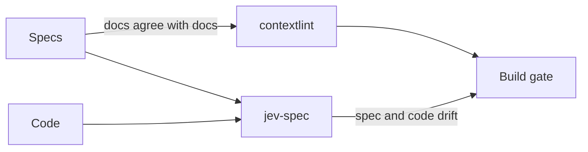

import RichLinkCard from '../../../components/RichLinkCard.astro';
import SiteImage from '../../../components/SiteImage.astro';
import jevSpecIntroductionOg from '../../../assets/og/jev-spec-introduction.png';

<SiteImage src={jevSpecIntroductionOg} alt="jev-spec: Catch spec drift on every commit." variant="articleHeader" style="width: 100%; height: auto;" />

## The Reality of Fast AI Coding and Spec Drift

About six months ago, I wrote [an article](/tech/contextlint-introduction/) about contextlint, a linter that statically analyzes the consistency of Markdown documents. In Specification-Driven Development (SDD), teams write detailed requirements, architectural decisions, and acceptance criteria in Markdown, feeding them into AI coding agents like Cursor or Claude Code.

AI writes code at breathtaking speed. However, as the velocity of code generation increases, the frequency with which human developers reread original specifications drops proportionally. In day-to-day code reviews, attention naturally gravitates toward immediate diffs and runtime smoke tests. Reviewing whether every sentence in the specification still holds against the generated code is rarely feasible. As a result, discrepancies between specifications and code accumulate unnoticed beneath the surface.

Static analysis can confirm that a specification contains an entry such as `REQ-AUTH-02` (an authentication requirement ID), follows the expected format, and is properly referenced across documents. But whether `src/auth/session.ts` still behaves according to `REQ-AUTH-02` cannot be verified by parsing document syntax alone.

To counter this drift, some teams create custom slash commands or Agent Skills in Cursor or Claude Code to periodically crawl the codebase and check alignment against specifications. In practice, this means asking an agent: "Check whether this code satisfies all requirements in the spec and flag any omissions."

Yet running this approach on every commit is impractical. Stuffing substantial codebases and full specifications into prompts and running general-purpose LLM agents takes minutes per run and consumes significant token costs. It is far too slow and expensive to act as a pre-commit hook gating `git commit`. Consequently, drift detection remains an occasional, heavy audit run only when someone remembers, while discrepancies between specifications and code continue to accumulate unnoticed during daily development.

"Could we catch the drift between specifications and code in tenths of a second on every single commit?" This question led me to develop the OSS `jev-spec`.

<RichLinkCard
  href="https://github.com/nozomi-koborinai/jev-spec"
  title="jev-spec"
  description="Catch spec drift on every commit: check your code against your Markdown specs with TypeSafe AI's Jev model."
/>

## The Limits of Traditional LLMs and the Arrival of Jev

When attempting to build a pre-commit gate that reconciles code against specifications, traditional LLMs face structural bottlenecks.

Standard LLMs generate strings autoregressively, decoding one token at a time. Even when using JSON mode or Structured Outputs to enforce a strict schema, the model is still decoding tokens sequentially under the hood. This sequential decoding is the root cause of high latency (seconds to tens of seconds) and per-token input/output billing. To avoid breaking a developer's flow during a local pre-commit check, verification must finish in under a second. High latency and recurrent token billing make traditional LLMs ill-suited for every commit.

A fresh architectural direction arrived with Jev, a model developed by TypeSafe AI. TypeSafe categorizes Jev as a "System One model."

<RichLinkCard
  href="https://docs.typesafe.ai/concepts/system-one"
  title="System One - TypeSafe"
  description="System One models make fast, structured decisions for software. Jev is TypeSafe's flagship model and the first System One model."
/>

To describe it accurately: Jev does not perform free-form autoregressive text generation or sequential token decoding. Instead, it directly evaluates given context or state—text, data, application state, and similar inputs—in a single pass and outputs typed decision primitives: well-calibrated probabilities and scores. jev-spec uses this capability by passing specifications and code as context and reading probabilities for each requirement Rubric.

Because it does not generate text token by token, there is no waiting on output decoding, and output tokens are free. Input token costs are negligible ($0.042 per million input tokens), and response times clock in at just 70 to 400ms.

Jev provides three core decision primitives:

- **`noul` (Boolean proposition)** — evaluates a proposition answerable with yes or no, returning a probability between 0 and 1
- **`choice` (Categorical distribution)** — evaluates a discrete probability distribution across declared, mutually exclusive options (such as `compliant`, `vulnerable`, or `inconclusive`)
- **`score` (Ordinal rubric)** — evaluates an ordered rubric (such as a multi-tier maturity scale from stub to production-grade), returning an expected score and level probabilities

The probabilities returned here are statistically calibrated—meaning that when Jev reports an 80% probability, roughly 80% of those predictions actually turn out to be true, much like a reliable weather forecast where an "80% chance of rain" produces rain on 80 out of 100 days.

Because Jev's output is numeric and grounded from the start, there is no need to parse natural language. Comparing the returned probability against a deterministic threshold (such as `minProbability: 0.85`) produces an immediate pass or fail verdict.

:::note
jev-spec is an independent open-source project that I develop on my own. It is not affiliated with or endorsed by TypeSafe AI. Descriptions of Jev's properties and pricing reflect the official documentation as of September 2026.
:::

## Expanding Horizons: Jev's Broader Potential and the Genesis of jev-spec

It is worth emphasizing that Jev was not designed exclusively for specification verification.

Observing the developer community on [X](https://x.com), engineers are leveraging this ultra-fast, low-cost decision primitive to build software interactions that were previously unviable.

Marcus Lowe's [smart clipboard demo](https://x.com/marcus_lowe/status/2101886533146161275) instantly evaluates copied text, recognizes whether it contains contact details or personal credentials, and routes the content to corresponding form fields in milliseconds. [OkinaAudio's creative audio workflow for Ableton](https://x.com/okinaaudio/status/2101156959546450049) demonstrates fast audio and UI interaction. Chris Tate's [json-render and Jev Generative UI (GenUI) experiment](https://x.com/ctatedev/status/2101022101750571357) shows structured outputs controlling the interface on the spot.

Instead of verbose, slow prose generation, executing fast, inexpensive, type-safe decisions unlocks entirely new user interfaces and interaction paradigms. As a software engineer, watching this architectural shift unfold is genuinely exciting.

Seeing Jev's capabilities firsthand sparked an immediate idea from my background building contextlint:

"If we have a decision primitive this fast and cheap, could we verify whether code satisfies its specification on every single git commit?"

jev-spec is one concrete application born from that insight, addressing the practical challenges of Specification-Driven Development amidst the broader wave of Jev's potential.

## How jev-spec Works

The operational pipeline in jev-spec consists of four steps:

1. **Read the spec** — extracts the relevant sections of a Markdown specification based on headings, tags, or requirement IDs
2. **Read the code** — loads the source files implementing those requirements
3. **Evaluate rubrics** — submits focused Rubrics to Jev, which evaluates the spec and code as context in a single pass and returns probabilities in parallel
4. **Compare** — evaluates the probabilities against defined threshold assertions, stopping the build as a validation error (check failure) if any assertion fails

jev-spec is configured in TypeScript. For speed and rigorous type safety, it adopts **TypeScript 7**, powered by the new Go compiler. Furthermore, it provides official dual runtime support for both Node.js (22+) and Bun.

In the configuration file, pairings of specification scopes and the code implementing them are defined as **targets** via the `targets` DSL:

```typescript
import { defineConfig, noul } from 'jev-spec';

export default defineConfig({
  client: { model: 'jev-1.13.0' },
  targets: {
    auth: {
      specPath: 'docs/specs/auth-requirements.md',
      codePaths: ['src/auth/**/*.ts', '!src/auth/**/*.test.ts'],
      rubrics: {
        'REQ-AUTH-01': noul(
          'Is the signature of a session token checked before access to a protected resource is granted?'
        ),
        'REQ-AUTH-02': noul('Is a token rejected when its ID is on the revocation list?'),
      },
      assertions: {
        'REQ-AUTH-01': { minProbability: 0.85 },
        'REQ-AUTH-02': { minProbability: 0.85 },
      },
    },
  },
});
```

Each evaluation question is called a **Rubric**, and the comparison with a threshold is an **Assertion**. While binary verification with `noul` is most common for specs, the DSL also supports `choice` and `score`.

jev-spec is designed for pre-commit hooks and CI pipelines. Running `npx jev-spec check --staged` (or `bunx jev-spec check --staged`) in a pre-commit hook inspects only targets affected by staged Git diffs, completing at a brisk pace that never interrupts local commit flow. Unaffected targets are marked as `SKIPPED`.

The CLI report output looks like this:

```text
$ npx jev-spec check

=== jev-spec Check Report ===

Target: auth [✖ FAILED]
  Spec files: docs/specs/auth-requirements.md
  Code files: src/auth/session.ts
  Model: jev-1.13.0
    ✔ REQ-AUTH-01: probability: 0.97
    ✖ REQ-AUTH-02: probability: 0.08
       └─ Violation: Probability 0.08 is below minimum threshold 0.85

Overall: ✖ CHECKS FAILED

$ echo $?
1
```

Naming Rubrics after requirement IDs ensures that when a check fails, the report immediately identifies which requirement drifted.

## What Real-World Measurements Revealed

Gating builds on a probabilistic model raised three natural concerns: cost, reproducibility, and doubt. To address them, I conducted empirical measurements on jev-spec's own repository, which maintains its own specs (`docs/specs/`). The numbers below were recorded on September 21, 2026 using `jev-1.13.0`.

### Measured Cost

Checking all 8 targets and 22 Rubrics across the entire repository completed in approximately 4 seconds. Individual targets took between 0.3 and 0.9 seconds. CLI startup alone took roughly 0.1 seconds on Node.js (and was even faster on Bun); the vast majority of runtime was spent on network requests.

The estimated cost reported by the CLI was approximately $0.0006 per full run. Rather than stuffing the entire codebase into context, jev-spec transmits only the relevant spec excerpt and a handful of files per target. Jev evaluates all Rubrics in that target in a single pass. The cost of running this on every commit is negligible.

### Reproducibility and Model Pinning

Repeating identical Rubrics over identical code five times yielded a confidence variance of 0.00 to 0.03 on clean code. A probability moving from 0.96 to 0.95 remains safely above the example threshold of 0.85 (configured as `minProbability` in the settings).

Set assertion thresholds in the stable region of correct answers—for example, 0.85 or higher for affirmative Rubrics and 0.3 or lower for negative Rubrics (note that 0.85 is an example threshold configured per requirement, not a hardcoded fixed value).

Because aliases such as `latest` can move to a different underlying model and change results, `client.model` supports pinning explicit versions (such as `jev-1.13.0`). The CLI report always prints the exact model version that produced the evaluation.

### Addressing Doubt with Probes

The concern that "a model saying 'probably fine' leaves lingering doubt" was addressed through "probes"—systematic tests applying deliberate spec-violating diffs.

For every requirement, I authored a minimal code patch designed to deviate from that requirement alone. For instance, the probe testing the requirement "the command exits with an error upon assertion failure" is:

```diff
-    return result.passed ? 0 : 1;
+    return 0;
```

Running `npm run probes` checks both the clean codebase and the patched copy. A Rubric must pass on compliant code and fail on the patch that deliberately violates the specification; any Rubric that passes unconditionally checks nothing.

In practice, all 22 probes were caught (22/22). Below is an excerpt:

| Requirement | Compliant code | Spec-violating code | Result |
| :--- | :--- | :--- | :--- |
| REQ-EXIT-02 | 0.92 | 0.17 | caught |
| REQ-RUN-01 | 0.96 | 0.09 | caught |
| REQ-CONFIG-01 | 0.97 | 0.55 | caught |
| REQ-CONFIG-04 | 0.98 | 0.57 | caught |
| REQ-GIT-01 | 0.04 | 0.92 | caught |
| REQ-PATH-03 | 0.07 | 0.95 | caught |

The last two Rubrics ask whether forbidden behavior occurred, so correct code yields low probabilities. The full dataset is documented in [docs/probe-results.md](https://github.com/nozomi-koborinai/jev-spec/blob/main/docs/probe-results.md).

This 22/22 rate is not a synthetic benchmark of the model's generalized capability. It reflects empirical validation within my repository, refining Rubric phrasing until code deviating from the spec was consistently flagged. What matters is having verified that each Rubric catches deviations, and being able to re-run the same validation when bumping model versions.

## Drift Discovered via Dogfooding

Dogfooding jev-spec—writing its own specifications and verifying itself with Jev—uncovered discrepancies that unit tests alone had obscured.

### Developer Blind Spots Behind All-Green Test Suites

In everyday development, maintaining comprehensive unit test coverage and seeing all-green CI builds provides immense reassurance. Yet because test suites are authored based on the developer's existing understanding and assumptions, they can never fully protect against developer blind spots.

When checking jev-spec's codebase against its formal English specifications, several subtle mismatches surfaced where the implementation did not honor what the specification promised, even though every unit test passed cleanly.

For example, when handling error-handling contracts and exit procedures, the spec established uniform guarantees across failure scenarios. However, parts of the codebase relied on implicit exception propagation. Relying solely on green tests had masked these gaps. Objectively evaluating the code against the explicit words of the written specification brought these developer blind spots to light.

### Diff Execution (`--staged`) and Context

Another lesson came from designing `--staged` diff checking for Git commits. The initial implementation prioritized execution speed and minimal token consumption by forwarding only changed diff hunks to the model. However, on a commit that merely adjusted a comment line, the check failed with false alarms on unrelated requirements. When evaluated against full files, those exact same Rubrics passed with high confidence.

The root cause was that semantic verification requires not just the altered lines, but the surrounding dependencies, invoking functions, and overall file context. When stripped down to an isolated diff fragment, the model could not see the logic that satisfied the requirement.

This led to an architectural shift: Git staged diffs are used strictly as a selector to identify which targets are affected, and the chosen targets are then forwarded in their entirety.

## Static Analysis vs. Decision Models, and Conclusion

Deploying jev-spec effectively requires recognizing its operational boundaries:

- **A check, not a mathematical proof** — passing indicates a probability surpassed an empirical threshold, not formal correctness. Internal terminology deliberately uses "check" rather than "verify"
- **English delivers the highest accuracy** — while Jev handles multiple languages including CJK, its primary training data is English. Specs and Rubrics written in English provide the highest fidelity
- **Adversarial code comments can bias evaluations** — comments stating "this function satisfies requirement X" can skew decisions. TypeSafe lists this as a known model limitation
- **Arithmetic, dates, and multi-step reasoning are poor fits** — counting items or comparing calendar dates should be verified via standard unit tests rather than Rubrics
- **Spec-only edits do not trigger staged diff targets** — because targets are selected by code changes, running full checks across all targets in CI remains essential

The complementary roles of contextlint and jev-spec can be summarized as follows:

| Dimension | contextlint | jev-spec |
| :--- | :--- | :--- |
| Scope | Consistency across documents | Alignment between specs and code |
| Method | Rule-based static analysis | Model Rubric evaluation and threshold comparison |
| Determinism | Deterministic | Probabilistic |
| AI Dependency | None | Yes (TypeSafe AI Jev) |



Verify mechanically with static analysis, evaluate semantics with decision models, and test Rubrics with probes.

In an era where AI generates code at unprecedented speed, guarding against specification drift without slowing down development rhythm is essential.

jev-spec started as a personal experiment, but if you maintain specifications in Markdown and worry about drift from code, consider giving it a try. `npx jev-spec check --dry-run` works immediately without an API key.

<RichLinkCard
  href="https://www.npmjs.com/package/jev-spec"
  title="jev-spec - npm"
  description="Catch spec drift on every commit: check your code against your Markdown specs with TypeSafe AI's Jev model."
/>

<RichLinkCard
  href="/tech/contextlint-introduction/"
  title="Building contextlint: A Static Analysis Linter for Markdown Document Consistency"
  description="The previous article: a rule-based linter for the Markdown consistency problems I ran into with SDD."
/>
