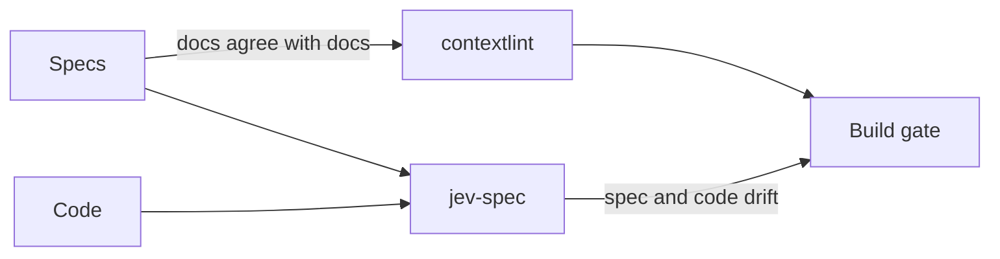

import RichLinkCard from '../../../components/RichLinkCard.astro';
import SiteImage from '../../../components/SiteImage.astro';
import jevSpecIntroductionOg from '../../../assets/og/jev-spec-introduction.png';

<SiteImage src={jevSpecIntroductionOg} alt="jev-spec: Catch spec drift on every commit." variant="articleHeader" style="width: 100%; height: auto;" />

## Introduction

About six months ago I wrote [an article](/tech/contextlint-introduction/) about contextlint, a linter that statically analyzes the consistency of Markdown documents. In Specification-Driven Development (SDD), the Markdown that holds the requirements and the specifications is the input an AI writes code from. When those documents contradict each other, the code that comes out of them suffers. contextlint guards that part.

But even when the documents agree with each other, one place is still unchecked: the gap between a specification and the code that was written from it.

That a requirement called `REQ-AUTH-02` exists, is well formed and is referenced from the right place is something static analysis can tell you. Whether `src/auth/session.ts` still does what `REQ-AUTH-02` says is not. The faster an AI writes code, the less often a person rereads the specification, and the two drift apart a little at a time without anyone noticing.

I want to catch that drift on every commit, so I am building a tool called jev-spec.

<RichLinkCard
  href="https://github.com/nozomi-koborinai/jev-spec"
  title="jev-spec"
  description="Catch spec drift on every commit: check your code against your Markdown specs with TypeSafe AI's Jev model."
/>

This article introduces jev-spec. Before that, there is something I have to face honestly. jev-spec puts questions to an AI model and decides pass or fail from the probabilities that come back. And in the previous article I wrote that LLMs are not suited for verification.

## What I Wrote Before

The contextlint article has a section called "Why Static Analysis, Not LLMs". It gives three reasons:

- **Cost** — every target file has to go into the context, so checks get slower and more expensive as the documents grow
- **Reproducibility** — LLM output is non-deterministic, and a probabilistic answer is a poor fit for a yes/no problem
- **Doubt** — being told "it's probably fine" still leaves you needing to verify it yourself

I still think all three are right. Whether a required column exists, whether an ID is duplicated, whether a linked file exists: when the condition can be decided mechanically, there is no reason to ask a model. contextlint stays a static analysis tool with no dependency on AI.

## Why Ask a Model Anyway

So why does jev-spec ask a model? Because it checks something static analysis cannot decide.

Take a requirement such as "The signature of a session token is checked before access to a protected resource is granted." I know of no way to decide from a syntax tree or a pattern match whether code does what that sentence says. Function names, variable names and the shape of the implementation change with whoever, or whichever AI, wrote it. This is exactly what a person looks at in code review: they read for meaning and judge whether it matches.

So the two tools guard different places.



What can be decided mechanically goes to static analysis, and only what needs meaning to be read goes to a model. With that division, this does not contradict the previous article.

But as long as a model is being asked, the three concerns from that article apply to jev-spec in full. Explaining the division of labor does not answer them, so the second half of this article checks them one by one with measurements.

## Jev Is a Model That Does Not Generate Text

The model jev-spec asks is not a general-purpose chat LLM. It is Jev, a model from TypeSafe AI, which TypeSafe calls a System One model.

<RichLinkCard
  href="https://docs.typesafe.ai/concepts/system-one"
  title="System One - TypeSafe"
  description="System One models make fast, structured decisions for software. Jev is TypeSafe's flagship model and the first System One model."
/>

According to the official description, a System One model understands natural language as an LLM does, but it does not generate text. Rather than generating text token by token (without autoregressive text decoding), it evaluates the shared context (spec and code) directly in a single pass and outputs calibrated probabilities for typed decision primitives.

Jev provides three core decision primitives:

- **`noul` (boolean proposition)** — answers a proposition with yes or no, returning a calibrated probability of yes as a number between 0 and 1
- **`choice` (categorical distribution)** — evaluates a discrete categorical distribution across declared, mutually exclusive options (such as `compliant`, `vulnerable`, or `inconclusive`)
- **`score` (ordinal rubric)** — evaluates an ordered scale (such as a 4-level maturity scale from stub to production-ready), returning an expected score

That property suits a build gate. Ask a general-purpose LLM "does this code satisfy the requirement?" and you get prose back: you have to parse it, its shape changes from run to run, and you pay for every generated token. Jev's answer is a number from the start, so all that is left is a comparison with a threshold. Because Jev evaluates the spec and code directly in a single evaluation rather than generating text token by token, multiple questions run in parallel without latency spikes—responding in tenths of a second (around 70–400ms). With no output tokens to generate, it costs virtually nothing ($0.042 per million input tokens, with free output; [prices](https://docs.typesafe.ai/models)).

To be clear, I am not going to argue that "Jev is not an LLM, so the concerns of the previous article do not apply". Jev, too, is a model that reads natural language and answers with probabilities, and nothing guarantees that an individual answer is right. TypeSafe itself writes that calibration is measured across groups of predictions and does not guarantee that an individual answer is correct. Having calibrated probabilities is what allows deterministic threshold assertions (such as `minProbability: 0.85`), but whether each specific question behaves as intended still had to be measured with my own hands.

:::note
jev-spec is an independent open-source project that I develop on my own. It is not affiliated with or endorsed by TypeSafe AI. What this article says about Jev's properties and prices is based on the official documentation as of September 2026.
:::

## How jev-spec Works

It does four things:

1. **Reads the spec** — extracts only the needed parts of a Markdown specification, by heading, tag or requirement ID
2. **Reads the code** — reads the files that implement those requirements
3. **Asks** — puts focused questions (rubrics) to Jev, which evaluates the spec and code directly in a single pass and returns probabilities and scores in parallel
4. **Compares** — compares each probability with a threshold, and exits with code 1 if any assertion is violated

jev-spec is configured in TypeScript (supporting TypeScript 7) and provides dual runtime support for both Node.js (22+) and Bun.

In the configuration, one part of a spec paired with the code that implements it is called a **target**, defined via the `targets` DSL.

```typescript
import { defineConfig, noul } from 'jev-spec';

export default defineConfig({
  client: { model: 'jev-1.13.0' },
  targets: {
    auth: {
      specPath: 'docs/specs/auth-requirements.md',
      codePaths: ['src/auth/**/*.ts', '!src/auth/**/*.test.ts'],
      rubrics: {
        'REQ-AUTH-01': noul(
          'Is the signature of a session token checked before access to a protected resource is granted?'
        ),
        'REQ-AUTH-02': noul('Is a token rejected when its ID is on the revocation list?'),
      },
      assertions: {
        'REQ-AUTH-01': { minProbability: 0.85 },
        'REQ-AUTH-02': { minProbability: 0.85 },
      },
    },
  },
});
```

A question is called a **rubric**, and the comparison with a threshold an **assertion**. While `noul` handles binary pass/fail checks against requirements, the DSL also supports `choice` for multi-class classification and `score` for ordinal evaluations. A run prints the probability and the verdict for every requirement (the layout is what the CLI prints; the probabilities are illustrative).

```text
$ npx jev-spec check

=== jev-spec Check Report ===

Target: auth [✖ FAILED]
  Spec files: docs/specs/auth-requirements.md
  Code files: src/auth/session.ts
  Model: jev-1.13.0
    ✔ REQ-AUTH-01: probability: 0.97
    ✖ REQ-AUTH-02: probability: 0.08
       └─ Violation: Probability 0.08 is below minimum threshold 0.85

Overall: ✖ CHECKS FAILED

$ echo $?
1
```

Name a rubric after its requirement, and a failure tells you which requirement drifted.

jev-spec belongs in a pre-commit hook and in CI. With `--staged` or `--diff` (a diff run), only the targets that the change touches are checked, and the others are reported as `SKIPPED`. The [README](https://github.com/nozomi-koborinai/jev-spec#readme) has the details.

## Checking the Three Concerns with Measurements

This is the main part. jev-spec has specifications of its own (`docs/specs/`) and checks its own code against them. Every number below was measured in that repository on September 21, 2026 against `jev-1.13.0`.

### Cost

Running checks across every target in the entire repository (rather than scoping to staged diffs) took under four seconds on jev-spec itself, covering 8 targets and 22 questions. By the estimate that jev-spec prints in its report, one such run costs about $0.0006. One target took 0.3 to 0.9 seconds. The CLI itself starts in about 0.1 seconds on Node (and even faster on Bun), so the network request is where almost all the time goes.

What worried me in the previous article was that tokens grow with the documents. jev-spec sends one request per target, consisting of the spec excerpt and one to three code files. Jev evaluates all rubrics in that target in a single pass. It never loads the entire repository into context, and it does not make repetitive round-trips per question. Running it on every commit did not add up to an amount I would notice.

### Reproducibility

Asking the same question about the same code five times, a confident answer about correct code moved by 0.00 to 0.03. That is 0.96 becoming 0.95, nowhere near crossing a threshold of 0.85.

Answers in the middle were unstable, though. One question about broken code ranged from 0.33 to 0.72, a spread of 0.4. A question that sits right next to its threshold flips between pass and fail from run to run; one moved between 0.82 and 0.86.

Two decisions came out of this. First, put the threshold nearer to the side where the answers are stable, the correct code: a question that expects yes passes at 0.85 or more, one that expects no at 0.3 or less. Second, a question that cannot clearly separate intact code from broken code does not go into the gate.

One more thing helps reproducibility: pinning the model version. Without it, requests go to the alias `jev-latest`, which moves every time a new model ships, so a result can change with no change in the repository. For this reason, `client.model` accepts a versioned ID, and every report prints the model that actually answered.

It will never be "same input, same output" the way static analysis is. But when only questions whose answers about correct code sit well away from the threshold go into the gate, correct code does not fail for no reason. Answers about broken code move more, so I cannot claim that nothing slips through. That leads to the third concern.

### Doubt

My answer to "it's probably fine" is to break the code on purpose and see what happens.

For every requirement I wrote a small patch that breaks that requirement and nothing else. I call these probes. The probe for the requirement "the command exits with 1 when an assertion is violated" is just this:

```diff
-    return result.passed ? 0 : 1;
+    return 0;
```

`npm run probes` checks both the intact code and a copy with the patch applied. A question has to pass on the intact code and fail on the broken copy: only a question that does both has earned its place in the gate. A question that only ever passes checks nothing.

The result: 22 of 22 caught. An excerpt:

| Requirement | Intact code | Broken code | Result |
| :--- | :--- | :--- | :--- |
| REQ-EXIT-02 | 0.92 | 0.17 | caught |
| REQ-RUN-01 | 0.96 | 0.09 | caught |
| REQ-CONFIG-01 | 0.97 | 0.55 | caught |
| REQ-CONFIG-04 | 0.98 | 0.57 | caught |
| REQ-GIT-01 | 0.04 | 0.92 | caught |
| REQ-PATH-03 | 0.07 | 0.95 | caught |

The last two ask whether something forbidden happens, so correct code scores low. The full table is in [docs/probe-results.md](https://github.com/nozomi-koborinai/jev-spec/blob/main/docs/probe-results.md).

For the record, 22 of 22 is not a benchmark of the model's accuracy. It is what I got for 22 requirements, written in English, in my own repository, after rewriting the questions until they caught their probes. What matters is not the number. It is that every requirement has been shown to have a question that does not miss broken code, and that the same check can be repeated when the model version changes.

## What the First Runs Against the Real API Taught Me

When I first checked jev-spec systematically against the real API using its own specifications, the result was a disappointment.

At that point a question restated its requirement:

```text
Does the code satisfy REQ-PATH-01: a path is accepted only when its real path,
with symbolic links resolved, lies inside the project root, and any other path
is rejected with an error?
```

With questions in that form, 14 of 20 probes were caught. Four answered "yes" to broken code, at 0.86 to 0.94, and two failed on intact code (0.64 and 0.75).

I measured again and again while changing how the questions were written, and learned four things.

### Ask Directly About the Mechanism Instead of Restating the Requirement

When a question repeats the requirement, the model reads it as a claim and leans toward yes. For REQ-PATH-01 the restated form gave 0.63 to 0.68 for intact code and 0.47 to 0.54 for broken code: hardly any difference. Asking literally about the mechanism in the code opened that up to 0.96 against 0.44 to 0.47.

```text
Does the asynchronous function that resolves a path with realpath throw an error
when the resolved path lies outside the project root?
```

### Keep the Requirement ID Out of the Question and Put It in the Rubric's Name

Even with the same direct question, putting "Does the code satisfy REQ-PATH-01:" in front of it raised the answer for broken code to 0.71 to 0.80. Adding "(REQ-PATH-01)" at the end was enough for 0.53 to 0.64. The name of a rubric is never sent to the model, so that is where the ID goes.

### Say Which Part of the Code Is Meant

In a file with two similar functions, a question that did not name one gave 0.85 against 0.78: no separation. Pointing at the place ("In the function that resolves glob patterns against the file system, …") gave 0.98 against 0.32 to 0.44.

### Keep Targets Small

Dropping one unrelated file lowered the answer for broken code from between 0.68 and 0.80 to between 0.56 and 0.64. TypeSafe's documentation says the same: [accuracy drops as irrelevant content grows](https://docs.typesafe.ai/model-jaggedness/jev-1.13).

And three requirements remained that no wording could check: one that needs a value to be followed through a function, one that depends on what a regular expression accepts, and one about whether a function is handed one list in place of another. I took them out of the questions for the model and pinned them with tests instead. In the specs they live in a separate file, and the test titles carry the requirement IDs.

Drawing the line between what a model can be asked and what it cannot, requirement by requirement: it is unglamorous work, and it is what turning "it's probably fine" into a gate consisted of.

## Drift That Checking Itself Found

Writing specs for jev-spec and checking it against them did find drift.

### The Exit Code of an Unexpected Error

The spec says that when a run cannot be carried out, the command exits with code 2, whatever the error. The code, however, re-threw every error that was not a usage error, and the process ended with Node's default exit code, 1. For jev-spec, 1 means "a check failed", so CI would have mistaken an internal error for a violated requirement. Writing the requirement down as one sentence is what made me notice.

### An Error Class That Nothing Used

In the first run against the real API, the question about whether every caught error ends in exit code 2 stayed at an unconvincing 0.78. Looking for the reason, I found an error class that nothing threw any more and that could carry exit code 1. After deleting it the answer was 0.97. The model's lack of confidence had been pointing at dead code.

### False Failures in Diff Runs

`--staged` originally sent the model only the lines around a change. On a commit that changed a single comment line, four questions about exit codes all failed, at 0.49 to 0.64. With the whole files they pass at 0.92 to 0.97. The code the questions ask about simply was not in the fragment that was sent.

The pre-commit hook that the README recommended was unusable in that form. So the design was adjusted: the diff is used only to choose which targets to check, and each chosen target is sent in full.

All three passed the tests. They only showed up when a sentence in the spec was held against the code.

## Limits

A few things to know before you use it.

- **A check, not a proof** — passing means a probability cleared a threshold, not that the code is correct. Inside the tool the word is "check", not "verify", for that reason
- **English works best** — per TypeSafe's documentation, English is Jev's primary training language, and [other languages, CJK scripts included, are handled but not equally well](https://docs.typesafe.ai/models#language-support). I write my specs in English. With specs in another language, tune the thresholds on your own documents before you gate on them
- **Claims inside the code can move the answer** — content that argues for its own classification, such as a comment saying "this function satisfies the requirement", can move the answer; TypeSafe lists this among the [known limitations](https://docs.typesafe.ai/model-jaggedness/jev-1.13#adversarial-content). In my experiments, a stale explanatory comment once kept a probe from being caught and once did not
- **Counting, comparing dates and multi-step reasoning are weak spots** — write requirements and questions that avoid them
- **A commit that changes only a spec selects nothing in a diff run** — only code changes choose targets, so keep running checks across all targets (a full repository check) in CI

## Closing

The division of labor between the two tools:

| | contextlint | jev-spec |
| :--- | :--- | :--- |
| What it checks | Documents agree with documents | Code agrees with its spec |
| How | Rule-based static analysis | Questions to a model, and thresholds on the probabilities |
| Result | Deterministic | Probabilistic (pin the model version, break the code to see the check fail) |
| Dependency on AI | None | Yes (TypeSafe AI's Jev) |

What can be decided mechanically goes to static analysis. What needs meaning to be read goes to a model. And whatever is left to the model gets broken on purpose, to see that the check fails.

I am not taking back "LLMs are not suited for verification". What I found is that the sentence had a sequel: how do you make something unsuited usable anyway?

jev-spec is young, and it has no track record outside my own repository yet. If you keep your specs in Markdown and the drift between them and the code bothers you, give it a try. Once you have written a configuration following the README's Quickstart, `npx jev-spec check --dry-run` runs without an API key.

<RichLinkCard
  href="https://www.npmjs.com/package/jev-spec"
  title="jev-spec - npm"
  description="Catch spec drift on every commit: check your code against your Markdown specs with TypeSafe AI's Jev model."
/>

<RichLinkCard
  href="/tech/contextlint-introduction/"
  title="Building contextlint: A Static Analysis Linter for Markdown Document Consistency"
  description="The previous article: a rule-based linter for the Markdown consistency problems I ran into with SDD."
/>
