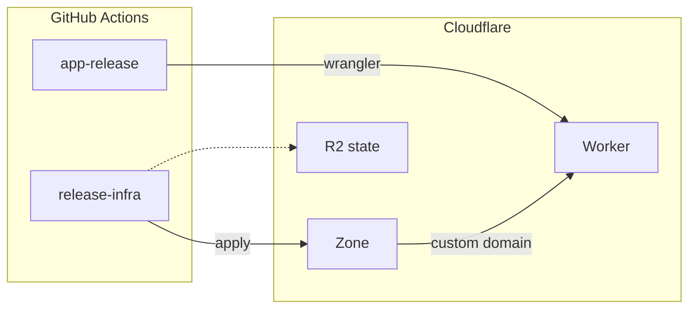
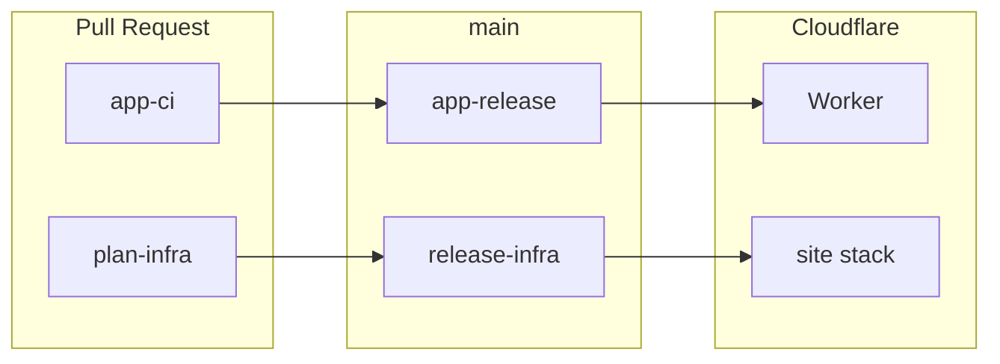

import RichLinkCard from '../../../components/RichLinkCard.astro';
import SiteImage from '../../../components/SiteImage.astro';
import koborinAiArchitectureOg from '../../../assets/og/koborin-ai-architecture.png';

<SiteImage src={koborinAiArchitectureOg} alt="og" variant="articleHeader" style="width: 100%; height: auto;" />

This site, [koborin.ai](https://koborin.ai), is my personal site (Technical Garden) for publishing technical notes and thoughts.

This article introduces the overall architecture and design philosophy of the site. I'll explain why I chose this setup from both infrastructure and frontend perspectives.

The first version ran on Google Cloud (Cloud Run behind a global HTTPS load balancer, with a separate `dev.koborin.ai` behind IAP). The site is a place to publish articles, not a GCP playground, so I moved delivery to Cloudflare Workers and left GCP for this project.

---

## Overall Architecture



### Terminology

| Abbreviation | Full Name | Description |
| --- | --- | --- |
| Worker | [Cloudflare Workers](https://developers.cloudflare.com/workers/) | Runs the static Astro site at the edge |
| Custom domain | [Workers custom domains](https://developers.cloudflare.com/workers/configuration/routing/custom-domains/) | Attaches `koborin.ai` to the Worker and manages DNS and certificates |
| R2 | [Cloudflare R2](https://developers.cloudflare.com/r2/) | S3-compatible object storage for Terraform state |
| Wrangler | [Wrangler](https://developers.cloudflare.com/workers/wrangler/) | CLI that uploads the Astro `dist/` assets |

### Key Points

- **Request path**: `koborin.ai` → Cloudflare custom domain → Worker static assets
- **One public host**: `koborin.ai` only. There is no `dev.koborin.ai` and no IAP
- **Split deploys**: app updates are `wrangler deploy`; DNS and the custom domain are TerraDart `terraform apply`
- **CI auth**: a scoped Cloudflare API token in GitHub Secrets. There is no Workload Identity Federation for this site

---

## Design Philosophy

### Infrastructure Design

#### One production host

I still want a place to preview drafts. That now happens on `localhost` with `npm run dev`, not on a second public hostname.

A personal site does not need a second Cloud Run service, a load balancer, or IAP. One Worker and one custom domain are enough.

#### App deploy and infra apply stay separate

Worker files are not uploaded by Terraform. `wrangler deploy` publishes `app/dist`. TerraDart only attaches the hostname and keeps Terraform state in R2.

That split keeps a content deploy from rewriting DNS, and an infra apply from overwriting the site files.

#### IaC history

The IaC for this site started as CDK for Terraform, then Pulumi Go, then TerraDart on Google Cloud. Those tools were fine. The hosting target changed.

<RichLinkCard
  href="https://github.com/hashicorp/terraform-cdk"
  title="hashicorp/terraform-cdk: Define infrastructure resources using programming languages"
  description="CDK for Terraform (CDKTF) allows you to define infrastructure using familiar programming languages."
/>

CDKTF was archived on December 10, 2025. I moved to Pulumi Go, then to TerraDart so the infrastructure code stayed in Dart and still emitted Terraform.

The current stack is one TerraDart root module: `site`.

### Frontend Design

#### No Need for Custom API / DB

For a personal site, I considered the following requirements:

- Write and publish technical notes and thoughts in Markdown (MDX)
- No need for dynamic data fetching or user authentication
- Keep operations as simple as possible

With these requirements, **there's no need for a custom API server or database**. Static content generation is sufficient.

#### GitHub as CMS

As an engineer myself, I don't need a CMS (like WordPress or Notion). **Managing MDX files directly in a GitHub repository** is enough.

- Article creation and editing are version-controlled with Git
- PR-based reviews and previews are possible
- CI/CD automatically builds and deploys

This eliminates the need for a separate database, reducing operational costs.

#### Adopting Starlight

When selecting a framework, I referenced the site structure of [genkit.dev](https://genkit.dev). genkit.dev uses Starlight and provides a polished UX as a documentation site.

<RichLinkCard href="https://starlight.astro.build/" title="Starlight" description="Build beautiful, accessible, high-performance documentation websites with Astro." />

Reasons for choosing Starlight:

- **Astro-based**: Specialized for static site generation with excellent performance
- **Multilingual support**: Can provide content in both English and Japanese
- **Documentation-focused features**: Sidebar, search, dark mode included by default
- **MDX support**: Can use React components within Markdown

---

## Request Path

### 1. DNS (Cloudflare)

The zone `koborin.ai` already lived on Cloudflare. TerraDart looks the zone up by name. It does not create the zone and does not manage MX or GitHub verification TXT records.

A Workers custom domain points `koborin.ai` at Worker `koborin-ai-web`. Cloudflare issues the certificate and the proxied DNS record.

### 2. Worker static assets

Astro builds a static site (`output: "static"`). Wrangler uploads `dist/` as [Workers static assets](https://developers.cloudflare.com/workers/static-assets/). There is no Worker JavaScript `main` module and no nginx container.

---

## Site Features

### llms.txt

This site provides LLM context files at `/llms.txt`.

| File | Content |
| --- | --- |
| `/llms.txt` | Index with links to all variants |
| `/llms-full.txt` | All English articles (with full Markdown body) |
| `/llms-ja-full.txt` | All Japanese articles (with full Markdown body) |
| `/llms-tech.txt`, `/llms-ja-tech.txt` | Tech category only |
| `/llms-life.txt`, `/llms-ja-life.txt` | Life category only |

```text
# koborin.ai
> Personal site + technical garden.

## Full (with article content)
- https://koborin.ai/llms-full.txt
- https://koborin.ai/llms-ja-full.txt

## By Category

### Tech
- https://koborin.ai/llms-tech.txt
- https://koborin.ai/llms-ja-tech.txt

### Life
- https://koborin.ai/llms-life.txt
- https://koborin.ai/llms-ja-life.txt
```

OSS projects often publish `llms.txt` to help LLMs understand "what the project is and how to use it." This is incredibly useful, providing context for LLMs to correctly work with libraries and frameworks.

For a personal site, there's a different use case. As my thoughts and technical notes accumulate over time (at least that's the plan... I hope to keep it up...), it might be useful in the future to have an LLM reference "what I was thinking in the past."

With that possibility in mind, I publish the full article body in this format.

### Engagement Features

Article pages include features to encourage engagement with readers.

#### Giscus (Comments)

[Giscus](https://giscus.app) is a comment system that uses GitHub Discussions as its backend.

- Readers can log in with their GitHub account to comment and react
- Comments are stored in GitHub Discussions, so no separate database is needed
- Automatically syncs with the site's dark/light mode

#### Share Buttons

Buttons are provided for sharing articles on social media:

- X (formerly Twitter)
- Bluesky
- Mastodon
- Hatena Bookmark
- Copy Link

These features are displayed **only on article pages with `publishedAt` in the frontmatter**. They don't appear on index pages or general documentation pages.

---

## CI/CD



### App Deployment

| Trigger | Workflow | Actions |
| --- | --- | --- |
| On PR | `app-ci.yml` | Validate lint / typecheck / test / build |
| On main merge | `app-release.yml` | `npm run build` then `wrangler deploy` |
| `app-v*` tag | `app-release.yml` | Same deploy to the production Worker |

### Infra Deployment

| Trigger | Workflow | Actions |
| --- | --- | --- |
| On PR | `plan-infra.yml` | `dart analyze` + `terraform plan` for the `site` stack |
| On main merge or `infra-v*` | `release-infra.yml` | `terraform apply` for the `site` stack |

Auth for these workflows is `CLOUDFLARE_API_TOKEN`. Terraform state lives in R2 bucket `koborin-ai-tfstate`.

### CI Optimization by Change Type

This site adjusts CI execution scope based on the nature of PR changes.

This approach is inspired by the distinction between **Behavior Change** and **Structure Change** that t-wada introduced at the Developer Productivity Conference 2025.

<RichLinkCard href="https://www.oreilly.com/library/view/tidy-first/9781098151232/" title="Tidy First?: A Personal Exercise in Empirical Software Design" description="By Kent Beck. Messy code is a nuisance. Tidying code, to make it more readable, requires breaking it up into manageable sections." />

The original source is Kent Beck's book "Tidy First?", which proposes categorizing code changes into "behavior changes" and "structure changes" to reduce review burden and clarify the intent of changes.

#### Lessons from a Previous Project

In a previous full-stack project at work, I built E2E tests with Playwright as guardrails for AI agents.

That project also separated `app` and `infra`, with a rule that CI would run whenever code under `app/` changed. However, after integrating E2E tests into CI, **execution time ballooned to 13 minutes**, turning CI into a significant bottleneck.

The problem was that even for changes that clearly had no UI impact (like adding model fields or refactoring), full E2E tests would run every time. **The lesson learned: test scope should be adjusted based on the nature of the change.**

#### Label-Based Branching

Based on this experience, koborin.ai uses path heuristics (and PR labels for release notes) to branch CI execution steps.

| Label | Meaning | CI Behavior |
| --- | --- | --- |
| `change:behavior` | Behavior change (UI/output/config changes) | Full checks (lint + build + audit) |
| `change:structure` | Structure change (refactoring/formatting) | Lightweight checks (lint only) |

The default is `behavior` (full checks). Structure-only diffs skip `npm audit` and `npm run build`.

#### Documentation for AI Agents

This change type distinction is also used when AI agents create PRs.

By documenting definitions in `AGENTS.md`, AI can judge the appropriate label based on the change content:

- **Behavior Change**: Content changes under `app/src/content/docs/`, changes to `astro.config.mjs` or `wrangler.jsonc`, TerraDart stack changes
- **Structure Change**: Updates to `README.md` or `AGENTS.md`, comment-only changes, refactoring

---

## Implementation Details

### Site stack

<RichLinkCard href="https://github.com/koborin-ai/site/tree/main/infra" title="site/infra" description="TerraDart site stack for koborin.ai." />

`infra/lib/site_stack.dart` looks up zone `koborin.ai` and attaches Worker `koborin-ai-web` as a custom domain. Synth writes Terraform JSON to `tf-out/site/`. GitHub Actions applies that module against R2 state.

Local wrappers in this repo cover `data.cloudflare_zone` and `cloudflare_workers_custom_domain`. `terradart_cloudflare` is not patched.

### App

<RichLinkCard href="https://github.com/koborin-ai/site/tree/main/app" title="site/app at main · koborin-ai/site" description="Astro + Starlight application for koborin.ai." />

`app/wrangler.jsonc` names the Worker `koborin-ai-web` and sets `assets.directory` to `./dist`. There is no `main` script and no `routes` block. `npm run deploy` runs `wrangler deploy`.

Astro and Starlight stay as they were: English `root` plus `ja`, sidebar from `app/src/sidebar.ts`, and custom Head / Header / Sidebar components.

---

## Conclusion

- **Simple setup**: one public hostname on Cloudflare Workers
- **Frontend**: no API/DB, GitHub as CMS, built with Starlight
- **Split deploys**: wrangler for the site, TerraDart for the custom domain
- **Behavior / Structure awareness**: adjusting CI scope based on the nature of changes
- **Site features**: llms.txt and Engagement Features (Giscus, Share buttons) to connect with readers

## Source Code

<RichLinkCard href="https://github.com/koborin-ai/site" title="site" description="Personal site and technical garden for koborin.ai." />
