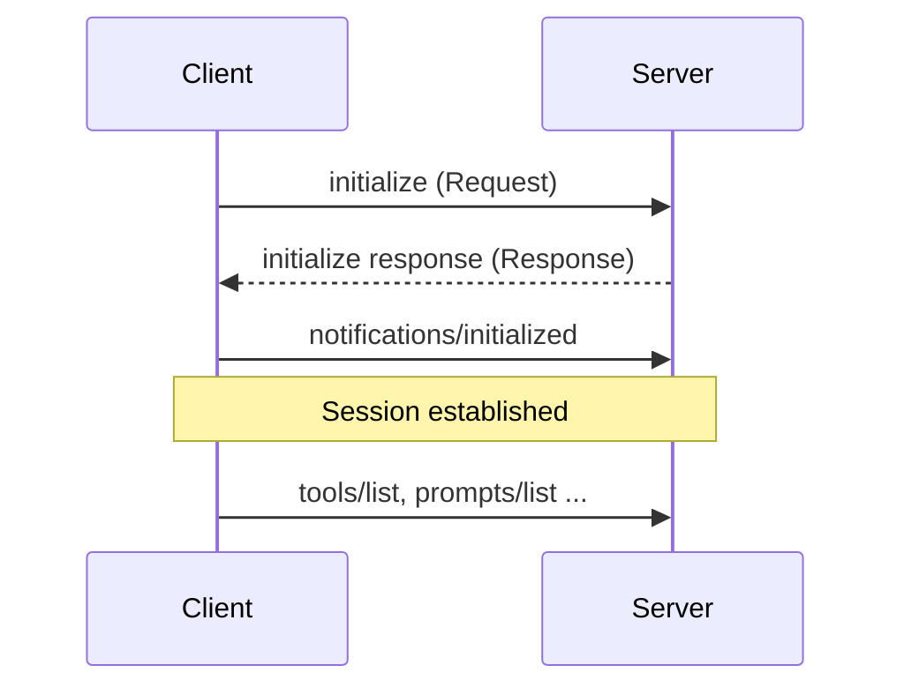
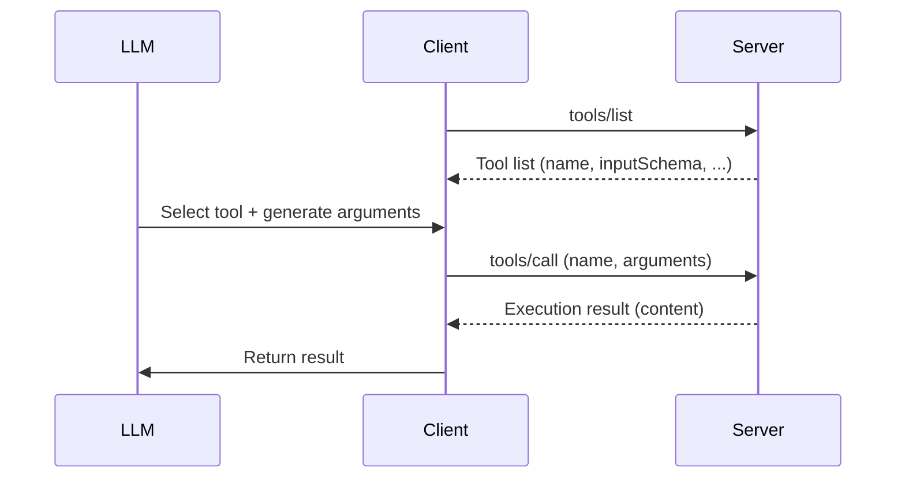
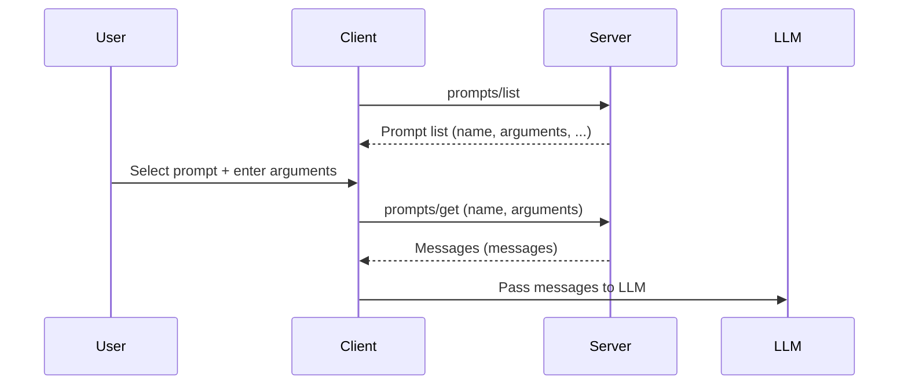
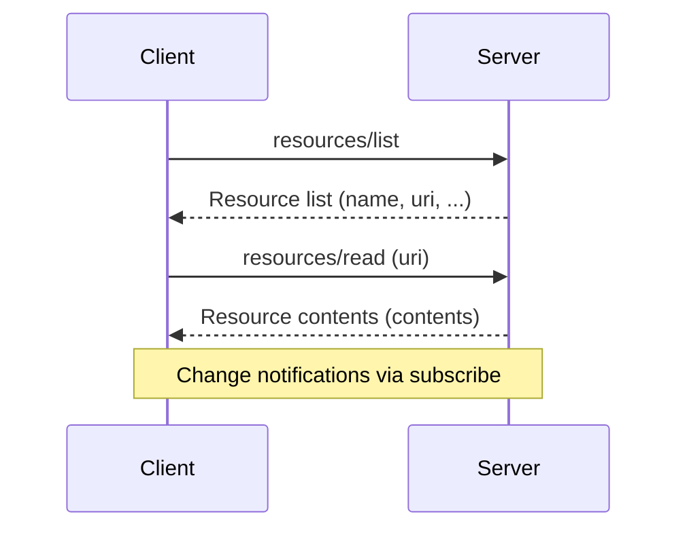
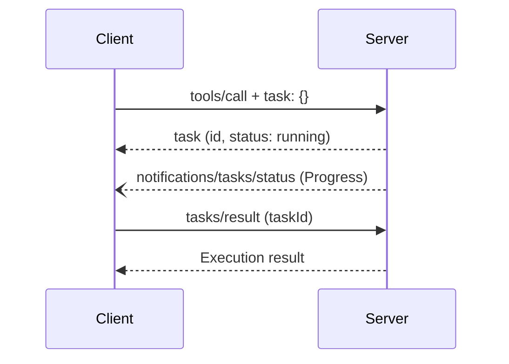
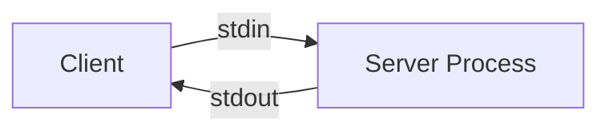
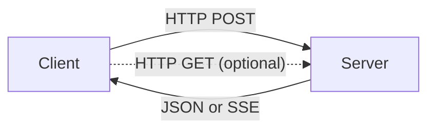

import RichLinkCard from '../../../components/RichLinkCard.astro';


## Introduction

[Genkit](https://genkit.dev/) is an AI application development framework built by Google.

TypeScript and Go are GA, and the [Dart version](https://github.com/genkit-ai/genkit-dart) is under development as a Preview as of February 2026.

I contribute to Genkit for Dart, and as part of the effort to build a full SDK, I was responsible for implementing the MCP (Model Context Protocol) plugin.

I had already published MCP server open-source projects like [gcp-cost-mcp-server](https://github.com/nozomi-koborinai/gcp-cost-mcp-server) and [ableton-osc-mcp](https://github.com/nozomi-koborinai/ableton-osc-mcp) using the [Genkit for Go MCP package](https://pkg.go.dev/github.com/firebase/genkit/go/plugins/mcp), so I was familiar with MCP as a user.
However, Genkit for Dart also needed MCP support on par with TypeScript/Go, and this time I had to engage with MCP as someone embedding the protocol itself.

<RichLinkCard
  href="https://github.com/genkit-ai/genkit-dart/pull/94"
  title="feat: add MCP (Model Context Protocol) plugin"
  description="Add genkit_mcp package — MCP integration for Genkit for Dart. Implements the MCP specification (2025-11-25)."
/>

In this article, I share what I learned about the Model Context Protocol specification while implementing the MCP plugin.
This is aimed at engineers who use MCP servers daily but are not familiar with how the protocol works under the hood.

## MCP Protocol Versions

The first thing I had to deal with when implementing the MCP plugin was deciding which version of the [specification](https://modelcontextprotocol.io/specification) to target.

MCP specifications are versioned using `YYYY-MM-DD` format dates, not semver. Available features differ by version, and updates have been released every few months since the initial version in November 2024.

| Version | Key changes |
| --- | --- |
| [2024-11-05](https://modelcontextprotocol.io/specification/2024-11-05) | Initial release. JSON-RPC 2.0, Tools / Prompts / Resources, [stdio / HTTP+SSE](https://modelcontextprotocol.io/specification/2024-11-05/basic/transports) transports |
| [2025-03-26](https://modelcontextprotocol.io/specification/2025-03-26) | [Streamable HTTP](https://modelcontextprotocol.io/specification/2025-03-26/basic/transports#streamable-http) transport, [OAuth 2.1](https://modelcontextprotocol.io/specification/2025-03-26/basic/authorization) authorization framework ([Changelog](https://modelcontextprotocol.io/specification/2025-03-26/changelog)) |
| [2025-06-18](https://modelcontextprotocol.io/specification/2025-06-18) | [Elicitation](https://modelcontextprotocol.io/specification/2025-06-18/client/elicitation), [Resource Links](https://modelcontextprotocol.io/specification/2025-06-18/server/tools#resource-links), [Structured tool output](https://modelcontextprotocol.io/specification/2025-06-18/server/tools#structured-content) ([Changelog](https://modelcontextprotocol.io/specification/2025-06-18/changelog)) |
| [2025-11-25](https://modelcontextprotocol.io/specification/2025-11-25) | [Tasks](https://modelcontextprotocol.io/specification/2025-11-25/basic/utilities/tasks), [OAuth Client ID Metadata Documents](https://modelcontextprotocol.io/specification/2025-11-25/basic/authorization#oauth-client-id-metadata-documents), JSON Schema 2020-12 as default ([Changelog](https://modelcontextprotocol.io/specification/2025-11-25/changelog)) |

MCP-compatible tools like Cursor, Claude Desktop, Claude Code, Windsurf, and Antigravity each implement this specification as clients.

The same applies to the server side. During connection, both parties exchange `protocolVersion` to agree on a mutually supported version (spec: [Lifecycle / Version Negotiation](https://modelcontextprotocol.io/specification/2025-11-25/basic/lifecycle#version-negotiation)). If the server does not support the version the client requested, it responds with a different supported version, and the client decides whether to accept it (more on this later).

For the Genkit for Dart MCP plugin, I targeted the latest [2025-11-25](https://modelcontextprotocol.io/specification/2025-11-25) specification.
The [OAuth 2.1 authorization flow](https://modelcontextprotocol.io/specification/2025-11-25/basic/authorization) was out of scope for this implementation.

## Communication Foundation of MCP: JSON-RPC 2.0

All MCP communication runs on [JSON-RPC 2.0](https://www.jsonrpc.org/specification).

JSON-RPC 2.0 is a lightweight protocol for JSON-encoded remote procedure calls.

The client and server exchange JSON messages to invoke procedures. MCP uses three types of messages:

- **Request**: Has `id` and `method` (`params` is optional). Expects a response.
- **Response**: Has `id` and either `result` or `error`. A reply to a request.
- **Notification**: Has `method` (`params` is optional) but no `id`. A one-way message that expects no response.

An MCP session always begins with an Initialize handshake.



The client sends an `initialize` request, the server responds, and then the client sends a `notifications/initialized` notification to establish the session.

In the Genkit for Dart MCP plugin, the client-side `_initialize()` method handles this handshake sequence.

```dart
// Client: initialize handshake (mcp_client.dart)
Future<void> _initialize() async {
  // 1. Send initialize request
  final result = await _sendRequest('initialize', {
    'protocolVersion': '2025-11-25',
    'capabilities': _clientCapabilities(),
    'clientInfo': {
      'name': options.name,
      'version': options.version ?? '1.0.0',
    },
  });

  // 2. Extract information from the server's response
  final serverInfo = asMap(result['serverInfo']);
  if (options.serverName == null && serverInfo['name'] is String) {
    _serverName = serverInfo['name'] as String;
  }

  // 3. For HTTP transport, set the negotiated version in headers
  final negotiatedVersion = result['protocolVersion'];
  if (negotiatedVersion is String &&
      _transport is StreamableHttpClientTransport) {
    (_transport as StreamableHttpClientTransport).setProtocolVersion(
      negotiatedVersion,
    );
  }

  // 4. Send notifications/initialized to establish the session
  await _sendNotification('notifications/initialized', {});
}
```

On the server side, `handleRequest()` receives the `initialize` request and returns its own `protocolVersion`, `capabilities`, and `serverInfo`.

```dart
// Server: handling the initialize request (mcp_server.dart)
case 'initialize':
  return _respond(id, {
    'protocolVersion': '2025-11-25',
    'capabilities': _serverCapabilities(),
    'serverInfo': {
      'name': options.name,
      'version': options.version ?? '1.0.0',
    },
  });
case 'notifications/initialized':
  return null; // No response needed for notifications
```

The actual JSON exchanged by this code looks like this:

**Client → Server (initialize request):**

```json
{
  "jsonrpc": "2.0",
  "id": 1,
  "method": "initialize",
  "params": {
    "protocolVersion": "2025-11-25",
    "capabilities": {
      "roots": { "listChanged": true }
    },
    "clientInfo": {
      "name": "my-client",
      "version": "1.0.0"
    }
  }
}
```

**Server → Client (initialize response):**

```json
{
  "jsonrpc": "2.0",
  "id": 1,
  "result": {
    "protocolVersion": "2025-11-25",
    "capabilities": {
      "tools": { "listChanged": true },
      "prompts": { "listChanged": true },
      "resources": { "listChanged": true, "subscribe": true },
      "logging": {},
      "tasks": { "cancel": {}, "list": {} }
    },
    "serverInfo": {
      "name": "my-server",
      "version": "0.1.0"
    }
  }
}
```

Now let's look at `protocolVersion` and `capabilities` in detail.

`protocolVersion` is the field used to agree on "the protocol version to use for this session" during the `initialize` handshake ([Lifecycle / Version Negotiation](https://modelcontextprotocol.io/specification/2025-11-25/basic/lifecycle#version-negotiation)).

If the server supports the requested version, it responds with the same value. If not, the server responds with a different version it can support.

If the client cannot support the returned version, it disconnects (SHOULD disconnect).

For HTTP transport, subsequent requests must include the agreed version in the `MCP-Protocol-Version` header ([Protocol Version Header](https://modelcontextprotocol.io/specification/2025-11-25/basic/transports#protocol-version-header)).

The `capabilities` field is a declaration used to align the set of features available in the session.

## Capabilities Negotiation in MCP

MCP servers and clients do not necessarily support the same set of features.

One server might only provide Tools, while another provides Resources and Prompts as well.

During the `initialize` handshake, both sides declare "what I can do" and finalize the features available for the session ([Capabilities Negotiation](https://modelcontextprotocol.io/specification/2025-11-25/basic/lifecycle#capability-negotiation)).

### Capability List

**Server Capabilities:**

| Capability | Description |
| --- | --- |
| `tools` | Provides tools. `listChanged` enables notifications for dynamic additions/removals |
| `prompts` | Provides prompt templates |
| `resources` | Provides resources. `subscribe` enables real-time update notifications |
| `logging` | Sends log messages |
| `completions` | Provides autocompletion |
| `tasks` | Manages asynchronous tasks (added in 2025-11-25) |

**Client Capabilities:**

| Capability | Description |
| --- | --- |
| `roots` | Provides workspace root directory information |
| `sampling` | Accepts LLM invocation requests from the server |
| `elicitation` | Accepts additional information requests from the server (added in 2025-06-18) |
| `tasks` | Manages asynchronous tasks (added in 2025-11-25) |

As a result of this negotiation, if the server does not declare `tools`, the client cannot call `tools/list`. If the client does not declare `sampling`, the server cannot request LLM invocations.

Features are not discovered by "calling and seeing if it errors" but by "declaring and agreeing upfront."

### Implementation in Genkit for Dart

The `capabilities` object is not manually assembled as JSON by MCP server/client developers — the SDK builds it automatically.

In Genkit for Dart, the server statically declares all supported features, while the client dynamically builds capabilities based on configuration.

```dart
// Server: statically declare all supported features (mcp_server.dart)
Map<String, dynamic> _serverCapabilities() {
  return {
    'tools': {'listChanged': true},
    'prompts': {'listChanged': true},
    'resources': {'listChanged': true, 'subscribe': true},
    'logging': {},
    'completions': {},
    'tasks': {
      'cancel': {},
      'list': {},
      'requests': {
        'tools': {'call': {}},
      },
    },
  };
}
```

On the client side, capabilities are dynamically determined based on whether the developer has set callback functions (handlers).

For example, `sampling` is "a function that handles LLM invocation requests from the server."

In Genkit for Dart, this handler is defined as an optional field in the client options.

```dart
// Client option definitions (mcp_client.dart)
class McpClientOptions {
  final String name;
  final String? serverName;
  final String? version;
  final bool rawToolResponses;
  final McpServerConfig mcpServer;
  final McpSamplingHandler? samplingHandler;     // nullable = optional
  final McpElicitationHandler? elicitationHandler; // nullable = optional
  // ...
}
```

If a request arrives from the server when no handler is set, a `Method not found` error is returned.

```dart
// Error handling when handler is not set (mcp_client.dart)
Future<void> _handleSamplingRequest(Object? id, Map<String, dynamic> params) async {
  final handler = options.samplingHandler;
  if (handler == null) {
    _sendError(id, {
      'code': -32601,
      'message': 'Method not found: sampling/createMessage',
    });
    return;
  }
  // If a handler is set, process the request normally
  await _respondWithClientTask(id, params, handler, requestType: 'sampling/createMessage');
}
```

To prevent this error, capabilities without handlers are simply not declared.

```dart
// Client: dynamically build based on handler availability (mcp_client.dart)
Map<String, dynamic> _clientCapabilities() {
  final capabilities = <String, dynamic>{
    'roots': {'listChanged': true},
  };
  // Declare sampling if samplingHandler is set
  if (options.samplingHandler != null) {
    capabilities['sampling'] = {'context': {}, 'tools': {}};
  }
  // Declare elicitation if elicitationHandler is set
  if (options.elicitationHandler != null) {
    capabilities['elicitation'] = {'form': {}, 'url': {}};
  }
  // Declare tasks if either sampling or elicitation is available
  if (options.samplingHandler != null || options.elicitationHandler != null) {
    capabilities['tasks'] = {
      'cancel': {},
      'list': {},
      'requests': {
        if (options.samplingHandler != null)
          'sampling': {'createMessage': {}},
        if (options.elicitationHandler != null)
          'elicitation': {'create': {}},
      },
    };
  }
  return capabilities;
}
```

The server reads this response to determine "I can/cannot request sampling from this client."

## The Three Primitives of MCP

In the previous section, `tools`, `prompts`, and `resources` appeared in the Server Capabilities.

The official MCP documentation calls these three [Primitives](https://modelcontextprotocol.io/docs/concepts/architecture#primitives) — the basic building blocks of features that servers provide to clients.

### Tools

Tools are functions that the LLM calls.

Many engineers are already familiar with Gemini's or Claude's Function Calling / Tool Use. MCP Tools standardize exactly this at the protocol level. They are the most commonly used of the three primitives.

The client retrieves the list of available tools via `tools/list`, and the LLM executes a selected tool via `tools/call`.



**tools/list response example:**

```json
{
  "tools": [
    {
      "name": "greet",
      "description": "Greets a user by name.",
      "inputSchema": {
        "type": "object",
        "properties": {
          "name": { "type": "string", "description": "Name to greet" }
        },
        "required": ["name"]
      }
    }
  ]
}
```

Each tool has an `inputSchema` (JSON Schema), and the LLM generates arguments according to this schema.

**tools/call request and response:**

```json
// Request
{
  "jsonrpc": "2.0",
  "id": 2,
  "method": "tools/call",
  "params": {
    "name": "greet",
    "arguments": { "name": "Dart" }
  }
}

// Response
{
  "jsonrpc": "2.0",
  "id": 2,
  "result": {
    "content": [
      { "type": "text", "text": "Hello, Dart!" }
    ]
  }
}
```

In Genkit for Dart, the server converts Genkit Tool definitions to MCP format, exposes them, and returns execution results via `tools/call`.

```dart
// Server: convert Genkit Tool definitions to MCP format and return the list (mcp_server.dart)
Future<Map<String, dynamic>> _listTools() async {
  await setup();
  return {'tools': _toolActions.map(toMcpTool).toList()};
}

// Server: find tool by name, pass arguments, and execute (mcp_server.dart)
Future<Map<String, dynamic>> _callTool(Map<String, dynamic> params) async {
  await setup();
  final name = params['name'];
  if (name is! String) {
    throw GenkitException('[MCP Server] Tool name must be provided.');
  }
  final tool = _toolActions.firstWhere(
    (t) => t.name == name,
    orElse: () => throw GenkitException('[MCP Server] Tool "$name" not found.'),
  );
  final input = params['arguments'];
  try {
    final result = await tool.runRaw(input);
    final output = result.result;
    final text = _stringifyToolOutput(output);
    return {
      'content': [
        {'type': 'text', 'text': text},
      ],
    };
  } catch (e) {
    // Return execution errors with isError: true so the LLM can self-correct
    return {
      'content': [
        {'type': 'text', 'text': e.toString()},
      ],
      'isError': true,
    };
  }
}
```

Note the `catch` block in `_callTool` that returns `isError: true`. The reason for returning tool execution errors with `isError: true` rather than as JSON-RPC protocol errors is explained in detail in a [later section](#how-to-return-tool-execution-errors).

### Prompts

Prompts are reusable message templates provided by the server.

While tools follow the flow of "the LLM calls server functions," prompts serve the reverse role: "the server defines message templates to pass to the LLM."

The client retrieves the template list via `prompts/list`, and the user selects a prompt and retrieves it with arguments filled in via `prompts/get`.



While Tools are **Model-controlled** (the LLM automatically selects and executes them), Prompts are **User-controlled** (the user explicitly selects them) ([Server Primitives Overview](https://modelcontextprotocol.io/specification/2025-11-25/server)).

For example, in Claude Desktop, typing `/` displays a list of prompts provided by MCP servers as slash commands. The user selects one and enters arguments.

In Genkit for Dart, the server returns MCP-format template lists and expanded messages from Genkit Prompt definitions.

```dart
// Server: return prompt list (mcp_server.dart)
Future<Map<String, dynamic>> _listPrompts() async {
  await setup();
  final prompts = _promptActions.map((prompt) {
    final args = toMcpPromptArguments(prompt.inputSchema);
    return {
      'name': prompt.name,
      'description': ?prompt.description,
      'arguments': ?args,
    };
  }).toList();
  return {'prompts': prompts};
}

// Server: fill in arguments and return expanded messages (mcp_server.dart)
Future<Map<String, dynamic>> _getPrompt(Map<String, dynamic> params) async {
  await setup();
  final name = params['name'];
  final prompt = _promptActions.firstWhere((p) => p.name == name);
  final args = params['arguments'];
  final result = await prompt.runRaw(args);
  return {
    if (prompt.description != null) 'description': prompt.description,
    'messages': toMcpPromptMessages(result.result.messages),
  };
}
```

### Resources

Resources are data provided as context for the LLM.

File contents, database records, API responses — servers expose information that the LLM should reference as resources.

The client retrieves the list via `resources/list` and reads contents via `resources/read`.



Using `resources/subscribe`, servers can notify clients of resource changes in real time.

In Genkit for Dart, resources are identified by URI. Both fixed-URI resources and URI templates (with parameters) are supported.

```dart
// Server: return resource list (mcp_server.dart)
Future<Map<String, dynamic>> _listResources() async {
  await setup();
  final resources = _resourceActions.map((resource) {
    final data = resource.metadata['resource'];
    if (data is Map<String, dynamic> && data['uri'] is String) {
      return {
        'name': resource.name,
        if (resource.description != null) 'description': resource.description,
        'uri': data['uri'],
      };
    }
    return null;
  }).whereType<Map<String, dynamic>>().toList();
  return {'resources': resources};
}

// Server: find resource by URI and return contents (mcp_server.dart)
Future<Map<String, dynamic>> _readResource(Map<String, dynamic> params) async {
  await setup();
  final uri = params['uri'];
  final resource = _resourceActions.firstWhere((r) => r.matches(ResourceInput(uri: uri)));
  final result = await resource.runRaw({'uri': uri});
  return {'contents': toMcpResourceContents(uri, result.result.content)};
}
```

## Tasks: Asynchronous Task Management

In addition to the three primitives, the 2025-11-25 version added [Tasks](https://modelcontextprotocol.io/specification/2025-11-25/basic/utilities/tasks).

The official documentation positions Tasks as a `cross-cutting utility` that extends across primitives.

Tasks add an option to execute requests like `tools/call` as asynchronous tasks.

For long-running operations (bulk data processing, chained external API calls, etc.), instead of waiting for a response, you receive a task ID and can poll for the result later.



The key point is that the client can switch behavior by including or omitting the `task` field in the request.

In Genkit for Dart's `_respondWithTask`, the presence of the `task` field determines whether to respond synchronously or create a task.

```dart
// Server: branch sync/async based on task field presence (mcp_server.dart)
Future<Map<String, dynamic>?> _respondWithTask(
  Object? id,
  Map<String, dynamic> params,
  Future<Map<String, dynamic>> Function() action, {
  required String requestType,
}) async {
  if (id == null) return null;
  final taskMeta = params['task'];
  if (taskMeta is Map) {
    // task field present → execute as asynchronous task
    final task = _createTask(
      requestType: requestType,
      meta: taskMeta.cast<String, dynamic>(),
      progressToken: _extractProgressToken(params),
      action: action,
    );
    return _respond(id, {'task': _taskToJson(task)});
  }
  // task field absent → normal synchronous response
  final result = await action();
  return _respond(id, result);
}
```

Task execution runs in the background via `_runTask`, and the client is notified via `notifications/tasks/status` on completion or failure.

```dart
// Server: run task in background and notify on completion/failure (mcp_server.dart)
Future<void> _runTask(
  _TaskState task,
  Object? progressToken,
  Future<Map<String, dynamic>> Function() action,
) async {
  await _sendProgress(progressToken, message: 'started');
  try {
    final result = await action();
    if (task.isCancelled) return;
    task.complete(result);
    await _sendProgress(progressToken, message: 'completed');
  } catch (e) {
    if (task.isCancelled) return;
    task.fail(toJsonRpcError(e));
    await _sendProgress(progressToken, message: 'failed');
  } finally {
    await _notifyTaskStatus(task);
  }
}
```

This design allows requests like `tools/call`, `prompts/get`, and `resources/read` to be turned into tasks without any code changes.

## MCP Transport Layer

So far, we have looked at "**what** is exchanged" — JSON-RPC message structure, Capabilities, and Primitives. Now let's look at "**how** it's carried" — the transport layer.

MCP [transports](https://modelcontextprotocol.io/specification/2025-11-25/basic/transports) define the communication channel that carries JSON-RPC messages between client and server.

The protocol itself is transport-agnostic by design, but the current specification defines two standard transports.

### stdio

stdio is a transport that uses standard input/output.

The client launches the server as a local child process and exchanges JSON-RPC messages via stdin/stdout.



This is suited for CLI tools and local development environments.

When you specify `command` and `args` to launch an MCP server in Cursor or Claude Desktop, the stdio transport is used.

### Streamable HTTP

[Streamable HTTP](https://modelcontextprotocol.io/specification/2025-11-25/basic/transports#streamable-http) was added in 2025-03-26, replacing the initial [HTTP+SSE transport](https://modelcontextprotocol.io/specification/2024-11-05/basic/transports#http-with-sse) from 2024-11-05.

The old HTTP+SSE required two endpoints — one for SSE and one for POST — and the client had to establish an SSE connection before sending requests.

Streamable HTTP consolidates these into a single endpoint, and the server can choose the response format.



The client sends requests via HTTP POST, and the server responds with either JSON (single response) or an SSE stream (sequential message delivery).

SSE is [optional per the specification](https://modelcontextprotocol.io/specification/2025-11-25/basic/transports#streamable-http), and a basic MCP server can be implemented with JSON responses only.

Session management uses the `MCP-Session-Id` header. This transport supports network communication and is used for connecting to remote MCP servers.

## Gotchas Discovered Through Implementation

Here are some issues that were hard to notice from reading the spec alone but became apparent during implementation.

### How to Return Tool Execution Errors

When an error occurs during tool execution, how should it be returned? In my initial implementation, I returned exceptions directly as JSON-RPC errors.

```json
{
  "jsonrpc": "2.0",
  "id": 2,
  "error": {
    "code": -32603,
    "message": "Tool execution failed"
  }
}
```

However, the MCP specification says tool **execution errors** should be returned using the `isError` flag in `CallToolResult`.

```json
{
  "jsonrpc": "2.0",
  "id": 2,
  "result": {
    "content": [
      { "type": "text", "text": "Error: Division by zero" }
    ],
    "isError": true
  }
}
```

`isError: true` means "error information returned as a normal response."

The LLM can read this message, correct its input, and retry.

In contrast, a JSON-RPC error is a protocol-level failure, so the LLM may not even see the error content.

Protocol errors (non-existent method, invalid argument types, etc.) and tool execution errors (API rate limits, external service failures, etc.) are different things.

The former uses JSON-RPC `error`; the latter uses `isError: true`. This distinction was easy to overlook when just reading the spec text.

### Tool-Level Task Support Declaration

Tasks, added in MCP 2025-11-25, manage long-running tool executions as asynchronous tasks.

Declaring `tasks` in the server's Capabilities alone is not enough — **each tool must individually** declare `execution.taskSupport`.

Even if the server declares `tasks.requests.tools.call`, a tool without `execution.taskSupport` in its definition is **prohibited** from being called as a task per the specification. This is a two-tier design that requires declarations at both the server level and the tool level.

In Genkit for Dart, when `toMcpTool` converts a tool definition to MCP format, it defaults to `'optional'` if no individual override is specified in metadata.

```dart
// convert_tools.dart — Genkit Tool → MCP Tool conversion
Map<String, dynamic> toMcpTool(Tool tool) {
  // Default to 'optional' if no explicit override in metadata
  final execution =
      _extractMcpExecution(tool.metadata) ?? const {'taskSupport': 'optional'};
  return {
    'name': tool.name,
    'description': tool.description ?? '',
    'inputSchema': _toJsonSchema(tool.inputSchema) ?? {
      r'$schema': 'http://json-schema.org/draft-07/schema#',
      'type': 'object',
    },
    'execution': execution,
    // ...
  };
}
```

### JSON Schema Dialect

The `$schema` set to `draft-07` in the code above is another gotcha.

The MCP specification defaults the JSON Schema dialect for `inputSchema` to 2020-12, but Genkit for Dart's schema generation library (schemantic, [discussed below](#integration-with-schemantic)) generates draft-07 schemas.

If `$schema` is omitted, clients might interpret it as 2020-12.

Therefore, `_toJsonSchema` explicitly sets `draft-07` on schemas generated by schemantic.

```dart
// convert_tools
Map<String, dynamic>? _toJsonSchema(SchemanticType? type) {
  if (type == null) return null;
  final schema = type.jsonSchema(useRefs: true).value;
  schema[r'$schema'] = 'http://json-schema.org/draft-07/schema#';
  return schema;
}
```

Cases where the spec's default value differs from what a library actually outputs are easy to miss when only reading documentation.

## Why I Chose a Custom Implementation

I initially planned to wrap a community-built Dart MCP SDK. However, as implementation progressed, I changed course and chose to implement the JSON-RPC layer directly.

There were two main reasons.

### Tight Coupling with Genkit's Type System

Genkit has its own type system: Registry / Plugin / Action.

MCP Tools map to Genkit's `Tool<I, O>`, Prompts to `PromptAction`, and Resources to `ResourceAction`.

Placing a third-party SDK in between would require an additional conversion layer: "SDK types → Genkit types."

By mapping directly from JSON-RPC to Genkit types, I kept the conversion to a single layer.

### Integration with schemantic

Genkit for Dart uses [schemantic](https://pub.dev/packages/schemantic), a mechanism comparable to zod and pydantic.

Dart lacks a standard way to define type-safe schemas, and schemantic was developed by Pavel, a Google engineer who maintains genkit-dart, to fill this gap.

With schemantic, you annotate abstract classes with `@Schematic()`, and type-safe data classes along with JSON Schema are auto-generated at build time.

```dart
@Schematic()
abstract class UserSchema {
  @StringField(minLength: 2, maxLength: 50)
  String get name;

  @IntegerField(description: 'Age of the user', minimum: 0, maximum: 120)
  int? get age;

  @Field(description: 'Is this user an admin?')
  bool get isAdmin;
}
```

During schemantic's design phase, there was another candidate approach: using the `Schema` object from `json_schema_builder` directly.

```dart
@Schematic()
final userSchema = Schema.object(
  properties: {
    'name': Schema.string(minLength: 2, maxLength: 50),
    'years_old': Schema.integer(description: 'Age of the user', minimum: 0, maximum: 120),
    'isAdmin': Schema.boolean(description: 'Is this user an admin?'),
  },
  required: ['name', 'isAdmin'],
);
```

When Pavel asked for feedback on these two approaches, I advocated for the annotation approach.

The reason is that the schema builder approach requires developers to be aware of JSON Schema structure, increasing cognitive load.

With the annotation approach, JSON Schema is hidden behind the implementation, and the build-time code generation pattern fits naturally into the Dart ecosystem — similar to `json_serializable` and `freezed`.

This mechanism can be used as-is for MCP tool definitions. Schemas defined with schemantic become the MCP `inputSchema` directly.

Wrapping a community SDK would have made this integration difficult, so I chose the direct implementation path.

This decision was ultimately accepted by the genkit-dart maintainers, and the [PR was merged](https://github.com/genkit-ai/genkit-dart/pull/94).

---

MCP is not a "product" or a "specific library" — it is a **protocol specification**.

In my case, studying the specification deeply improved my understanding of questions like "why does this MCP server behave this way," "why is this procedure required for connection," and "why is the error returned in this format."

I hope this article helps you understand what goes on behind the scenes of MCP.

<RichLinkCard
  href="https://modelcontextprotocol.io/specification/2025-11-25"
  title="Model Context Protocol Specification (2025-11-25)"
  description="The latest version of the Model Context Protocol specification."
/>

<RichLinkCard
  href="https://github.com/genkit-ai/genkit-dart"
  title="genkit-dart"
  description="Dart SDK for Genkit — Build, deploy, and monitor AI-powered apps in Dart."
/>
