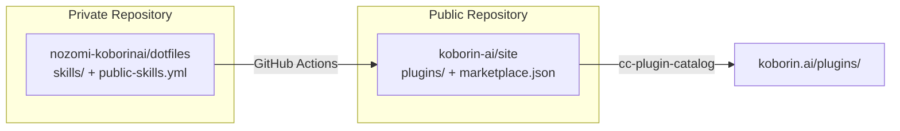

import RichLinkCard from '../../../components/RichLinkCard.astro';


## Introduction

koborin.ai has had [llms.txt](https://koborin.ai/llms.txt) for a while, making the site's structure understandable to AI.

This update takes that a step further by adding a **Claude Code Plugin Marketplace**. From a site that AI can read, to a site that **AI agents can use**.

Check out the live catalog at [koborin.ai/plugins/](https://koborin.ai/plugins/).

---

## What's New

koborin.ai now functions as a Claude Code Plugin Marketplace.

<RichLinkCard
  href="https://code.claude.com/docs/en/plugin-marketplaces"
  title="Create and distribute a plugin marketplace"
  description="Build and host plugin marketplaces to distribute Claude Code extensions across teams and communities."
/>

Anyone can install published skills with the following commands:

```bash
# From the terminal
claude plugin marketplace add koborin-ai/site
claude plugin install mermaid-diagram@koborinai-plugins

# From within Claude Code
/plugin marketplace add koborin-ai/site
/plugin install mermaid-diagram@koborinai-plugins
```

For example, `mermaid-diagram` is a workflow I originally built for my own projects. When working with clients whose deliverables are restricted to Google Docs or Microsoft Word, Mermaid diagrams can't be rendered natively, so I needed an efficient way to generate PNGs and embed them in documents. I documented this workflow in a SKILL.md and shared it at an internal study session.

But that was one-off knowledge sharing at best. Even when others wanted to adopt it, they ended up re-implementing it in their own projects. By turning it into a Plugin, anyone can now install it with a single command through Claude Code's official plugin system.

See all published plugins at [koborin.ai/plugins/](https://koborin.ai/plugins/).

---

## Why I Did This

It started when I came across an OSS project called **cc-plugin-catalog**.

<RichLinkCard
  href="https://github.com/giginet/cc-plugin-catalog"
  title="cc-plugin-catalog"
  description="Static site generator for Claude Code Plugin Marketplace repositories."
/>

It's a static site generator that builds a catalog page from a Plugin Marketplace repository. When I saw this, I realized I could turn the skill definitions I write every day into a catalog with zero extra effort.

Writing SKILL.md files is something I already do to organize my workflows and thinking. So I figured I could build a system where anyone who wants to use these skills can freely adopt them through Claude Code's official plugin mechanism, **without creating any additional work for me**.

---

## How It Works

Skills are managed in my personal dotfiles (a private repository), and `public-skills.yml` controls which ones get published.



When I push to dotfiles, GitHub Actions converts the skills into Plugin Marketplace format and syncs them to the koborin-ai repository. On the koborin-ai side, the app release pipeline runs cc-plugin-catalog to generate the catalog site and serves it on the existing infrastructure.

To publish a new skill, I just add an entry to `public-skills.yml` and push. Note that this file is not part of the Plugin Marketplace spec — it's a custom definition file I created to control which skills get synced from dotfiles to koborin-ai.

```yaml
public_skills:
  - name: agent-team-fullstack
    category: development
    tags: [agent-team, fullstack, parallel-development]
  - name: mermaid-diagram
    category: documentation
    tags: [mermaid, diagram, documentation]
```

Syncing, format conversion, and catalog generation are all handled by CI, so no manual work is needed beyond updating this file and the SKILL.md files themselves.

---

## Takeaway

The guiding principle for this update was **turning everyday work into publishable assets**.

| Task | Before | Now |
| --- | --- | --- |
| Write a skill | Write SKILL.md for myself | Same (unchanged) |
| Share a skill | Write in AGENTS.md, explain at study sessions | Add 1 entry to `public-skills.yml` |
| Document a skill | Write a separate blog post | Catalog is auto-generated |
| Provide installation | Hand over files manually | `claude plugin install` |

The act of writing SKILL.md hasn't changed. It just now doubles as catalog content and an installable plugin. Publishing happens as a byproduct — and that's the system I built into koborin.ai.
