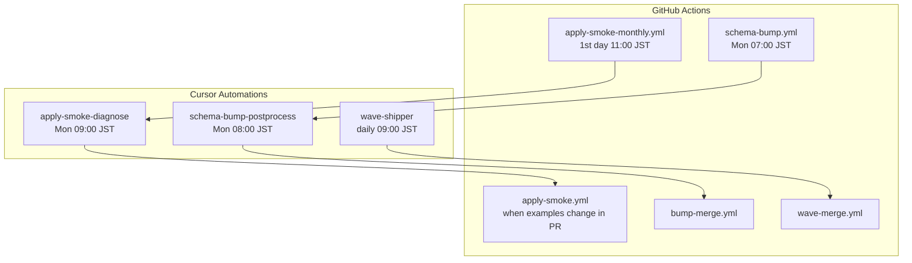

import RichLinkCard from '../../../components/RichLinkCard.astro';
import SiteImage from '../../../components/SiteImage.astro';
import articleHeader from '../../../assets/tech/solo-maintainer-cursor-automations/solo-maintainer-cursor-automations-hero.jpg';
import automationsListLight from '../../../assets/tech/solo-maintainer-cursor-automations/automations-list-light.png';
import automationsListDark from '../../../assets/tech/solo-maintainer-cursor-automations/automations-list-dark.png';
import waveShipperSettingsLight from '../../../assets/tech/solo-maintainer-cursor-automations/wave-shipper-settings-light.png';
import waveShipperSettingsDark from '../../../assets/tech/solo-maintainer-cursor-automations/wave-shipper-settings-dark.png';
import wavePrSummary from '../../../assets/tech/solo-maintainer-cursor-automations/wave-pr-summary.png';
import wavePrMerged from '../../../assets/tech/solo-maintainer-cursor-automations/wave-pr-merged.png';
import licenseManagerCostTable from '../../../assets/tech/solo-maintainer-cursor-automations/license-manager-cost-table.png';

<SiteImage src={articleHeader} alt="Cursor Automations for Solo Maintainers" variant="articleHeader" style="width: 100%; height: auto;" />

I maintain a library called [TerraDart](https://github.com/nozomi-koborinai/terradart), mostly by myself.
It is an IaC library that lets you define Google Cloud infrastructure in Dart and convert it into JSON that can be used with `terraform apply`.
It has 389 reviewed resource factories, 60 sample projects across Google Cloud services, and an upstream Terraform provider that changes every week.

To keep up with that amount of work alone, TerraDart was built with agents from the beginning.
I ask agents to add resources and samples in interactive sessions, review the output myself, and when I find drift, I add lint rules or validation scripts so the same drift does not pass again.
That loop helped, but one bottleneck remained.
On days when I did not open an agent session, nothing moved.
Opening a session every night after my day job was not realistic.

Looking back, only two jobs were still left to me inside those interactive sessions:

- starting the work
- deciding whether a PR can be merged

The instructions had already moved into repository documents, and most review work was already handled first by accumulated lint rules and CI.
If that was true, the start trigger could move to a scheduler, and the merge decision could move to a workflow.

The result was a maintenance loop that splits responsibility between **Cursor Automations** and **GitHub Actions**.
Cloud agents launched by Automations handle judgment and drafting until they open a PR.
GitHub Actions handles tests, real-cloud apply checks, and the final verification before merge.

This article is not about how to use TerraDart.
It is about how a solo maintainer can split the recurring maintenance loop of verification, shipping, and upstream tracking between agents and CI, using the actual TerraDart setup as the example.

<RichLinkCard
  href="https://github.com/nozomi-koborinai/terradart"
  title="TerraDart"
  description="Type-safe IaC for Dart. Google Cloud infrastructure as real Dart code — typed, refactor-safe, drop-in for terraform apply."
/>

## Align terms with the Cursor docs

The same feature is often named differently in the UI and in blog posts, so this article uses the terms from the [Cursor documentation](https://cursor.com/docs/cloud-agent/automations.md).

| Term | Meaning in this article |
| --- | --- |
| **Cloud Agents** | Agents that run on cloud VMs. They clone the repository, work on a branch, and push a PR |
| **Automations** | Scheduled or GitHub-event-based triggers that start cloud agents |
| **Rules / Skills / Hooks** | Persistent guides committed to the repository. TerraDart uses `AGENTS.md`, `.agents/skills/`, and `.cursor/hooks.json` |
| **GitHub Actions** | Deterministic CI execution. It handles schema fetching, `terraform apply`, tests, and conditional auto-merge |

## The maintenance loop

I call this a maintenance loop, but in practice it combines weekly work with daily Wave shipping and monthly full apply-smoke runs.
Scheduled work is built as pairs of GitHub Actions, which run deterministic jobs, and Automations, which handle judgment and drafting.



There are only three Automations.

| Automation | Instruction file | Paired workflow | Responsibility |
| --- | --- | --- | --- |
| schema-bump-postprocess | `.cursor/agents/schema-bump-postprocess.md` | `schema-bump.yml` -> `bump-merge.yml` | Classifies and mechanically fixes weekly bump PRs |
| wave-shipper | `.cursor/agents/wave-shipper.md` | -> `wave-merge.yml` | Opens PRs that add resources from the backlog |
| apply-smoke-diagnose | `.cursor/agents/apply-smoke-diagnose.md` | `apply-smoke-monthly.yml` | Diagnoses failed monthly validation issues and opens fix PRs |

<figure class="theme-figure">
  <SiteImage src={automationsListLight} alt="Cursor Automations list showing wave-shipper, apply-smoke-diagnose, and schema-bump-postprocess as active" variant="inline" class="theme-light" />
  <SiteImage src={automationsListDark} alt="Cursor Automations list showing wave-shipper, apply-smoke-diagnose, and schema-bump-postprocess as active" variant="inline" class="theme-dark" />
</figure>

On a timeline, the loop looks like this.
All times are in Japan Standard Time.

**Monday 07:00, schema-bump (GitHub Actions).**
It fetches the latest `schema.json` from the HashiCorp provider.
If new `google_*` resources appear, it adds them to the curation backlog and opens a PR.

**Monday 08:00, schema-bump-postprocess (Automation).**
It reads the bump PR opened one hour earlier and classifies it into three groups: ready to merge, mechanically fixable, or requiring human review.
If it can fix the diff, it pushes the change and adds a report and labels.
The merge itself belongs to the bump-merge workflow.

**Every day 09:00, wave-shipper (Automation).**
It takes a product group of 3 to 6 resources from the top of the backlog and opens a PR that includes factories, samples, and cost-classification ledger updates.
In the repository, this unit of work is called a Wave.
If a `wave/*` PR is already open, it does nothing that day.
Keeping work in progress to one PR prevents review from piling up.

<SiteImage src={wavePrSummary} alt="A Wave PR implemented by wave-shipper, including three added resources, cost-classification evidence, and reasons for resources that were intentionally skipped" variant="inline" />

The image above is a real Wave PR implemented by wave-shipper.
In addition to the three added resources, the agent wrote cost-classification evidence and the reasons why some resources were intentionally skipped.
One honest limitation: in the current Cursor setup, the agent's GitHub token cannot create PRs.
So the final action of opening the implemented change as a PR is still something I do manually.

**On PRs, apply-smoke change-gate (GitHub Actions).**
When a PR touches samples, only the changed samples are applied to and destroyed from a validation GCP project.

**On the first day of each month at 11:00, apply-smoke monthly (GitHub Actions).**
This is the full validation run for all samples.
It also includes high-cost samples that are skipped during PR validation.
When it fails, it opens an issue.

**Monday 09:00, apply-smoke-diagnose (Automation).**
It takes one unresolved failure issue, classifies the cause from the logs, and opens a fix PR if it can fix the problem.
It does not merge.

The responsibility split is the same in every pair.
Workflows run what machines can run deterministically, and Automations receive only the follow-up work that needs judgment.

## Three design principles

### Principle 1: Put judgment in the repository

I do not put long instructions in the Automations settings screen.
The prompt in the UI is only a one-line pointer to the file that contains the instructions.

<figure class="theme-figure">
  <SiteImage src={waveShipperSettingsLight} alt="wave-shipper settings screen. The trigger is daily at 09:00 GMT+9, and Agent Instructions contain only one line pointing to the instruction file" variant="inline" class="theme-light" />
  <SiteImage src={waveShipperSettingsDark} alt="wave-shipper settings screen. The trigger is daily at 09:00 GMT+9, and Agent Instructions contain only one line pointing to the instruction file" variant="inline" class="theme-dark" />
</figure>

The Agent Instructions field contains only this line: `Read .cursor/agents/wave-shipper.md in the repository and follow it exactly.`
The detailed procedure, ledger update rules, and escalation conditions are all committed to the repository.

- Operating guide: `AGENTS.md`
- Task-specific instructions: `.agents/skills/` in the Agent Skills format
- Exception and debt ledgers: `tool/*.yaml`
- Scheduled-agent instruction files: `.cursor/agents/*.md`

Unlike chat history, the repository is version-controlled.
Instruction changes can be reviewed as diffs, and the instructions survive even if I change agent products.
Automation is only the launcher; the judgment lives in the repository.

There is another reason: prose rules drift over time.
TerraDart writes this in `AGENTS.md` as "prose rules drift; gates converge."
Review comments fix one PR once, but if the rule becomes a gate, it applies to every future run.

### Principle 2: Let GitHub Actions run deterministic work

I do not put agents between inputs and outputs when the process should produce the same result from the same input.
In TerraDart, these jobs belong to GitHub Actions:

- fetch the latest `schema.json` from the Terraform provider
- synthesize all samples from Dart into Terraform JSON and run `terraform validate`
- run `terraform apply` and `destroy` against a validation GCP project
- squash-merge PRs that satisfy the conditions

Agent output can vary from run to run, but workflows do not.
The more deterministic work moves into workflows, the more agent work narrows to the parts that actually need judgment.

### Principle 3: Do not give merge to agents

Cloud agents only have permission up to opening PRs.
Merge is handled by a dedicated workflow after it mechanically checks three conditions:

- whether the changed files stay inside allowed paths
- whether all required checks have passed
- whether there is proof that the affected samples applied successfully in a real cloud project

I also started with auto-merge disabled by a repository variable, and enabled it only after the operation became stable.

Merge stays with humans and CI because the cost of a wrong merge is high.
Cloud billing, breaking API changes, and resources that only work in organization accounts are cheapest to stop before merge.

<SiteImage src={wavePrMerged} alt="Merge screen for a Wave PR with 82 checks passing. apply smoke is visible at the top of the check list" variant="inline" />

This is a real Wave PR at merge time.
You can see apply smoke at the top of the 82 checks.
This PR changed samples that are skipped during PR validation and only applied during monthly validation, so it did not satisfy the auto-merge condition that requires real apply proof.
The merge workflow did exactly what it was designed to do: it did nothing, and I reviewed and merged the PR myself.

## Split quality gates into three Test Sizes

To run this maintenance loop safely, each PR needs a clear rule for what gets tested and how far the validation goes.
TerraDart organizes test layers using [Google's Test Sizes](https://testing.googleblog.com/2010/12/test-sizes.html): Small, Medium, and Large.
The point of Test Sizes is to classify tests by constraints, not by names: whether they use the network, touch external systems, and how long they are allowed to run.

| Size | TerraDart example | What it proves |
| --- | --- | --- |
| Small | `dart test`, generated-code diff checks, override lint | The generated Dart shape and design-rule compliance |
| Medium | Full sample synth gates, `terraform validate` | The synth output is valid Terraform and consistent with the catalog |
| Large | apply-smoke against real GCP with apply and destroy | A representative sample can actually be created and destroyed in the cloud |

Small and Medium run fully on every PR.
Large costs time and money on every run, so it does not run everything every time.
The samples that can be applied are controlled by ledgers.

The need for the Large layer came from failure.
When I first ran apply-smoke across all samples, samples that passed `terraform validate` failed almost completely during real apply.

- required variables were missing
- APIs were not enabled
- placeholders remained in sample code
- resources that only work in organization accounts were included

None of these can be found by syntax and reference validation at the Medium layer.
The gap between "validates" and "can be created" was much wider than I expected.

### Ledgers that limit real-cloud apply

If Large tests run without limits, billing and cleanup can overwhelm a solo maintainer.
TerraDart uses three YAML ledgers to decide which samples may be applied.

| Ledger | Unit | Role |
| --- | --- | --- |
| `apply_cost_denylist.yaml` | Terraform resource type | Classifies resources as `safe`, `sweep_only`, or `never_apply`. Types not listed anywhere are treated as unclassified and are not applied |
| `apply_smoke_skip.yaml` | Sample name | Always skip apply. Used for organization-only resources, external secrets, resources billed by existence, resources that cannot be deleted, and similar cases |
| `apply_smoke_pr_skip.yaml` | Sample name | Skip only during PR validation. Monthly full validation still applies them |

The shared rule across the three ledgers is: "if it is not listed, do not run it."
New resources never touch the real cloud until their cost behavior is checked and classified on the safe side.

This design also came from a billing incident.
The Office SPLA license configuration created by a License Manager sample was billed just for existing, even when no VM was created.
There was no prorating, so the monthly charge was fixed even if apply and destroy finished in a few minutes.
apply-smoke creates and immediately destroys resources, so ordinary time-billed resources stay within a few hundred yen per month.
That assumption did not hold for existence-based billing.

<SiteImage src={licenseManagerCostTable} alt="Monthly bill for the validation project. Of 40,342 yen, 36,277 yen came from Cloud License Manager, while Compute Engine used for real VMs was 203 yen" variant="inline" />

This is the bill from that month.
Out of 40,342 yen, 36,277 yen came from License Manager.
Compute Engine, where VMs were actually created and destroyed, was only 203 yen.
The difference is two orders of magnitude.
`terraform validate` did not warn me about anything; I noticed it only on this billing screen.
Now that resource type is classified as `never_apply`, and CI fails if a sample that contains an existence-billed resource is not listed in a skip ledger.

### Agent-based cost classification

wave-shipper classifies resources into the ledgers every time it ships a Wave.
I did not want it to write `safe` by guesswork, so I made the evidence machine-readable.
I connected my own MCP server, gcp-cost-mcp-server, to the maintenance loop.
It uses the Cloud Billing Catalog API to fetch SKU prices.

There are three classification rules:

- fetch SKU prices through MCP before writing to the ledger
- leave the evidence SKU and price as comments next to the classification
- fail CI when a `safe` classification has no evidence comment

The last rule is not a request written in an instruction file.
It is enforced as a CI gate.

There was one integration problem.
The repository MCP configuration works from local Cursor.
But cloud-agent sessions do not start command-based MCP servers.
Those cloud agents are exactly where the daily classification work runs.
So I put a small client CLI in the repository that calls the same tool through stdio, and cloud agents fetch SKU data through that CLI.
The implementation uses genkit_mcp, the Genkit Dart MCP plugin that I initially implemented and contributed.
The client intentionally does only one thing: call the tool.
Which tool to call, how to read the result, and how to classify the resource remain the agent's responsibility.
If the wrapper returned preselected SKUs or ready-made classifications, the judgment would move back to the human who wrote the wrapper.

Pricing data is not perfect.
Even when a unit price is available, it does not always explain the billing shape: whether a resource is billed by existence or by running time.
The SPLA license in the License Manager incident did not have a SKU in the Cloud Billing Catalog at all.
So the billing shape is checked against official documentation, and if there is any doubt, the resource stays unclassified, which means it does not get applied.
The Wave PR above has an example.
The agent classified MIG-related resources as safe because they looked like metadata, but a MIG creates member VMs.
I caught that during review and changed the classification to `sweep_only`, which means monthly apply only.
Evidence is enforced by machines, while final correction authority stays with a human.
That is the same split as merge.

<RichLinkCard
  href="https://github.com/nozomi-koborinai/gcp-cost-mcp-server"
  title="gcp-cost-mcp-server"
  description="An MCP server that enables AI assistants to estimate Google Cloud costs, powered by Cloud Billing Catalog API and built with Genkit for Go"
/>

## Appendix: TerraDart's generation flow

The maintenance loop is the main topic of this article.
For readers interested in Terraform bindings, here is the short version of what cloud agents create.

The factories that users import from `terradart_google` are generated and committed by maintainers with the `terradart wrap` command.
There are two inputs.

```text
schema.json + upstream metadata     -> merged intermediate representation
override YAML (API design judgment) -> code generation -> terradart_google .dart files
```

The machine-generated parts, such as attribute types and required/optional flags, come from the schema.
Only human and agent judgment, such as how to group fields and what to hide, remains in override YAML.
What wave-shipper does every morning is write those overrides, generate factories and samples, and bring the result to a PR.

There is no exhaustive test for every attribute combination.
The Large-layer coverage model is that one sample proves one representative path in a real cloud project.
The details of the generation pipeline are written in TerraDart's [`AGENTS.md`](https://github.com/nozomi-koborinai/terradart/blob/main/AGENTS.md).

## Summary

When Automations handles judgment and drafting, and GitHub Actions handles execution and gates, even a solo maintainer can keep an OSS maintenance loop moving.
Outside TerraDart-specific details, the core ideas are:

- do not let agents merge
- control real-cloud validation with ledgers, and do not run unclassified resources
- put judgment in the repository and version-control it, not in chat

This setup is running in TerraDart today, and both the instruction files and gates are readable in the repository.

## References

- [TerraDart](https://github.com/nozomi-koborinai/terradart) / [terradart.dev](https://terradart.dev/)
- [Cursor Automations](https://cursor.com/docs/cloud-agent/automations.md)
- [Cursor Cloud Agents](https://cursor.com/docs/cloud-agent.md)
- [Google Testing Blog — Test Sizes](https://testing.googleblog.com/2010/12/test-sizes.html)
