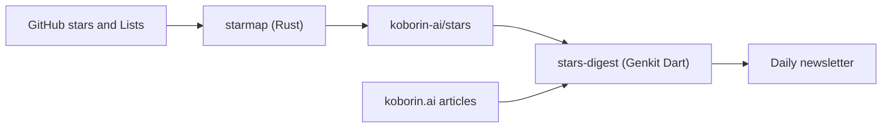

import SiteImage from '../../../components/SiteImage.astro';
import RichLinkCard from '../../../components/RichLinkCard.astro';
import listsLight from '../../../assets/tech/stars-digest/lists-light.png';
import listsDark from '../../../assets/tech/stars-digest/lists-dark.png';
import devUiLight from '../../../assets/tech/stars-digest/dev-ui-light.png';
import devUiDark from '../../../assets/tech/stars-digest/dev-ui-dark.png';
import starsDigestOg from '../../../assets/og/stars-digest.png';

<SiteImage src={starsDigestOg} alt="An agent that has read everything I've written digs up the OSS I starred" variant="articleHeader" style="width: 100%; height: auto;" />

:::note[Discontinued]
The personal `/stars` newsletter has been discontinued. This article remains as a record of the system I built at the time.
:::

When I find a repository I'm curious about on GitHub, I star it. But after that, I almost never look back. I don't do anything further with it; the count just keeps growing.

To do something about this pile-up, I built a system that picks one of my starred repositories each morning and writes me a short note about it. The one choosing and writing isn't me; it's an AI agent. And that agent has read the articles I've written on this site.

## I star it, sort it into a List, feel satisfied, and leave it

I sort my starred repositories into themed Lists with GitHub's Lists feature: Cloud & DevOps, Web, Agent Tools, Dev Tools, Databases, and so on.

<figure class="theme-figure">
  <SiteImage src={listsLight} alt="My GitHub Lists, where starred repositories are sorted by theme" variant="inline" class="theme-light" />
  <SiteImage src={listsDark} alt="My GitHub Lists, where starred repositories are sorted by theme" variant="inline" class="theme-dark" />
</figure>

But once I've sorted them, I tend to feel satisfied and rarely open the Lists again. Right after starring something I think "I'll read this later" or "I'll try this soon," but my attention quickly moves on to the next thing. I star something new, drop it into a List, and feel satisfied again. Repeat that, and the earlier ones sink down the list; "I'll look at it later" turns into "I'll never look at it."

What I wanted was a system that takes these piled-up stars, pulls them toward my current interests and whatever I'm building right now, and hands me the one that feels like "this could be useful to me today." I could just read GitHub Trending or a newsletter rounding up popular OSS, but that means chasing "what's popular out there," which is a separate stream from the things I actually starred.

## Keeping the structure I sorted by hand

The system splits into two parts: one that prepares the star data, and one that picks the daily repository from it. Let's start with preparing the data.

There are already several tools that export your GitHub stars. A popular one is maguowei/starred, which automatically categorizes your stars by language or topic and outputs them as an awesome list (a link collection organized by theme).

<RichLinkCard href="https://github.com/maguowei/starred" title="maguowei/starred" description="Create and maintain your own Awesome-style list from GitHub stars!" />

But automatic categorization ignores the way I'd already sorted things into GitHub Lists. I wanted to keep that sorting itself, so I wrote my own tool that mirrors the Lists as they are. It's called starmap (written in Rust).

<RichLinkCard href="https://github.com/nozomi-koborinai/starmap" title="nozomi-koborinai/starmap" description="⭐️ Generate Awesome Lists from your GitHub Stars, organized by Lists" />

starmap writes out an awesome list without breaking how I sorted the Lists. It also generates an llms.txt meant to be read by LLMs (large language models) and an llms-full.md that excerpts each repository's README. These run every day via GitHub Actions and are committed automatically to a repository called koborin-ai/stars.

<RichLinkCard href="https://github.com/koborin-ai/stars" title="koborin-ai/stars" description="🌟 A personal library of GitHub stars — catalogued by topic, refreshed by starmap" />

## Translating it into something addressed to me

The second part is handled by a small program called stars-digest, written in Genkit Dart. Genkit is Google's AI framework, and it can be used from Dart too.

stars-digest reads the data in koborin-ai/stars and assembles the daily newsletter. Here is the overall flow.



The interesting part is how the main pick is chosen. It doesn't pick something I just starred; it picks from repositories I starred earlier and haven't featured yet. In other words, it digs one out of the pile. Which one gets chosen is determined by the date, and anything already featured is excluded, so the same repository won't show up two days in a row. On top of that, if I starred anything new by that day, it adds a few as new arrivals.

The write-up itself is generated by Gemini. The model is Gemini Flash. Instead of the Gemini API, I call it through Agent Platform (formerly Vertex AI), authenticated with a Google Cloud service account. That way I don't have to issue and manage an API key myself. It runs just once a day, and the result comes back in a fixed structure (what the tool is, why it suits me right now, where to use it, and a first step).

The actual call is just this.

```dart
final response = await ai.generate(
  model: vertexAI.gemini(modelId),        // Gemini Flash via Agent Platform
  messages: [
    Message(role: Role.system, content: [TextPart(text: systemPrompt)]),  // editorial policy + my persona
    Message(role: Role.user,   content: [TextPart(text: userPrompt)]),     // the day's repositories
  ],
  outputSchema: Edition.$schema,          // receive a fixed structure
);
```

While developing, I can iterate on the prompt in Genkit's Developer UI.

<figure class="theme-figure">
  <SiteImage src={devUiLight} alt="The Genkit Developer UI running the starsDigest flow of stars-digest" variant="inline" class="theme-light" />
  <SiteImage src={devUiDark} alt="The Genkit Developer UI running the starsDigest flow of stars-digest" variant="inline" class="theme-dark" />
</figure>

The newsletter itself used to be published on the site, but it has since been discontinued.

## The "me" the agent reads

I've been saying it "pulls things toward who I am right now," but how does the agent know "me"?

The answer: I have it read the articles I've written on this site. It picks up my technical interests and stack from the top page and the tech articles, and my way of thinking and personality from the life articles, then assembles a persona. That persona is passed to the model as context when it writes the note.

In code, the assembly looks like this.

```dart
Persona buildPersona({
  required String indexMdx,       // top page = tech stack
  required List<String> lifeMdx,  // life articles = personality and values
  required String steering,       // manual editorial steering
}) {
  return Persona(
    stack: stripMdx(indexMdx),
    character: lifeMdx.map(stripMdx).join('\n\n---\n\n'),
    steering: steering.trim(),
  );
}
```

koborin.ai also publishes its articles as [llms.txt](/llms.txt). It's text meant to be read by LLMs, and it includes not just the tech content but the life content too. So not only my technical notes but also the way I think sits there in a machine-readable form. stars-digest uses that as "me."

This creates a small loop. When I write an article, it accumulates on the site. The agent reads those articles, picks stars as "me," and writes the notes. Those notes then accumulate on koborin.ai as well. What I wrote comes back around as recommendations addressed to me.

## This time, not stopping at building the system

I've only just started running it, so I can't really say how well it works yet. Still, now that one arrives each morning, I do feel like I'm paying a bit more attention to the stars I'd left untouched.

To put it more broadly, what I think matters isn't chasing new things in itself, but being able to pull the information I gather toward my own context (my stack, what I've built, the way I think) and turn it into something of my own. stars-digest is also a small personal tool for doing that conversion, little by little, each morning.

There's one thing I want to watch out for. Until now I've starred things, sorted them into Lists, felt satisfied there, and left them. The object of that satisfaction might just shift to "having built the system." If I build it, feel satisfied, and stop reading the actual newsletter, I'll have ended up right where I started.

To avoid that, I'll start by simply making sure I read it every morning, and keep going from there.
