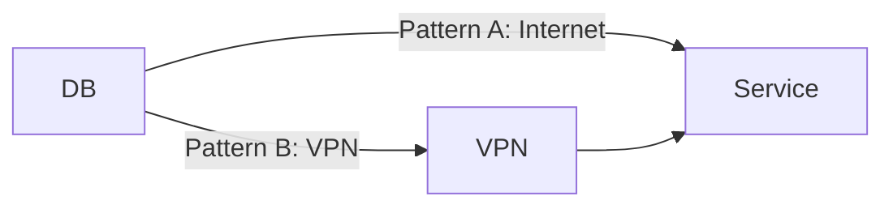

# Mermaid Diagram Workflow

## Quick Start

Generate PNGs for all diagrams:

```bash
bash .claude/skills/mermaid-diagram/scripts/generate-diagrams.sh
```

Generate a single diagram:

```bash
bash .claude/skills/mermaid-diagram/scripts/generate-diagrams.sh docs/zones/auth/diagrams/er-design/er-diagram.mmd
```

Generate all diagrams in a directory:

```bash
bash .claude/skills/mermaid-diagram/scripts/generate-diagrams.sh docs/zones/auth/diagrams/
```

The script defaults to scale 4 (highest quality) with a white background.
Override via environment variables: `MERMAID_SCALE=8 MERMAID_BG=transparent bash .claude/skills/mermaid-diagram/scripts/generate-diagrams.sh`

## When to Use Mermaid

If you find yourself writing `→` arrows or `---` separators in plain text to describe a flow, that's a sign to use Mermaid.

| Document Pattern | Mermaid Diagram Type |
|---|---|
| `A → B → C` process flows | `flowchart` |
| System-to-system communication, auth flows | `sequenceDiagram` |
| Table relationships (1:N, M:N) | `erDiagram` |
| Architecture comparison (Pattern A vs B) | `flowchart` (**as separate diagrams**) |
| State transitions (unauthenticated → authenticated) | `stateDiagram-v2` |
| Milestones, schedules | `gantt` |

### When Plain Text Is Enough

| Pattern | Reason |
|---|---|
| Directory trees (`tree` format) | No matching Mermaid diagram type |
| Simple 2–3 line transformations (`before → after`) | Not complex enough to warrant a diagram |
| Screen layouts (`┌──┐` format) | Text wireframes are sufficient |

## Single Responsibility Principle for Diagrams

**One diagram = one responsibility.**

### Bad: Two alternatives crammed into one diagram



Neither pattern is clearly explained. Use a Markdown comparison table with separate diagrams.

### Good: One diagram per concept

Create `pattern-a.mmd` and `pattern-b.mmd` separately, each clearly illustrating its architecture.

### Decision Flow

```
About to create a diagram
  │
  ├─ Trying to show "Option A vs B" in a single diagram
  │    → Split. One diagram per option. Compare in a table.
  │
  ├─ 4+ actors (systems, users) involved
  │    → Consider splitting into overview + detail diagrams.
  │
  └─ Filename contains "and" (e.g., "auth-and-sync")
       → Likely two responsibilities. Consider splitting.
```

## Scope Boundary Principle

**Only diagram what your system controls. Don't diagram the internals of external systems.**

| Draw | Don't Draw |
|---|---|
| Your system's APIs and component interactions | Internal processing of external systems |
| External API endpoints your system calls | Data stores inside external systems |
| User ↔ your system interactions | Internal flows of external systems |

**Litmus test**: "Can our system control or verify this element?" → If no, don't draw it.

Represent external system internals as a black box:

```
note over ExternalSystem: External processing (internals out of scope)
```

## Flow Symmetry Principle

**Multiple flows serving the same purpose (e.g., two auth methods) should share the same level of abstraction.**

| Checkpoint | Question |
|---|---|
| Actor count | Does one flow show backend/DB while the other omits them? |
| Step count gap | Is one flow 3 steps while the other is 10? |
| Granularity | Does one flow leak implementation details? |

## Read Before You Draw

**Don't draw flows based on assumptions.**

| Don't | Do |
|---|---|
| Draw flows without checking the implementation | Read the actual code/spec first |
| Assert based on partial reading | Understand the full context first |
| Depict unverified facts as confirmed | Exclude them or mark with a `note` |

---

## Directory Structure

### Separate Source from Generated Images

Mermaid source files (`.mmd`) and generated images (`.png`) live in separate directories:

```
docs/zones/{zone}/
  diagrams/{topic}/
    {diagram-name}.mmd        ← Mermaid source
  images/{topic}/
    {diagram-name}.png         ← Generated image (via script)
```

### Cross-Zone Diagrams

```
docs/
  diagrams/{topic}/
    {diagram-name}.mmd
  images/{topic}/
    {diagram-name}.png
```

## Mermaid Source File Rules

- Extension: **`.mmd`**
- Content: **Mermaid code only** — no headings, prose, HTML, or annotations
- One diagram per file
- **No `\n` line breaks in node labels.** Keep labels on a single line.

Bad:
```
DB[("Oracle DB\n(user data)")]
```

Good:
```
DB[("Oracle DB")]
```

Express supplementary information via separate nodes, edge labels, or subgraph titles.

## Referencing from Markdown

Reference PNGs using relative paths. **Never leave inline Mermaid code blocks as the final form in documents.**

```markdown

```

### Why Not Inline Mermaid?

- GitHub preview renders Mermaid, but PDF exports, print, and shared notes do not
- Separating source and image enables change tracking (OBS principle)

## Required Workflow

| Step | Action |
|---|---|
| 1. Create source | Place `.mmd` file in `diagrams/{topic}/` |
| 2. Generate PNG | Run `bash .claude/skills/mermaid-diagram/scripts/generate-diagrams.sh <file>` |
| 3. Embed in document | Reference PNG via relative path (remove any inline Mermaid) |
| 4. Commit both | Include both `.mmd` source and `.png` in the commit |
